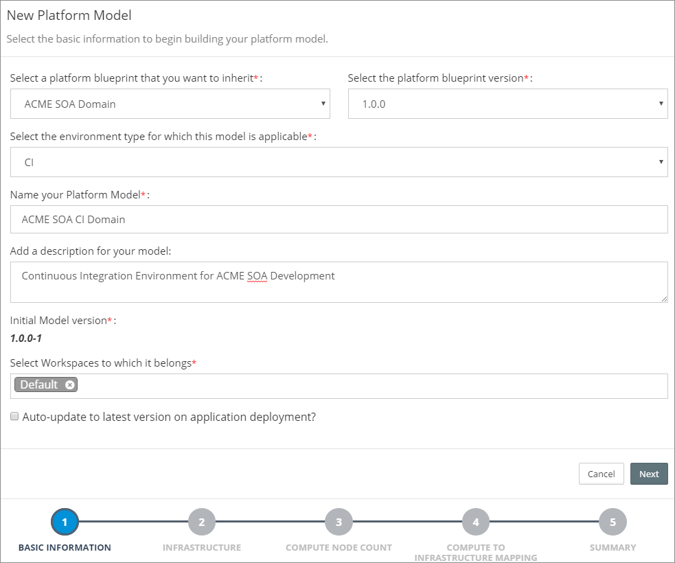

# Overview
Before we can provision a Platform Instance based on a Platform Blueprint, we need to define a Platform Model. 

The Platform Model maps the Platform Blueprint to the target environment for our Oracle Middleware platform and provides environment specific configuration details. The target environment can be on premise or on the cloud.

When we create the Platform Model, we also have the ability to override many of the configurations defined in the Platform Blueprint, this provides a mechanism to safely manage configuration differences between environments. For example, you may want for detailed logging levels in a Development or Test environment.

For each Platform Instance that we want to create, we need to create a corresponding Platform Model in MyST.

## Create Platform Model for Pre-Existing Infrastructure
From the side menu navigate to`Modeling` > `Platform Model`, this will display a list of existing Platform Models. Click on `Create New` in the top right-hand corner of the screen. This will launch the `New Platform Model` wizard.

In the initial dialogue we need to specify the following details about our Platform Model:

* **Platform Blueprint** - The Platform Blueprint that we will use for our Platform Model.
* **Platform Blueprint Version** - The version of the Platform Blueprint that we will use for our Platform Model.
* **Environment Type** - The Environment Type for the Platform Model.
* **Name** - Short hand name for the Platform Blueprint.
* **Description** - A longer description of the Platform Model.

* **Workspaces** - This defines the Workspaces to which the Platform Model belongs. See Role Based Access Control for further details.

>> Note: MyST will set the initial version of the Platform Model to 
`<Platform Blueprint Version>-1`. See Platform Blueprint and Model Versioning for further details.

Once we have entered the basic details about our Platform Model click `Next`.

## Select Infrastructure Provider

### Specify Compute Node Count

### Map to Pre-Existing Servers

### Specify Platform Model Configurations
The final stage is to specify configuration properties that are specifc to the Platform Model.

For the Platform Model we need to specify the following details :
* **Domain Name** - This is the WebLogic Domain name, it will default to the value specified in the Platform Blueprint, but can be overridden in the Platform Model.
* **WebLogic Admin User* - Enter the WebLogic Admin user, it defauts to Weblogic.
* **Weblogic Admin Password** - Enter the password to be used for the WebLogic Admin User.
* **JDBC Data Source type** - This option is used to specify the Data Source Type for Oracle Middleware specific schemas which are created by the Oracle Middleware Repository Creation Utility (RCU). This will default to the value specified in the Platform Blueprint, but can be overridden in the Platform Model.
* **RCU Components** - This details the RCU specific schemas that will be created. This is pre-populated based on the Oracle Middlware Components specified in the Platform Blueprint, this is for information purposes only and can't be modified.
* **RCU Database URL** - Enter the database URL for the database that will host the 
* **RCU Prefix** - Specify the RCU Prefix to be used. The prefix is prepended to and separated from the schema name with an underscore (_) character.
* **RCU Database Password** Enter the password to be used for each of the schema owners created by RCU.
* **RCU SYS User** - Enter the user name for the RCU database. This should be a username with DBA or SYSDBA priviliges, for example SYS.
* **RCU SYS Password** - Enter the password for the RCU Sys User.

>> Note: All passwords stored by MyST are encrypted. 

#### Configure Advance 
