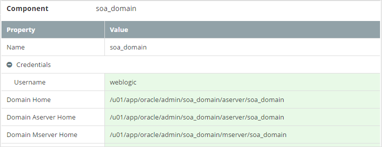
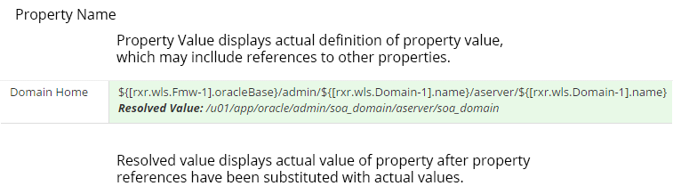

## Platform Editor
MyST holds the configuration details of a Platform Blueprint and Platform Model in a hierarchical or tree-like structure. The Platform Editor is used to view and edit Platform Blueprints and Platform Models.

### Opening a Platform Blueprint in the Platform Editor
From the side menu navigate to`Modeling` > `Platform Blueprint`, this will display a list of existing Platform Blueprints. Click on the `Actions` drop-down in the top right-hand corner of the Platform Blueprint we want to view / edit and select `Open`. This will open the Platform Blueprint in the `Platform Editor` in view mode.

### Opening a Platform Model in the Platform Editor

From the side menu navigate to`Modeling` > `Platform Models`, this will display a list of existing Platform Models. Select the Platform Model you are interested in and MyST will display summary details about the Platform Model and its coresponding instance as shown below.

Click on the `Actions` drop-down in the top right-hand corner and select `Configuration`. This will open the Platform Model in the `Platform Editor` in view mode.

## Platform Editor Layout
The Platform Editor is split into four core sections:

1. **Control Bar** - Displays the version, revison and state of the Platform Blueprint or Model you are viewing, plus allows you to perform actions such as editing.
2. **Tree View** - Displays a hierarchical view of the Platform Blueprint. That can be used to navigate the Platform Blueprint or Model configuration. Selecting a component in the tree view will display a list of properties defined for that component in the properties view.
3. **Topology View** - Helps to visualize the configuration that is defined in the Platform Blueprint or Model. Selecting a component in the topology diagram will display a list of properties defined for that component in the properties view.
4. **Property View** - Displays the list of properties and corresponding values defined for the selected component in your Platform Blueprint. 

You can re-size each view by dragging the grey bars which seperate each section. By clicking on appropriate arrow you can close / open the corresponding view.

### Control Bar
The Control Bar Displays the version, revison and state of the Platform Blueprint or Model for further details on versioning see [Platform Blueprint and Model Versioning]().

By default the Platform Editor is opened in read only mode, selecting `Edit Configuration` will put the Platform Editor into edit mode, allowing us to make and save changes. [See ...]()

In addition, the `Actions` drop down allows you to perform a number of additional actions, these are:
* `Save as new version` - Allows you to create a new version of the Platform Blueprint
* `Delete` - Allows you to delete the current version of the Platform Blueprint or Model. Note we can only delete a Platform Model that does not have an active Platform Instance and we can only delete a Platform Blueprint that does not have any dependent Platform Models.
* `Publish` - Sets the status of the Platform Blueprint or Model to `FINAL` meaning no further changes can be made against that version.

### Tree View
MyST holds the configuration details of a Platform Blueprint and Platform Model in a hierarchical or tree-like structure, consisting of the following object types:
* `string` - Primitive type consisting of a key value pair used to hold the value of a property.
* `component` - Complex type consisting of a pre-defined collection of object types.
* `list` - Complex type consisting of a list of zero, one or more components of the same type.
* `paramList` - List of zero, one or more `string` property types.

The Tree View provides a hierarchical view of the Platform Blueprint and Platform Model, providing a simple way to navigate the configuration details of a Platform Blueprint or Model.

Clicking on the plus sign () of a component will expand it to show any child components. Selecting an child element will display the list of properties and values defined for that component in the properties view. 

At the top level, a Platform Blueprint or Model will consist of some or all of the following components:

* **Global Variables** - List of zero, one or more `string` property types.
* **Middleware Settings** - Defines core properties such as the Oracle Base and Oracle Middleware home directory.
* **Products** - Defines the core products that make up the Platform, such as Java, WebLogic, Oracle SOA, etc.
* **Compute Groups** - Defines the Compute Groups for the Platform.
* **Load Balancers** - Configuration details for Load Balancers
* **WebTier Configuration** - Configuration details for Oracle Http Server
* **WebLogic Domain** - Configuration details of the WebLogic domain
* **Keystores** - Holds details of any Keystores used by the Platform

### Topology View
The toplogy view provides a summary visualization of your Platform Blueprint or Model and provides a quick short cut for referencing key components. Specifically, it displays:
* **Load Balancer** - Clicking on this will select the LoadBalancer component; located at `[Blueprint|Model] > Load Balancers > LoadBalancer` and display it corresponding properties in the Property View.
* **Compute Groups** - The toplogy view shows each Compute Group and the components it contains. Clicking on a Compute Group will select the corresponding Compute Group element in the Platform Blueprint or Model; located at `[Blueprint|Model] > Compute Groups > [Compute Group Name]` and display it corresponding properties in the Property View.
* **Clusters** - The toplogy view shows each WebLogic Cluster and the corresponding Product Components. Clicking on a WebLogic Cluster will select the corresponding component in the Platform; located at `[Blueprint|Model] > WebLogic Domains > [domain_name] > WebLogic Clusters > [Cluster Name] ` and display it corresponding properties in the Property View.
* **Product** - Clicking on a Product will select the corresponding component in the Platform; located at `[Blueprint|Model] > Products > [component_name]` and display it corresponding properties in the Property View.

### Property View
The `Property View` displays the properties and values for the selected component. A component may also contain other components, for example the screenshot below is showing the properties for the *soa_domain* component. This contains the component `Credentials` which has the properties `Username` and `Password`.

To expand a component within the property view click on the `+` symbol, and to collapse a component click on the `-` symbol. Alternatively to expand or collapse all components within the property view click on the corresponding `Exapnd All` or `Collapse All` button.

By default, MyST only shows the core properties for a component. To see all properties, select `Show advanced properties` (outlined in red above).

MyST auto-computes many of the property values in accordance with Oracle Enterprise Deployment Guide.  the
The auto-computed values are highlighted in green, if we choose to change any of these, then MyST will display the user entered property in white.

## Editing Properties
To edit either a Platform Blueprint or Platform Model, click `Edit Configuration`. This will put the Platform Editor in **Edit** mode. 

When defining the value of a property, we can reference the value of one or more other properties see [MyST Property Overview](). Once in **Edit** mode, the Property Viewer will display the property definition for calculation the property value, which may include references to other property values. As underneath that the actual resolevd (or calculated) value of the property after property reference have been substituted with actual values, as shown below.

To edit a property, within the TreeView browse to the component where you want to make changes and click `Edit`(outlined in red below).

This will allow you to edit the property definitions for each property within the selected component. Once you have finished making your changes, click `Save`.

**Important** - Saving changes at the component level only saves the changes with the current editing session. The Platform Editor allows you to make all the changes you need to the Platform Blueprint or Model, and save them to the MyST Repository all at once by clicking `Apply Changes` Alternatively, click `Discard Changes` to discard all the changes made within the current `Edit Session`. 

Note: Any edits made to a Property Definition which have not yet been saved to the MyST Repository are highlighted in yellow to indicate this.

**Every time you apply changes to a blueprint version, a new revision is created of the blueprint. You can only view the latest revision of the blueprint. However, if the latest revision of the blueprint is not the same as the revision used to provision an instance, you will need to update the instance from the Platform Model or Platform Instances page.** Update for commit.

## Referencing MyST Property Values
When defining the value of a property, we can reference the value of one or more other properties. For example, if we examine the following properties:
* `oracle.base` - Defines the Oracle Home directory for installing the Oracle Middleware Platform. 
* `oui.inventory.directory` - Defines the Oracle Universal Installer (OUI) Inventory Directory

The default location for (OUI) Inventory Directory is to place this in the sub-directory `inventory` under the Oracle Home. MyST enables us to write an expression similar to:    

`oui.inventory.directory = ${oracle.base}\inventory`

Where the syntax `${<property-path>}` is used to reference the value for property uniquely identified by its `<property-path>`.

## Referencing MyST Properties
...

The simplest way to derive the expression to reference a property value is to locate the property within the Propery Viewer and click on the Property Name. Myst will open a speech bubble containing the expression to reference the property value as show below.

**Note:** The Platform Editor needs to be in Edit mode.

### Understand the MyST Property Path
In general, a dot notation is used to traverse the property hierarchy. For example, `a.b.c` would mean locate `c` within `b` within `a`. The following table lists the object property keys for the top level objects in the Platform Blueprint and the Platform Model.

| Object | Object Property Key |
| -- | --------- |
| Global Variables | var |
| Middleware Settings | rxr.wls.Fmw-1 |
| Products | rxr.def |
| Compute Groups | rxr.infra |
| Load Balancers | rxr.infra |
| WebTier Configuration | rxr.infra |
| WebLogic Domain | rxr.wls |
| Keystores | rxr.def |

* `string` - Primitive type consisting of a key value pair used to hold the value of a property.* `component` - Complex type consisting of a pre-defined collection of object types.* `list` - Complex type consisting of a list of zero, one or more components of the same type.* `paramList` - List of zero, one or more `string` property types.

### Referencing a `property` value within a `component`
A component is a complex type consisting of a pre-defined collection of object types. To reference a `property` value within a component we used the following syntax:

`<component-property-path>.<propery-key>`

Where
* `component-property-path` - Is the path to the component containing the property.
* `property-key` - Is the key for the property whose value we are referencing within the component.

For example, within a Platform Blueprint or Model we have the `Middleware Settings` component, to reference the `Version` property value, we would use the expression: 

* The Middleware Setting is the component the version property. Thus the value of `component-property-path` is `rxr.wls.Fmw-1` (as per table above).
* `version` is the object key for the property we are referencing.

To reference the Middleware version   

`${[rxr.wls.Fmw-1].version}`

### Locating an object within a `list`
A list is a complex type consisting of a list of zero, one or more components of the same type. For example, within a WebLogic Domain we will have a list of JDBC Data Sources. To locate an `object` within a list we used the following syntax:

`[<componentPropertyPath>.<listObjectType>-<objectKey>]`

Where
* `parentComponentPropertyPath` - Is the path to the parent component containing the list
* `listComponentType` - Is the object type stored in the list
* `key` - Is the key for the component stored in the list.

For example, a Platform Blueprint contains a list of Products (for example Java, SOA, Service Bus, RCU) that will be installed. In this example, if we want to reference the property object for RCU:

* The Platform Blueprint is the component containing the list. Thus the value of `list-property-path` is `rxr.def`.
* `Product` is the object type stored in the list.
* `rcu` is the object-key for the RCU product object in the list 

Thus the object property path would be expressed as `[rxr.def.Product-rcu]`. To reference the RCU product version we would use the expression:   

`${[rxr.def.Product-rcu].version}`

For many lists, the `objectKey` defaults to the index no of the object stored in the list. For example, a WebLogic Domain contains a list of WebLogic Clusters. In this example: 
* The WebLogic Domain is the object containing the list. So `list-property-path` is `rxr.wls`
* `Cluster` is the object type stored in the list.
* `1` is the object-key for the first cluster, `2` the object key for the second cluster, and so on.

Thus the object property path to the second cluster in the list would be expressed as `[rxr.wls.Cluster-2]`. To reference the cluster name we would use the expression:  
`${[rxr.wls.Cluster-2].name}`

### Locating a property within a property of type `paramList`
A `paramList` is a list of zero, one or more `string` property types. The list of properties is not fixed.

To locate an `string` property within a `paramList` we used the following syntax:  
`<paramList-property-path>.param[<string-key>]`

Where
* `paramList-property-path` - Is the path to the object containing the `paramList`
* `string-key` - Is the key for the string property stored in the paramList

For example, the Oracle SOA Suite Product object contains a Name-Value Parameter list, that contains a numnber of `string` properties, such as audit-level and base-port. To reference the base-port value we would use the expression:  

`${[rxr.def.Product-soa].param[base-port]}`

### Locating a Global Variables
MyST supports the notion of global variables, these are referenced in a similiar way to properties. But need to be preceded with the prefix `var`. 

For example, to reference the value of `install.directory` we would specify `${var.install.directory}`
