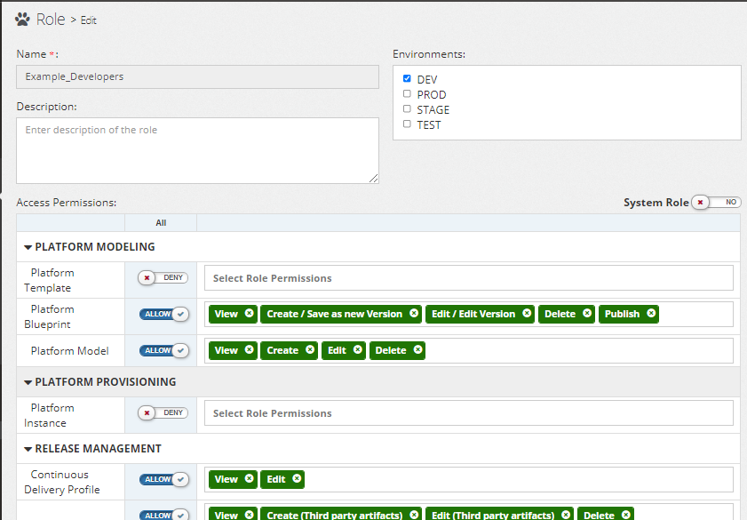
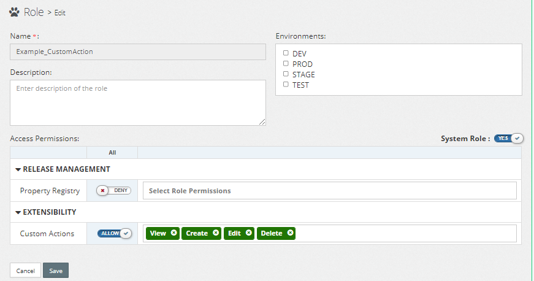
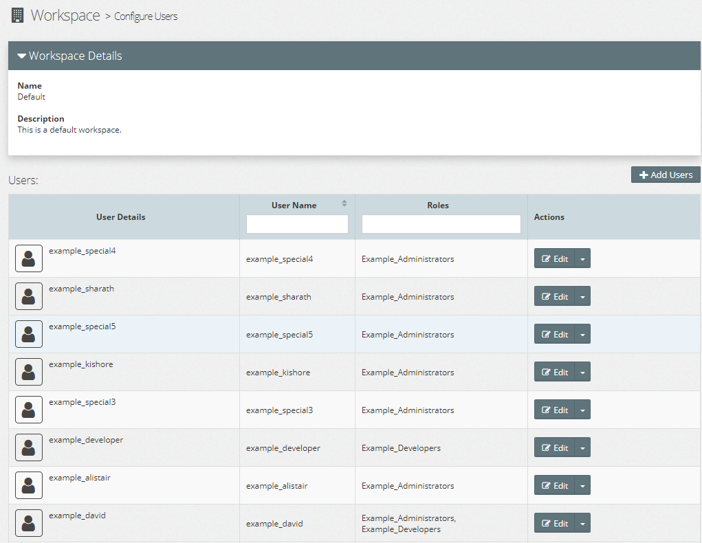

# Connecting Myst to an Active Directory Domain

1. Login as Administrator

2. Go to **Administration** -> **Users**

3. Click 

4. Fill in the Active Directory details.

### Example Configuration

| Name                 | Value                                     |
|----------------------|-------------------------------------------|
|**Connection**|---------------------------------------------------|
| Port                 | `myst.ad.local`                           |
| Port                 | `389`                                     |
| Principal            | `cn=admin,dc=mystsoftware,dc=com`         |
| Credential           | `Welcome1`                                |
|**Users**|----------------------------------------------------|
| User Base DN         | `ou=users,o=myst,dc=mystsoftware,dc=com`  |
| User Name Attribute  | `cn`                                      |
| User Object Class    | `person`                                  |
| All Users Filter    | `(&(cn=*)(objectClass=person)(mail=myst))` |
|**Groups**|----------------------------------------------------|
| Groups Base DN       | `ou=groups,o=myst,dc=mystsoftware,dc=com` |
| Group Name Attribute | `cn`                                      |
| Group Object Class   | `groupOfNames`                            |
| Member DN Attribute  | `member`                                  |
| All Groups Filter    | <code>(&(cn=*)(mail=myst)(&#124;(objectclass=groupofNames)(objectclass=orcldynamicgroup)))</code>       |

# Configuring the Roles

When Active Directory (AD) is integrated with Myst the AD groups synchronise.
* The default workspace will be populated with **Users**
* **Users** will be placed in their respective **Roles**

## Myst Roles

Configure the new **Roles** (synchronised from Active Directory) with the appropriate permissions. Example below:

## Myst System Role

Similar to Myst Roles, the Myst _System_ Roles can be configured and assigned to users. Example below:

# New Users in Active Directory

New users added into Active Directory will automatically synchronise with Myst on login. The user will be assigned to the **Default** workspace and associated to their role.

1. Add new user to Active Directory along with their group
2. User logs into Myst
   1. Myst automatically synchronises the user/role(s)
   2. Synchronises to the **Default** (`6fafeb5a-0bcb-4683-8f57-e287ea7eebaf`) workspace

# Known Issues and Limitations

Log any issues or improvements to [https://rubiconred.freshdesk.com/](https://rubiconred.freshdesk.com/).

## Synchronisation

### Deleting Users from Active Directory

###### Use Case

User leaves team.

###### Issue

FC-6609 - Myst does not synchronise deleted users.

###### Workaround

Delete or retire the users manually via Myst

### Moving a User to a different group

###### Use Case

User changes team.

###### Issue

FC-6612 - Changing a User to a different group does not synchronise in Myst. The user will remain in the same role.

###### Workaround

Manually change the user in Myst to the desired role.

### Changing the User and Group filters

###### Use Case

Myst admin incorrectly applies a filter and wants to apply a new filter.

###### Issue

FC-6612 - Changing the User and Group filter does not remove existing Myst users and roles. Users and Groups in the new filter will added into Myst.

###### Workaround

Manually delete users and groups that should be filtered out.

### Synchronises only to Myst 'Default' workspace

###### Use Case

Myst has multiple workspaces where different users should be assigned.

###### Issue

FC-6613 - Allow a configurable default workspace along with a configurable Active Directory attribute.

###### Workaround

Manually delete the users and roles from the Default workspace and assign to the preferred workspace.

## Connectivity Issues

###### Issue

FC-6610 - No error when Myst fails connecting to Active Directory.

###### Workaround

Check the Myst Studio docker container logs for errors.

## Disabling AD Integration

###### Issue

FC-6611 - No ability to disable AD integration.

###### Workaround

Use an invalid hostname in the Myst provider configuration to prevent further connections to Active Directory.

