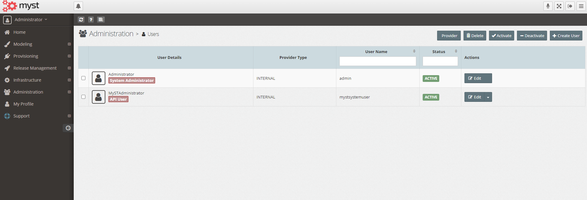
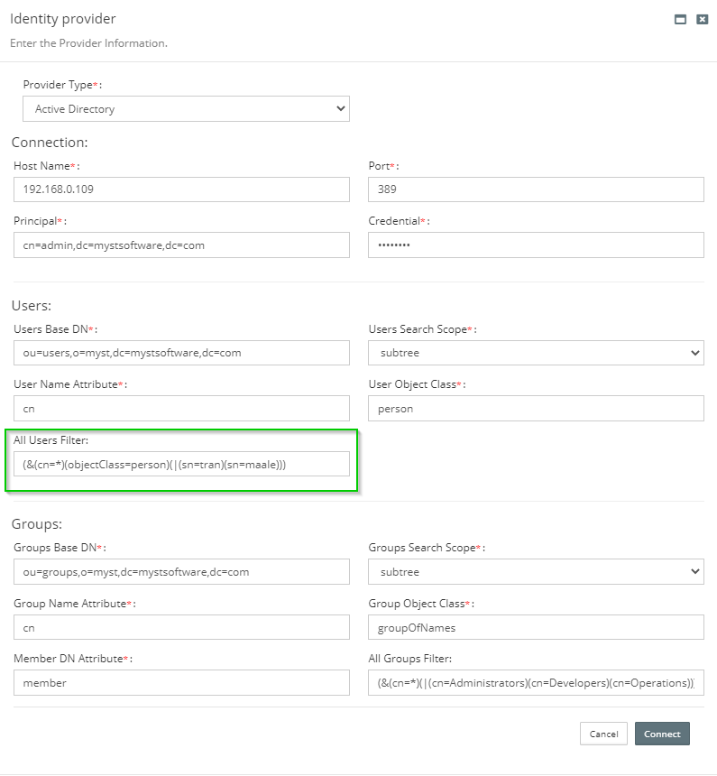
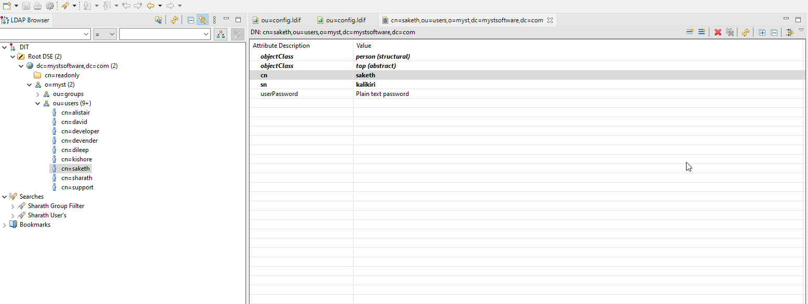
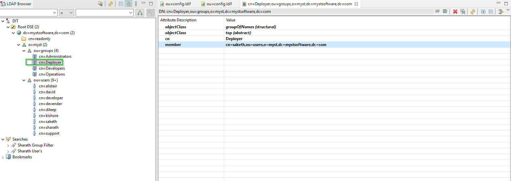
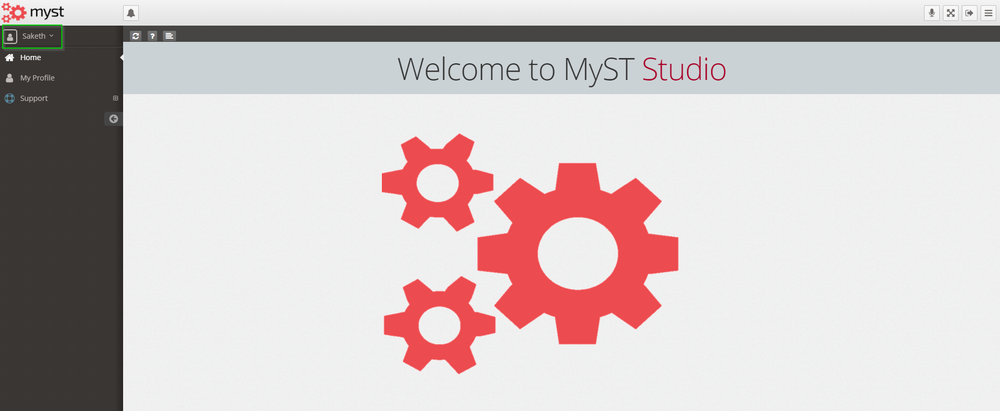
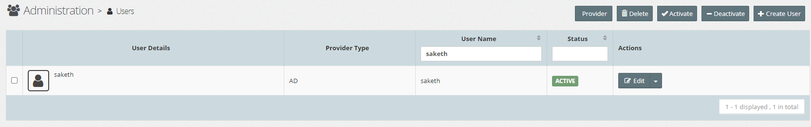
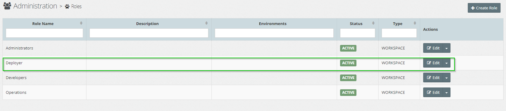
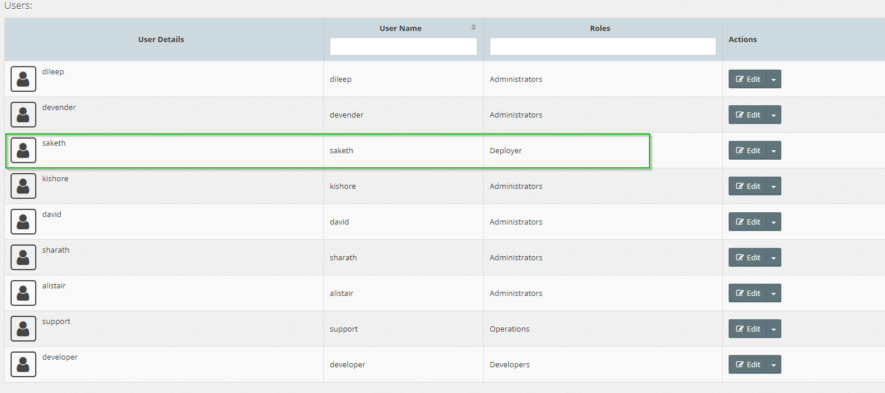

# {{ page.title }}

After logging into the studio as Administrator.  

Go to Administration -> Users -> Provider.

Now you need to fill the details as per your AD Configuration.

A sample configuration is given below for your reference.

## User Filter and Group Filte

Instead or fetching all the users and groups from AD, certian users and groups can be fetched and associated to MyST.  
This can be achieved by the usage of User and Group filters which are in handy use.  

Below sample will help to understand the usage of filters.  

Users before AD integration.  

  

Users after AD integration successful connection and can be seen in MyST under Administration -> Users.

### User Filter

Let's understand more by below example.

Out of ennumber of users in AD you are looking for set of users.  
Use User filter to filter the users easily.

  

In the above screenshot we are expecting users with sn **david**, **maale**

After filtering the users obtained are  

 
Similarly, use Group filter for filtering groups.
  
  

In the above screenshot we are expecting groups with cn **Administrators**, **Developers**, **Operations**.

After filtering groups obtained are  

## New User/Group addition

Thinking what happens when a new user is added to AD?  

Simple when you try to login into MyST, it automatically syncronize the newly added Users or Group into the MyST.  

Below images gives you detailed idea of how it works.  

Adding new user to AD(In this case using Apache Studio for adding user to AD)  

Below screenshot show's a new User **saketh** is added and a new Group **Deployer** is added and assigned user **saketh** to it.

  

  

When user **saketh** tries to login to MyST studio, he can successfully login into it, because of MyST's syncronization ability. And user **saketh** is associated to group **Deployer** .

  

  

  

  

  