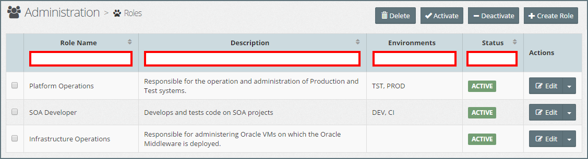
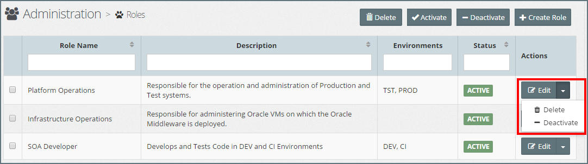

## {{ page.title }}

Within MyST, a Role is used to define the type of MyST resources that a user in that role has access to, and the actions that can be performed against the resources. Specifically it  will define:
* What actions a user can perform against each resource type, for example, Platform Blueprints / Models, Platform Instances, Artifacts, Application Blueprints / Models.
* Where a resource, such as Platform, Instance or Application Models is Environment specific then the role will define which actions can be performed against that resource in each environment.
* A separate reserved MyST Administrator Role will be used to manage system specific configurations, for example, user and role management, tag management
* A separate reserved MyST Workspace Administrator Role will be used to manage workspace specific configurations, for example defining which users have which roles within a workspace.

### List Roles
To see a list of MyST Roles, click  `Administration > Roles`. This will display a list of Roles similar to the one below.

The list can be filtered/sorted by Role Name, Description, Environments or Status, by entering the filter criteria in the filter fields (outlined in red in the above screen-shot).

### Creating a New Role
Click `+ Create Role`, this will open the **Add Role** dialog. Specify the following values:

* **Name:** Role Name
* **Description:** Description of the role
* **Environments:** These are the environment types that the role has access to (see Specify Environment Types for details).
* **Access Permissions:** These are the access permissions that the role has to the different resource types in MyST (see Specify Access Permissions for details).

Once we have entered the Role details, click `Save` to create the Role.

**Note:** Once we have created a role we can assign it to one or more users, this is done within a Workspace.

#### Specify Environment Types
During the lifetime of a project, source code will be built and promoted to various staging environments, such as Development (DEV), System Integration Testing (SIT), User Acceptance Testing (UAT), Pre-Production (PRE), and Production (PROD).

Within MYST any resource that is environment specific, such as a Platform Model or Platform Instance, is tagged to an Environment Type.

For each role, we must specify which Environments it has access to, and what type of actions the role can perform against each resource type in that environment. 

Within MYST any resource that is environment specific, such as a Platform Model or Platform Instance, is tagged to an Environment Type. This in conjunction with Role-Based Access Control (RBAC) allows us to control who can perform which actions in which environment.

**Note:** The same access permissions are assigned to all Environment Types. If we want to define different access permissions per environment type, then we will need to create multiple Roles

#### Specify Access Permissions
Once we have specified which environments the role has access to, the next stage is to specify the access permissions the role has to each resource type in those environments.

##### Platform
The following table details the access permissions for Platform resources.

| Resource Type | Env. Specific | Permission | Description |
| ------------- | ------------- | ---------- | ----------- |
| Platform Template | No | View | Allows a role to view a Platform Template |
| | No | Create | Allows a role to create a Platform Template |
| | No | Edit | Allows a role to edit an existing Platform Template |
| | No | Delete | Allows a role to delete an existing Platform Template |
| Platform Blueprint | No | View | Allows a role to view a Platform Blueprint |
| | No | Create | Allows a role to create a Platform Blueprint. When creating a Blueprint based on a template the user must have view access to the Platform Template |
| | No | Edit | Allows a role to edit an existing Platform Blueprint |
| | No | Delete | Allows a role to delete an existing Platform Blueprint |
| Platform Model | No | View | Allows a role to view a Platform Model |
| | No | Create | Allows a role to create a Platform Model. Note that a role can only create Platform Models for which they have at least View Access on the corresponding Platform Blueprint |
| | No | Edit | Allows a role to edit an existing Platform Model |
| | No | Delete | Allows a role to delete an existing Platform Model |
| Platform Instance | Yes | Create | Allows a user to provision a new environment as defined by its corresponding Platform Model |
| | Yes | Delete | Allows a user to terminate a platform instance. Note that a user needs both create and delete access to re-provision a platform instance |
| | Yes | Execute | Allows a user to execute actions against the Platform Instance, including updating a platform instance (as defined by its Platform Model), starting and stopping the Platform Instance |

##### Release Management
The following table details the access permissions for Release Management resources.

| Resource Type | Env. Specific | Permission | Description |
| ------------- | ------------- | ---------- | ----------- |
| Artifact  | No | View | Allows a role to view an Artifact. Note that View access is required to be able to add an Artifact to an Application Blueprint |
|   | No | Create | Allows a role to view an Artifact |
|   | No | Edit | Allows a role to edit an existing Artifact |
|   | No | Delete | Allows a role to delete an existing Artifact |
| Application Blueprint  | No | View | Allows a role to view an Application Blueprint |
|   | No | Create | Allows a role to view an Application Blueprint |
|   | No | Edit | Allows a role to edit an existing Application Blueprint |
|   | No | Delete | Allows a role to delete an existing Application Blueprint |
|   | Yes | Deploy | Allows a role to deploy an Application Blueprint into an Environment |

##### Other
The following table details the access permissions for other resources in MyST.

| Resource Type | Env. Specific | Permission | Description |
| ------------- | ------------- | ---------- | ----------- |
| Infrastructure Provider | No | View | Allows a user to view details of an Infrastructure Provider |
|  | No | Create | Allows a role to create Infrastructure Provider |
|  | No | View | Allows a role to edit an existing Infrastructure Provider |
|  | No | View | Allows a role to delete an Infrastructure Provider |
| Continuous Delivery Profile  | No | View | Allows a role to view details of a Continuous Delivery Profile |
|  | No | Create | Allows a role to create a Continuous Delivery Profile |
|  | No | Edit | Allows a role to edit an existing Continuous Delivery Profile |
|  | No | Delete | Allows a role to delete a Continuous Delivery Profile |

### Edit Role
To edit the user account, click on the `Edit` button for the corresponding role. This will open the **Edit Role** dialog.

Here you can modify the Description, Environments and Access Permissions of the Role. Once done, click `Save` to confirm your changes.

### Activate / Deactivate Role
By default, when you create a Role, it is in an active state. Meaning that the Role can be assigned to a **User** within a **Workspace** to provide the corresponding access permissions to resources within that workspace.

We can deactivate a role at any time. Deactivating a Role does not remove any workspaces roles a user has been granted but deactivates the permissions they have been granted through that role.

A deactivated role can be reactivated at any time, at which point any user assigned that role will receive back the corresponding access permissions.

To deactivate a User account, click on the  **Actions** drop-down menu for the corresponding Role and select `Deactivate` as illustrated below.

To activate a deactivated environment, click on the  **Actions** drop-down menu for the corresponding Role and select `Activate`.