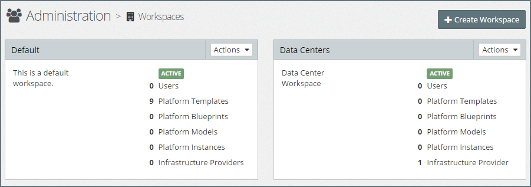
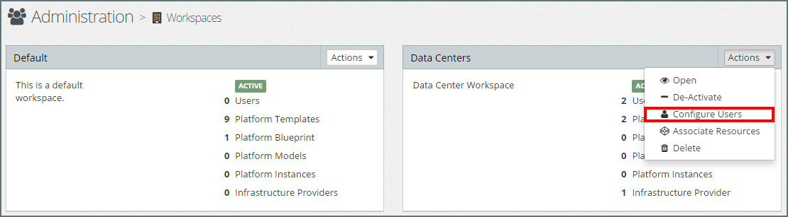
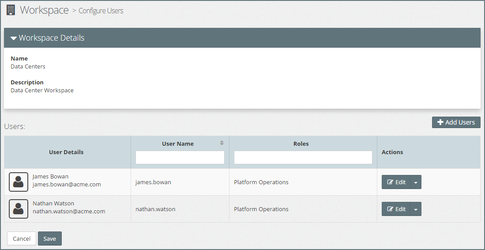
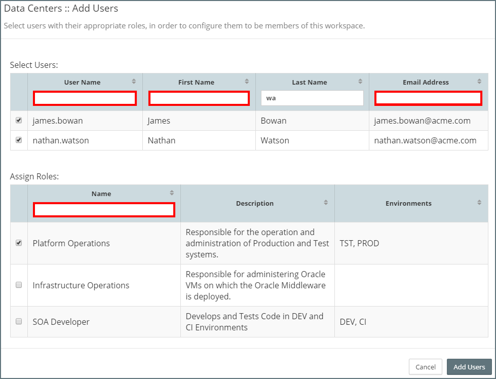
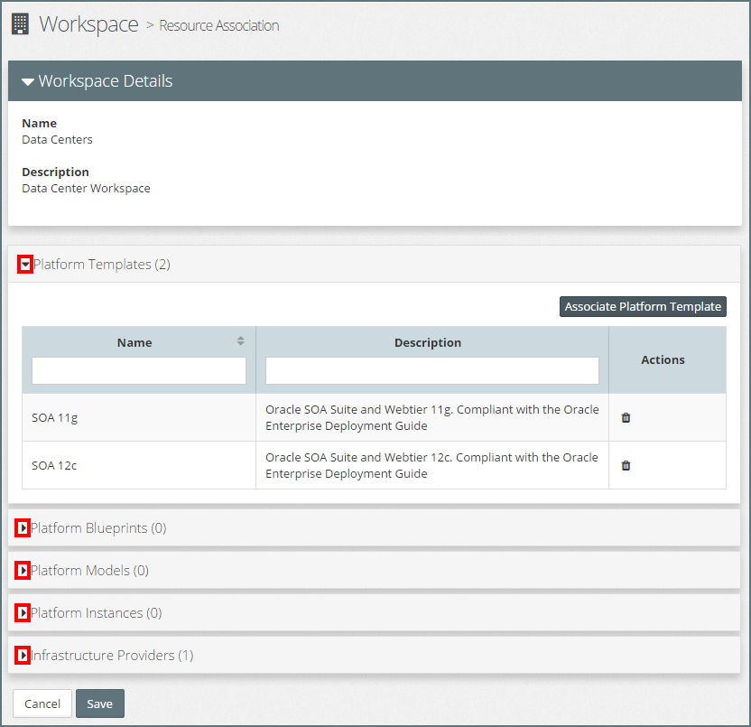
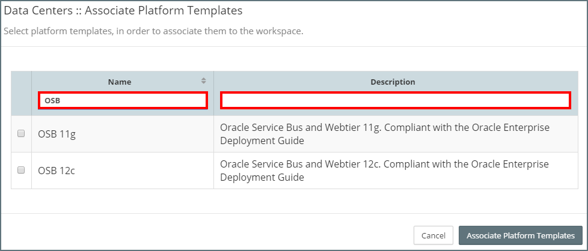

## {{ page.title }}

MyST Workspaces provide a flexible way to control which resources in MyST a user has access to and what actions a user can perform against each resource type.

Each resource within MyST can be associated with one or more workspaces. When a user is assigned to a workspace, they are assigned one or more Roles. The role defines what actions the user can perform against resources associated with that workspace.

**Note:** when a user is assigned multiple roles, they receive the combined set of access permissions defined by their assigned roles. 

Workspaces are typically used to associate users with particular work streams within an organization. These could be project based, for example, an SOA development project, or team based, for example, the Middleware Operations team. 

When a resource is first created, the user must specify which Workspace(s) the resource should be associated with. This can only be a workspace where the user has the appropriate privileges to create a resource of that type.

Once created, any changes to which workspaces a resource is associated with need to be done using the **Associate Resources** dialog under Workspace Administration.

### List Workspaces
To see a list of MyST Workspaces, click  `Administration` > `Workspaces`. This will display a tiled view of Workspaces similar to the one below.

For each workspace, MyST provides a summary of the number of resources contained in the workspace, including:
* Users
* Platform Templates
* Platform Blueprints
* Platform Models
* Platform Instances
* Infrastructure Providers

### Creating a New Workspace
Click `+ Create Workspace`, this will open the **Add Workspace** dialog. Specify the following values:

* **Name:** Name of the Workspace
* **Description:** Description of the Workspace

Click `Save` to create the Workspace. Once saved we can configure workspace users and associate resources with the workspace.

### Configure Users
To configure workspace users, click on the  **Actions** drop-down menu for the corresponding Workspace and select `Configure Users`, as illustrated below. 

This will open the **Configure Users** dialog.

#### Add Users
To add new users to the Workspace, click `+ Add Users`. This will open the **Add Users** dialog which will display the list of users and roles defined to MyST.

The list can be filtered/sorted by User Name, First Name, Last Name or Email Address by entering the filter criteria in the filter fields (outlined in red in the above screen-shot).

To choose the user(s) we wish to add to the workspace, simply select the corresponding checkbox for each user required.

Once selected the next step is to choose the roles we wish to assign to the selected users. The role list can be filtered/sorted by role Name by entering the filter criteria in the filter fields.

To specify the roles(s) we want to provide to the selected users, simply check the corresponding check box for each role required.

Once we have specified the users and their corresponding roles, click `Add Users` to confirm our selection and return to the `Configure Users` dialog. From here we **must** click `Save` to save our changes to the Workspace.

**Note:** we can select a user who is already assigned to the workspace, for example, if we want to assign them another role.

#### Edit User Roles
To edit roles assigned to a user account, click on the `Edit` button for the corresponding user. This will open the **Edit User Roles** dialog. This will display the list of roles defined to MyST and indicate which of these roles are currently assigned to the user.

To add or remove roles from the user, simply set the corresponding checkbox for each role as required. Once done, click `Edit User Configuration` to confirm our selection and return to the main `Configure Users` dialog. From here we **must** click Save to save our changes to the Workspace.

#### Delete User
To delete a User from the Workspace, click on the  **Actions** drop-down menu for the corresponding User and select `Delete`. We will be prompted to confirm our action, click `Yes` to proceed. From here we **must** click Save to save our changes to the Workspace.

### Associate Resources
Users within a Workspace are only granted access privileges against resources that are associated with the workspace. 

**Note:** Resources can be associated with multiple workspaces.

When we first create a resource, we need to specify the workspace(s) to which we want to associate the resource. Once created, then if we want to associate the resource with additional workspaces or remove its association with a workspace, we perform this activity as part of Workspace Administration.

Within Workspace Administration, click on the  **Actions** drop-down menu for the corresponding Workspace and select `Associate Resources`. This will open the **Associate Resources** dialog.

For each *Resource Type*, MyST will provide a summary of the number of resources associated with this workspace and by default expand the Platform Templates section to list the Platform Templates associated with the Workspace.

Click on the corresponding `>` expand icon (outlined in red above) to expand the resource type you are interested in.

#### Add Resource Association
To add a Resource Association expand the corresponding resource type and click on `Associate <Resource Type>` (for example `Associate Platform Template`). This will open the corresponding `Associate <Resource Type>` dialog.

The list can be filtered/sorted by Name and Description, by entering the filter criteria in the filter fields (outlined in red above).

To choose the resource(s) we wish to associate with the workspace, simply select the corresponding checkbox for each user resource.

Once we have specified the resources, click `Associate <Resource Type>` to confirm our selection and return to the main `Associate Resource` dialog. From here we **must** click Save to save our changes to the Workspace.

#### Delete Resource Association
To delete a Resource Association, expand the corresponding resource type and click on the delete icon in the *Actions* column. This will remove the corresponding resource association from the Workspace. Finally, click `Save` to save our changes to the Workspace.

### Edit Workspace
To edit a workspace, click on the **Actions** drop-down menu for the corresponding Workspace and select `Open`, this will open the **Edit Workspace** dialog.

Here you can modify the Name and Description of the Workspace. Once done, click `Save` to confirm your changes.

### Activate / Deactivate Workspace
By default, when you create a Workspace, it is in an active state. We can deactivate a Workspace at any time. Deactivating a Workspace does not remove any workspace roles a user has been granted but deactivates the permissions they have been granted through that role.

A deactivated workspace can be reactivated at any time, at which point any user assigned a role within that workspace will receive back the corresponding access permissions.

To deactivate a Workspace, click on the  **Actions** drop-down menu for the corresponding Workspace and select `Deactivate`.

To activate a deactivated environment, click on the **Actions** drop-down menu for the corresponding Workspace and select `Activate`.

### Delete Workspace
To delete a Workspace, click on the **Actions** drop-down menu for the corresponding Workspace and select `Delete`. MyST will prompt us to confirm out action, click `Yes` to proceed.

**Note:** You will need to delete all Resource Associations from a Workspace prior to deleting it.
