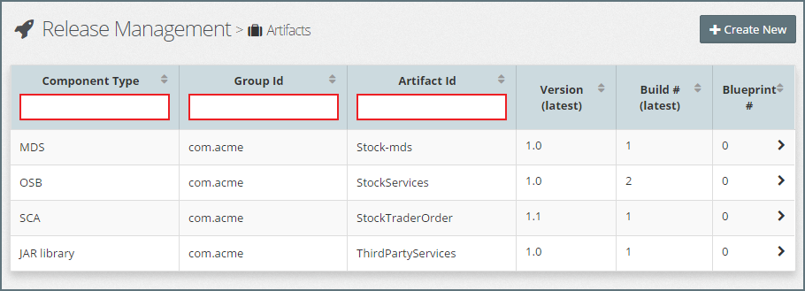
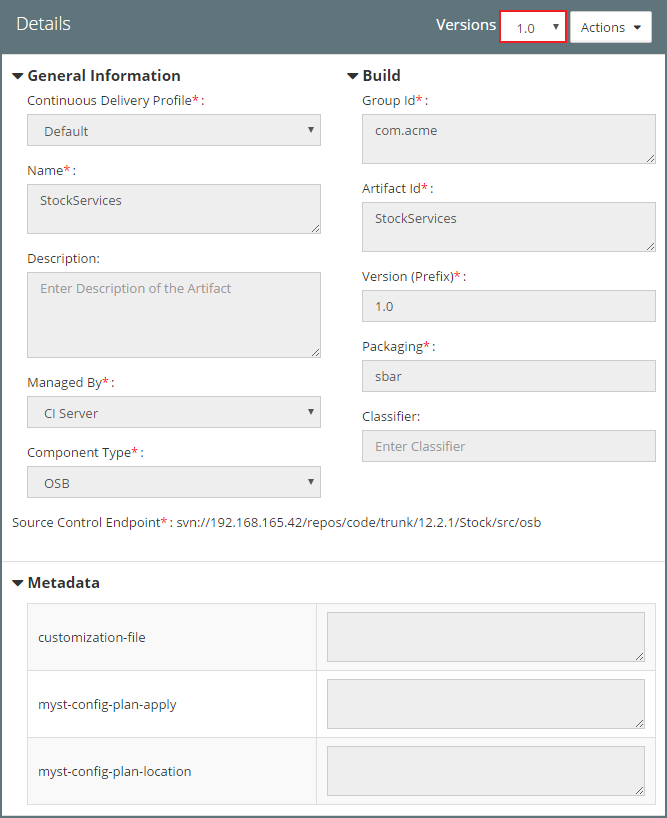
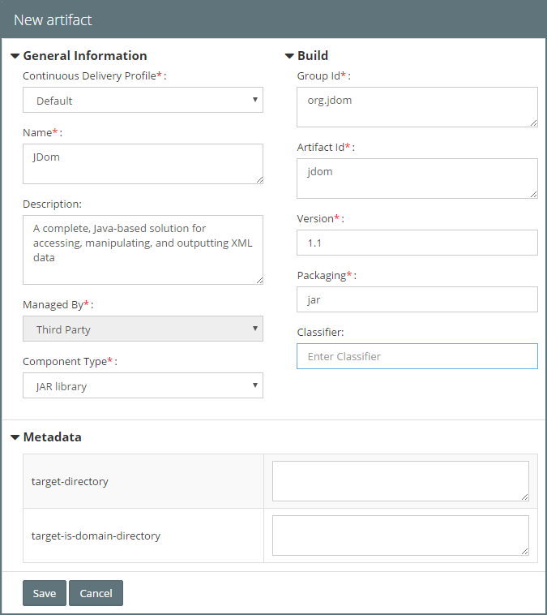
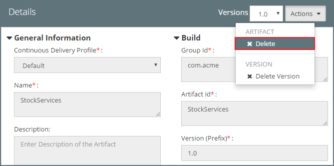

## {{ page.title }}

Before an artifact can be deployed, it must first be registered with MyST. There are two methods for registering an artifact, these are:
* **CI Server Registration** - Used for registering artifacts that are built by the CI Server as part of the build process.

* **Third Party Registration** - Used for registering artifacts that are built by a third party, for example commercial or open source libraries.

### List Artifacts
From the side menu, navigate to`Release Management` > `Artifacts`. This will display a list of existing Artifacts, similar to the one below.

For each artifact, MyST displays the following summary information:
* **Component Type** - This is the type of artifact, for example, OSB, SCA, MDS, JAR and so on.
* **Artifact Group Id** - The maven group id of the artifact
* **Artifact Id** - The maven artifact id of the artifact
* **Version (latest)** - The latest version number of the artifact
* **Build # (latest)** - The latest build number for the latest version of the artifact
* **Blueprint #** - The number of Application Blueprints that contain the artifact

We can filter this list on Component Type, Artifact Group Id, and Artifact Id by entering the filter criteria in the corresponding filter fields (outlined in red).

### View Artifact Details
If we select an artifact from the list, MyST will display detailed information about the artifact.

If multiple versions of the artifact exist, we can select the artifact version in the drop-down (outlined in red above).

For each Artifact, MyST holds the following information:
* **General Information** - Basic details about the artifact.
* **Build** - The Maven build information about the artifact.
* **Metadata** - Metadata used by MyST to manage the deployment and configuration of the artifact.

This is detailed further below.

#### General Information
This provides basic information about the artifact, including:
* **Continuous Delivery Profile** - The Continuous Delivery Profile to which the artifact is registered. This is used to determine the Software Repository that the artifact has been published to and, in the case of CI Server managed artifacts, the source code repository for the artifact.
* **Name** - The artifact name.
* **Description** - An optional description of the artifact.
* **Managed By** - Set to either `CI Server` or `Third Party` to indicate who is responsible for building and registering the artifact.
* **Component Type** - The Artifact type, for example, OSB, OSB Custom XPath, SCA, Java EAR, JAR Library, MDS and so on.

#### Build
This provides the following build information about the artifact, and is used by MyST to locate the artifact within the software repository:
* **Artifact Group Id** - The Maven group id of the artifact. 
* **Artifact Id** - The Maven artifact id of the artifact. 
* **Version** - The Maven artifact version.
* **Packaging** - The artifact packaging type, for example, jar, sbar, sar, ear, and so on.
* **Classifier** - Optional maven classifier for the artifact.

#### Metadata
This shows the artifact metadata which is used by MyST to manage the deployment and configuration of the artifact. The actual metadata is dependent on the artifact type, for example the following metadata is configurable for a SCA Composite.
* composite.configuration-plan
* composite.name
* composite.partition
* composite.redeploy
* composite.revision
* keepInstancesOnRedeploy
* soa.policies
* soa.service-client
* soa.service-endpoint
* soa.subject

The metadata is detailed further in the [Artifact Types and Properties](/appendix/artifact/README.md) section.

### Register Third Party Artifact
As part of any application, we may want to include third party artifacts, for example, commercial or third party open source libraries. These artifacts are typically provided as pre-built libraries.

To use MyST to manage the deployment of these pre-built artifacts, we need to first upload the artifact to our Software Repository and then register it with MyST.

From the side menu, navigate to`Release Management` > `Artifacts`. Click `Create New`, this will open the **New Artifact** dialog. Here we need to specify the **General Information**, **Build** and **Metadata** details as covered above.

> The property `Managed By` will automatically set to `Third Party`.

Click `Save` to register the third party artifact.

#### Edit Third Party Artifact
To edit the `Metadata` properties for a third party artifact, open the artifact from artifact list. Make the required changes and click `Save`.

#### Register New Version of Third Party Artifact
To register a new version of a third party artifact, open the artifact from artifact list and click `Save as new version`. MyST will save a new version of the Artifact.

### Delete Artifact
To delete an `Artifact` from MyST, open the artifact from artifact list and click on the `Actions` drop-down and select `Delete`.

MyST will prompt you with the message `Do you want to delete this artifact and its versions permanently?`. Click `Yes` to continue.

> Only artifacts that are not contained within an Application Blueprint can be deleted.

> Deleting Artifacts from MyST only removes the Artifact Registration details from MyST, the actual artifact contained within the Software Repository is not removed.

### Delete Artifact Version
To delete a specific version of an artifact from MyST, open the artifact from artifact list, ensure the appropriate artifact version is selected, click on the `Actions` drop-down and select `Delete Version`.

MyST will prompt you with the message `Do you want to delete this artifact version?`. Click `Yes` to continue.

> MyST will only allow deletion of an artifact version from artifacts that contain two or more versions.

> Only artifact versions that are not contained within an Application Blueprint can be deleted.

