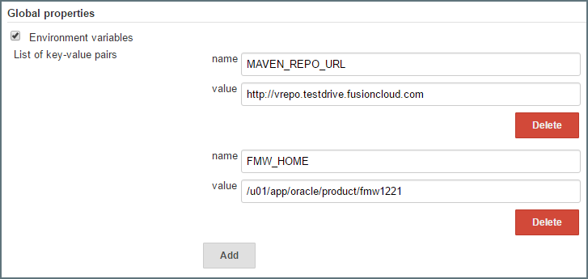
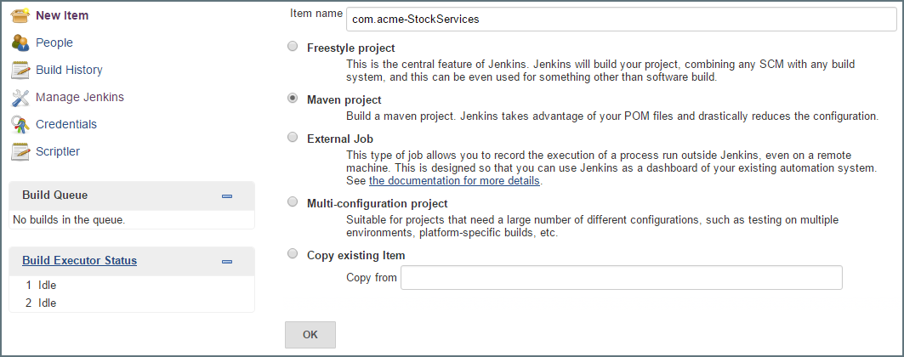
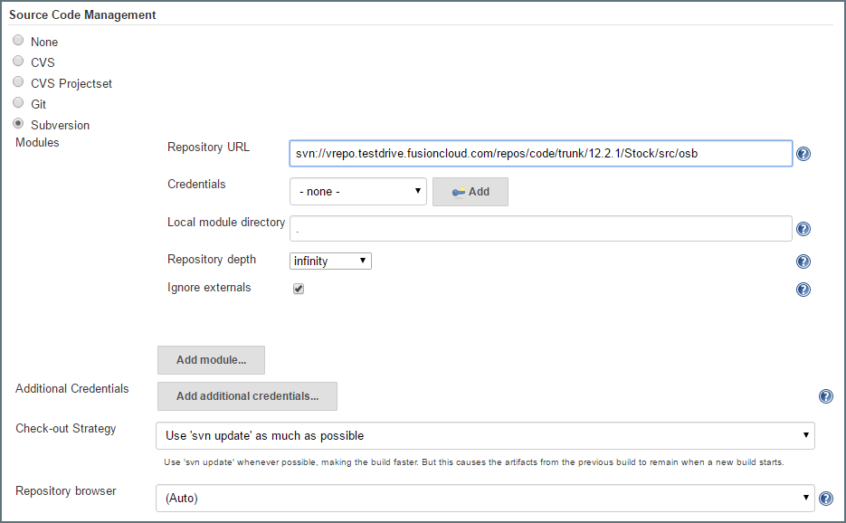
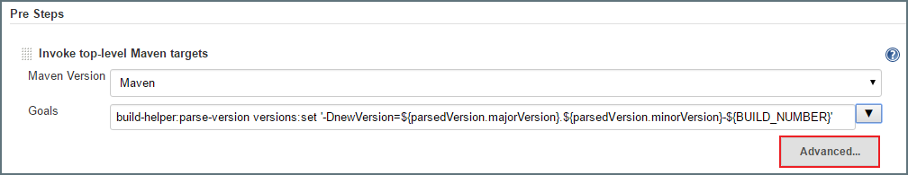
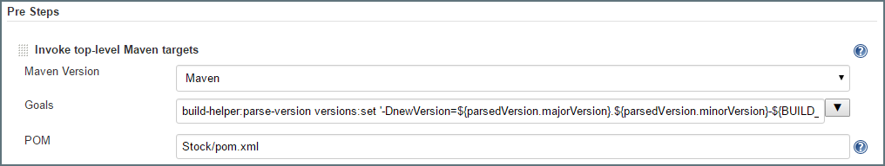
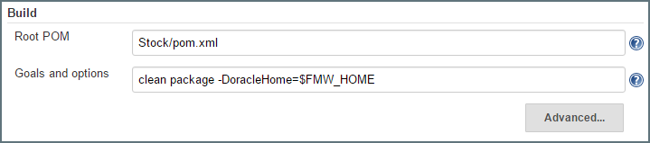
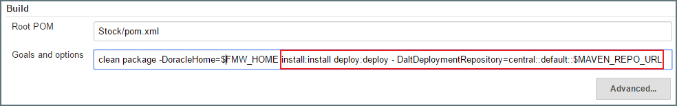
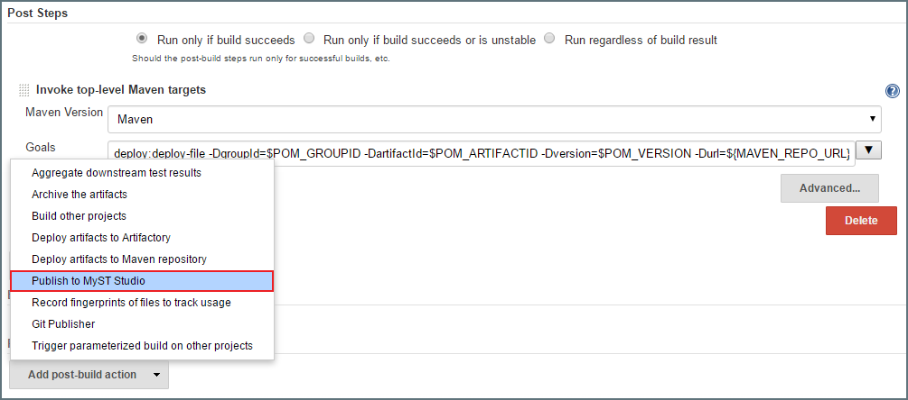
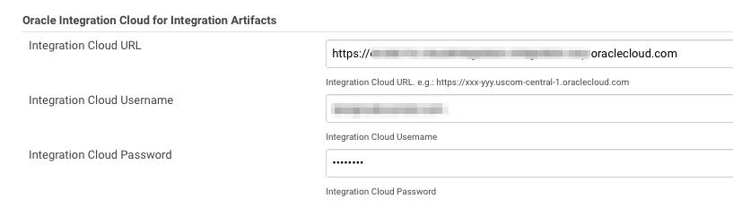
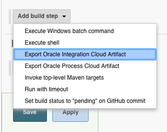

## {{ page.title }}

<!-- toc -->

In this section, we cover how to configure an automated build job in Jenkins, this will perform the following steps:
* Periodically poll our source code repository for new code commits.
* On detection of a new code commit, initiate Maven to build and package the code.
* Publish the packaged code (or artifact) to a Software Repository, such as Artifactory, Nexus or Archiva.
* Register the artifact with MyST.

### Prerequisites

Before performing a SOA, OSB or ADF build it assumed that:
1. the Oracle products are installed on our CI server and
2. the local or remote Maven Repository used by the CI server has been pre-seeded with the required Oracle Maven dependencies as described in [Configuring Maven Builds](/build/maven/README.md).

### Setup global variables in Jenkins
To simplify the on-going configuration of jobs in Jenkins, we recommend defining a couple of global properties. Log into the Jenkins console, click on `Manage Jenkins` and select `Configure System`.

Locate the `Global properties` section and click on the `Environment variables` checkbox if not already selected. Then click `Add` to add the following variables.

* **MAVEN_REPO_URL** -  This is the URL of the Software Repository (such as Artifactory, Nexus or Archiva) that we will publish our built artifacts to.

* **FMW_HOME** - The location of the Oracle Fusion Middleware Oracle Home where the Oracle Middleware is installed.



Click `Save`. We will re-use these variables later in our automated jobs.

### Create Automated Build Job
From within the Jenkins console, click on `New Item`. In `Item Name` enter an appropriate name for our Maven build job. Next select `Maven project` as job type.



Click `OK`.

#### Specify Source Code Location
Under `Source Code Management` select your source code repository type (such as  Subversion or Git). For the URL, enter the full path to the JDeveloper project directory in our source code repository.



We can leave all the other fields with default values.

> When checking out an Oracle OSB project we need to specify the project's parent directory, this is due to a constraint with the Oracle OSB Maven build which needs to take the deployment URI from the parent directory.

> This means, when Jenkins checks out the project, by default it will look for the POM file in the parent directory, so we need to specify the relative path to the POM file in the project sub-directory.


#### Configure Build Triggers
Under `Build Triggers` tick `Poll SCM` and enter the schedule, for example, a schedule of `H/10 * * * *` means to poll every ten minutes.

#### Add Pre-Build Step
Click on `Add pre-build step` and then select `Invoke top-level Maven targets`

Select Maven as the Maven Version and enter the following into the Goals field:

```
build-helper:parse-version versions:set '-DnewVersion=${parsedVersion.majorVersion}.${parsedVersion.minorVersion}-${BUILD_NUMBER}'
```
This tells Maven to always append the build number to the artifact version.



Click on `Advanced...` below the step. For POM specify the location of the `pom.xml` file relative to the URL we set under `Source Code Management`.



> Normally this will be just `pom.xml`, but in the case of OSB projects, we need to specify this in the format `<osb_project-dir>/pom.xml`

#### Configure Build Step
Go to the `Build` section. For the `Root POM` specify the location of the `pom.xml` file relative to the URL we set under `Source Code Management`.

> Normally this will be just `pom.xml`, but in the case of OSB projects, we need to specify this in the format `<osb_project-dir>/pom.xml`

For the Goals and options field enter `clean package -DoracleHome=$FMW_HOME`.



Click `Save`. This will take us to the main job screen for our newly created job.

### Execute Build Job
To test that the job is executing correctly, either wait for Jenkins to initiate the job according to the specified schedule or click `Build Now` to manually trigger the job.

This will take us back to the main job screen.
Once initiated, click on the progress bar to see the Console Output.

> The first time Jenkins executes a build job for a particular component type, Maven has to download all of the build dependencies, as a result the initial execution can take a while, future builds should be significantly faster.

### Update Build Job to Publish to Artifactory
Once our build job is performing as expected, we need to modify it to publish the built artifact to our software repository.

From the main screen for our build job, click `Configure` to return to the configuration screen.

Navigate to the `Build` section and add the following to the end of the `Goals and options` field:

```
install:install deploy:deploy - DaltDeploymentRepository=central::default::$MAVEN_REPO_URL
```



### Update Build Job to Register Artifact with MyST Studio
Once our build job is performing as expected, we need to modify it to register the built artifact with MyST.

From the main screen for our build job, click `Configure` to return to the configuration screen.

Navigate to the `Post-build Actions` section at the bottom of the page. Click on `Add post-build action` and then select `Publish to MyST Studio`.



Make sure the `Active` box is ticked.

Click `Save` to save our changes and return from to main job screen within Jenkins.

#### Validate Registration with MyST
Click `Build Now` to manually trigger the job. Click on the progress bar for the job that appears in the `Build History` and go to the Console Output.

Once the job completes, at the end of the output we should see output similar to the following
```
{
  "buildNumber": "3",
  "startTime": "2016.06.09 at 04:24:45 UTC",
  "endTime": "2016.06.09 at 04:25:32 UTC",
  "status": "SUCCESS",
  "component": {
    "componentType": "ofmw-osb",
    "description": "",
    "mavenModel": {
      "groupId": "com.acme",
      "artifactId": "StockServices"
    },
    "binaryVersion": "1.0-3",
    "managedBy": "CI_SERVER",
    "buildStatus": "BUILT",
    "metadata": {
      "artifact.repository.type": "sbar"
    },
    "name": "StockServices",
    "topLevel": true
  },
  "scmState": {
    "url": "svn://vrepo.testdrive.fusioncloud.com/repos/code/trunk/12.2.1/Stock/src/osb",
    "branch": "NA",
    "commit": "3"
  }
}
```
Your artifact has now been published to MyST Studio. See section [Artifact Management](/build/artifacts/README.md) for details on how to view this artifact in MyST Studio.

### Jenkins Plugin for Oracle PAAS

Oracle PAAS services can be exported to an archive that can then be promoted into multiple environments. To simplify this process, Rubicon Red provide a Jenkins plugin that can be used for the automatic registration of Oracle PAAS Artifacts directly from the Cloud runtime to MyST Studio.

The plugin is currently in BETA. We are continually looking to improve it. If you have any feedback on the plugin, please share it via [Rubicon Red Support](http://support.rubiconred.com/).

#### Currently Supported Artifact Types

* Oracle Integration Artifacts for OIC
* Oracle Process Artifacts for OIC

#### How to install the plugin

1. Login to the MyST website
2. Download the plugin from [here](https://myst.rubiconred.com/webhelp/installer/release/oracle-integration-cloud-jenkins-plugin.hpi)
3. Install the Plugin into Jenkins

#### How to setup the plugin (one-time configuration)

Before using the plugin, we must first point to our chosen Oracle PAAS environments for design-time. This may also be known as our "Development" or "Configuration Integration" environment.

This one-time configuration is configurable under **Manage Jenkins** then **Configure System**.



We can define a separate Integration Cloud for **Integration Artifacts** and **Process Artifacts** or we can set them both to point to the same instance.

Once this is established, users can a create Jenkins freestyle build job and use the plugin to automatically allow a given artifact to be:

1. pulled from a given Oracle PAAS service
2. packaged as a Maven artifact
3. pushed to MyST Studio.

#### Using the plugin from a Jenkins freestyle build job

From the freestyle build configuration screen under **Build** click on **Add build step** and choose the desired action. Currently the options are:

- Export Oracle Integration Cloud Artifact
- Export Oracle Process Cloud Artifact



It is recommended to create a separate job for each artifact that needs to be exported.
