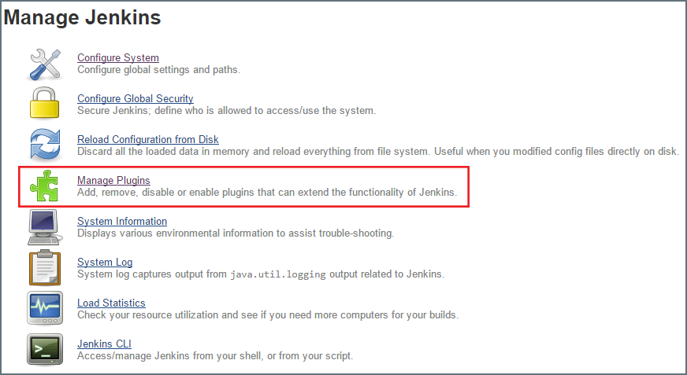
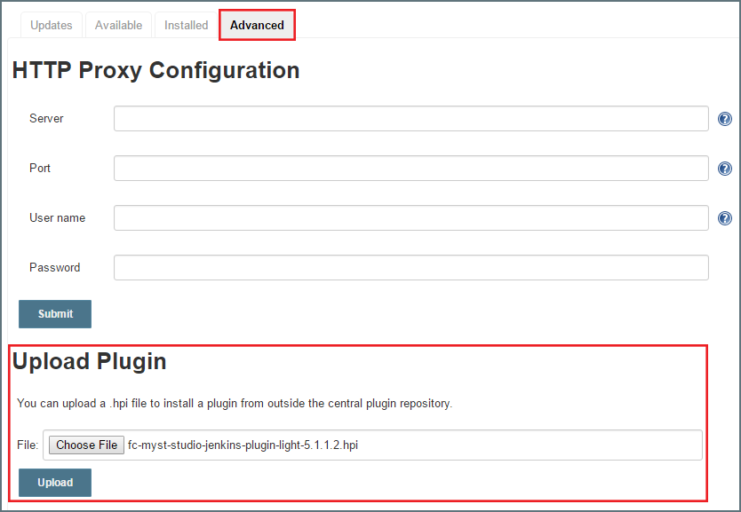
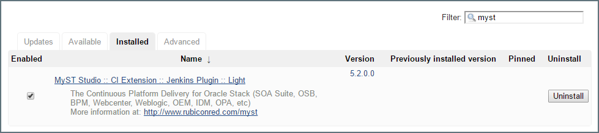
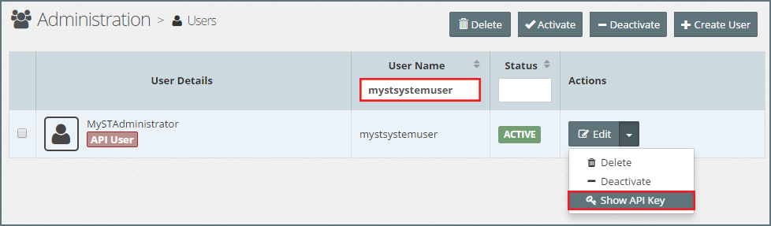
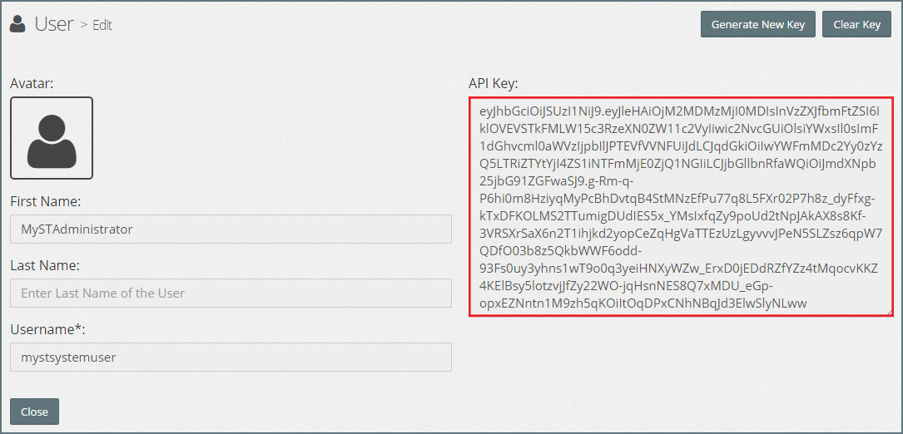
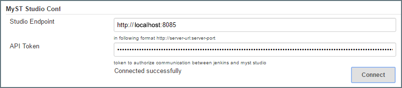

## {{ page.title }}

As part of the build process, we require Jenkins to publish details of each artifact build to MyST Studio. To enable this, we need to install and configure the MyST Studio plugin for Jenkins.

#### Install MyST Plugin
The first step is to install the MyST Studio plugin for Jenkins. To do this, go to the  MyST Documentation site and download the MyST Studio Plugin for Jenkins (hpi). Ensure that the version of the plugin selected is the same as the version of MyST Studio being used.

Once downloaded, log into Jenkins and select `Manage Jenkins`. 

Next, select `Manage Plugins` and select the `Advanced` tab. Scroll down to the `Upload Plugin` section. Click on `Choose File` and browse to and select the plugin that we downloaded in the previous step.

Jenkins will upload and install the plugin. We will need to restart our Jenkins instance once the plugin has been uploaded.

After restarting Jenkins, to validate that the plugin has been successfully installed, go to the `Manage Plugins` page and select the `Installed` tab.

Enter `myst` in the `Filter` criteria and we should be able to see the installed MyST plugin as shown below.

#### Retrieve the API key from MyST Studio
The next step is to retrieve the API Key for connecting to MyST Studio. Login to MyST Studio and from the side menu navigate to `Administration` > `Users`, this will display the list of MyST Users. Locate the `mystsystemuser` - we can filter on `User Name` to make this simpler.

Click on the down arrow next to the `Edit` button of the MyST System User (API User) and select `Show API Key`. This will display the user details including the `API Key`.

Take a copy of the API Key. We will use this in the next step to configure Jenkins. 

> A new key may also be generated by clicking `Generate New Key`.

#### Configure MyST Plugin
Within Jenkins, click on `Manage Jenkins` on the left-hand side of the screen then select `Configure System`.

Scroll down to the MyST Studio Configuration section and enter the following information:
* **Studio Endpoint** - This is the URL for MyST Studio and takes the format `http://<myst-server-url>:<server-port>`. The default server port is 8085.

* **API Token** - This token is used to authorize communication between Jenkins and MyST Studio and is the API Key that we obtained from MyST Studio in the previous section.

Next, click `Connect`. The MyST Studio plugin will attempt to connect with MyST Studio. If the connection is successful, the message `Connected successfully` will be displayed.

Once done, click `Save` to save your configurations within Jenkins.