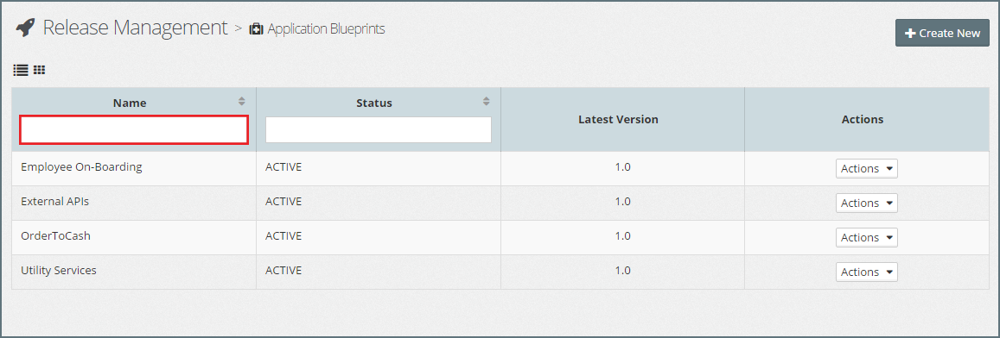
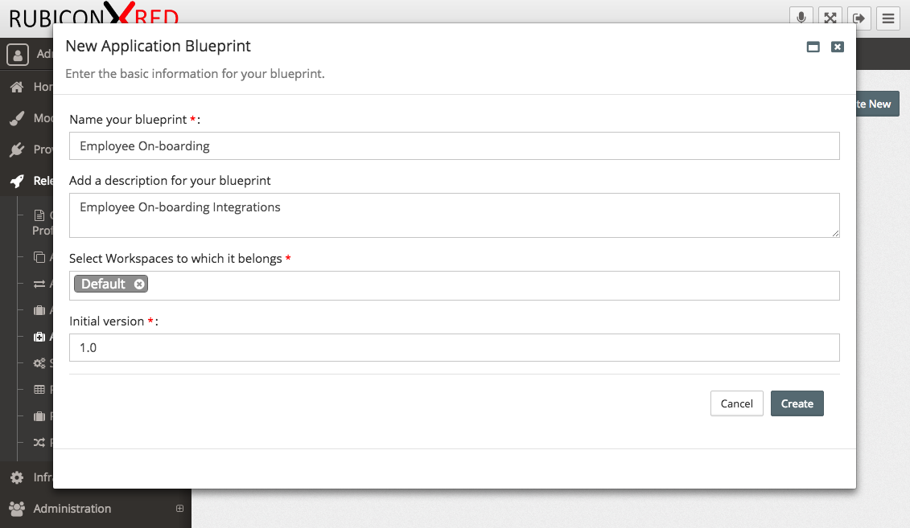
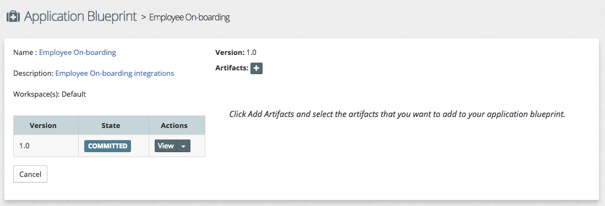
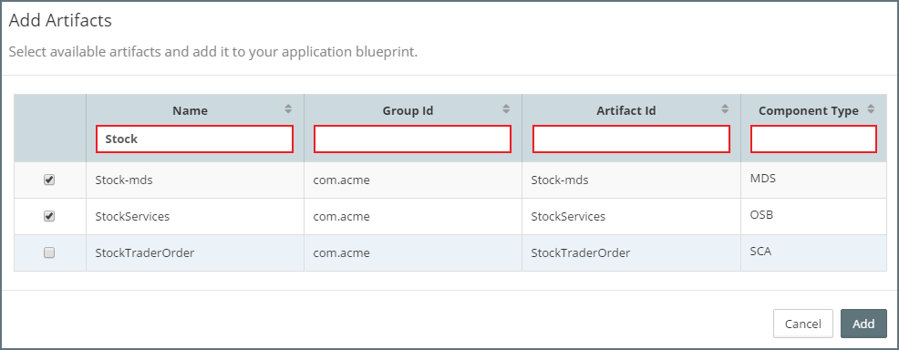
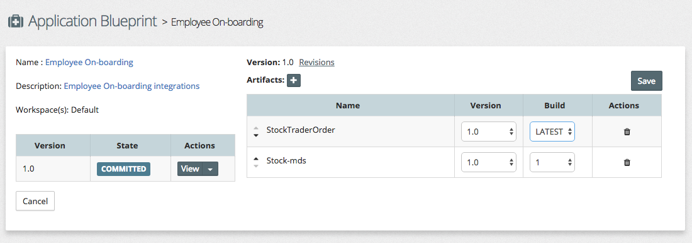
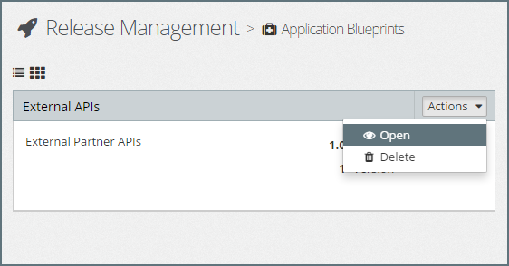
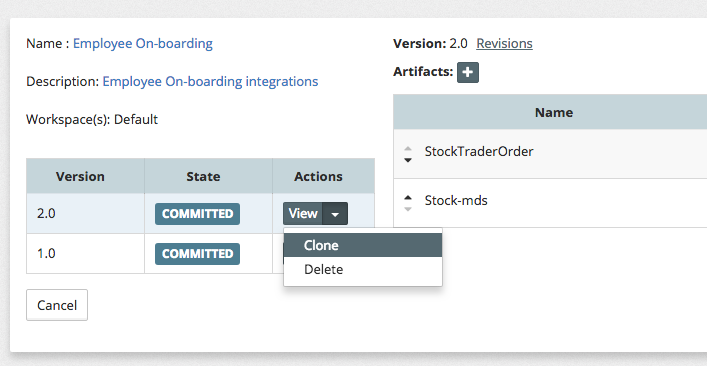
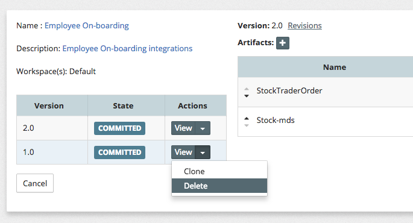

## {{ page.title }}

### List Application Blueprints
From the side menu navigate to`Release Management` > `Application Blueprints`, this will display a list of existing Application Blueprints, similar to the one below.

By default, MyST will display the list of Application Blueprints using the `Card view`. To switch to the list view, click on the `List View` icon (outlined above in red). MyST will display the Applications Blueprints in a list, as illustrated below.

In the list view, we are able to filter the list by typing part of the Application Blueprint name in the `Name` filter (outlined above in red).

### Create Application Blueprint
Click `+ Create New`, this will open the **Application Blueprint** dialog. Here we need to specify the following values:

* **Name** - Shorthand name for the Application Blueprint
* **Description** - A longer description of the Application Blueprint
* **Version** - Specifies the initial version of the Application Blueprint. See Application Blueprint versioning for further details.

Next, we need to add the required artifacts to our application blueprint. Click on the `+` icon next to `Artifacts`, this will open the `Add Artifacts` window, which by default will list all artifacts available.

For each artifact, MyST displays the following information:
* **Name** - The artifact name
* **Group Id** - The maven group id of the artifact.
* **Artifact Id** - The maven artifact id of the artifact.
* **Component Type** - This is the type of artifact, for example, OSB, SCA, MDS, JAR and so on.

We can filter this list by one or more of these values by entering the filter criteria in the corresponding filter fields (outlined in red).

To add an artifact, simply select its checkbox; to remove an artifact from an Application Blueprint, deselect it.

Once happy with the selection click `Add`. This will return us to our Application Blueprint where we can see the list of Artifacts that we have added.

For each artifact selected, we need to specify
* **Version** - This is the artifact binary version.
* **Build No** - The build number of the artifact. Notice it defaults to the LATEST build number. If we want to lock the artifact down to a specific build, we can select a specific Build number.

Optionally, we can order the artifacts if we require them to be deployed in a certain order.

Once we are happy with the content of our Application Blueprint, click `Save`.

### Editing Application Blueprint
Over the Application Lifecycle, we can have multiple **versions** of an Application Blueprint. Typically we would have a maximum of two versions under development at any point in time: one for main development (like a trunk in version control) and another one optionally for patches (like a production fix for an earlier version of the Application Blueprint deployed into Production).

Each time we edit the artifacts within an Application Blueprint Version, or a new build of an artifact contained within an Application Blueprint is published, MyST automatically creates a new revision. These revisions are tracked through the Release Pipeline so we can determine exactly what is deployed into each environment at any point in time.

To edit an Application Blueprint, go to the list view, click on the `Actions` drop-down for the corresponding Application Blueprint, and select `Open`. This will open the Application Blueprint editor.

When we open an Application Blueprint, the editor defaults to the latest version of the Application Blueprint. We can select `View` next to a different version to change to an earlier version.

Within the editor we can update the Application Blueprint **Name** and **Description**; it should be noted that these are held at the Application Blueprint level, not at the version level, meaning any changes to these values will be reflected across all versions of the Application Blueprint.

We can also add, delete or edit the list of artifacts contained within an Application Blueprint. These changes are version specific and will result in a new revision of the Application Blueprint.

#### Create New Application Blueprint Version from Existing
To create a new version of an Application Blueprint, we need to open an existing version of the Application Blueprint.

Next we need to click on a previous version that we wish to base our new version from and select `Clone` from the available `Actions`. MyST will prompt us to provide the new version number for the Application Blueprint. Once entered, click `Create`.

#### Delete Application Blueprint Version
We can delete unpublished Application Blueprint versions which are not included within a Release Pipeline.

To delete a specific version of an Application Blueprint, open it in the Application Blueprint editor, and select `Delete` from the available `Actions` next to the version you wish to delete.

MyST will prompt us with the message, `You are about to delete this version permanently. OK to proceed?`. Click `Yes` to continue.

### Delete Application Blueprint
We can delete unpublished Application Blueprints as long as none of its versions are included within a Release Pipeline.

To delete an Application Blueprint, go to the list view, click on the `Actions` drop-down for the corresponding Application Blueprint, and select `Delete`.

MyST will prompt us with the message `Do you want to delete this application blueprint?`. Click `Yes` to continue.

> When we delete an Application Blueprint, **ALL** versions of the Application Blueprint will be deleted.
