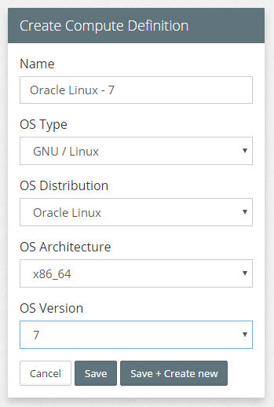
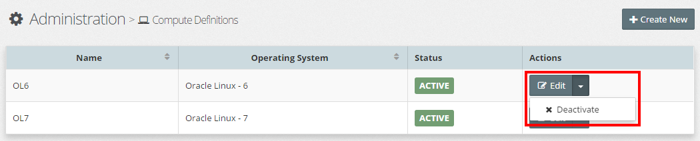

# Compute Definitions

When Creating a Platform Blueprint

Compute Definitions define what the target OS environment details are within our environment.

Compute definitions contain the operating system requirements for the infrastructure that you define in your blueprint. A compute definition is assigned to compute groups and hosts. Only the hosts that match the compute group operating system requirements can be assigned to the compute group in a blueprint.

You can deactivate a compute definition if you do not want to use it as part of your infrastructure definitions. Deactivating a compute definition does not affect the compute groups or hosts that are mapped to the definition. However, you can not assign the compute definition to any compute group or host after it is deactivated. Only active compute definitions are shown in the list when you want to assign it to a host or compute groups.

## List Compute Definitions
To see a list of defined Environment Types, click  `Infrastructure` > `Compute Definitions`. This will display a list similar to the one below.

## Creating a New Compute Definition
Click `+ Add New`, this will open the **Add Compute Definition** dialogue. Specify the 

 * **Name** - Name of your compute definition.
 * **OS Type** - The operating system type that you want as part of your compute definition.
 * **OS Distribution** - Select the operating system of your compute definition.
 * **OS Architecture** - Select the operating system architecture of your compute definition.
 * **OS Version** - Select the version of the operating system for your compute definition.

Click `Save` to create the new Compute Definition. You can also click `Save + Add New` to immediately create a new compute definition after saving the current one.

## Edit Compute Definition
To edit the Compute Definition; click on the `Edit` button for the corresponding Compute Definition, this will open the **Edit Compute Definition** dialogue.

Here you can modify the Name and Status of the Compute Definition.

## Activate / Deactivate Compute Definition
By default, when you create a Compute Definition, it is in an active state. Meaning we can create Platform Blueprints and Models that reference that Compute Definition.

To prevent any new Blueprints / Models reference a Compute Definition, we can deactivate the reference that Compute Definition.

**Note**: 
* Deactivating a Compute Definition does not affect resources that already reference that Compute Definition.
* A deactivated Compute Definition can be reactivated at any time.

To deactivate a Compute Definition; click on the  **Actions** drop-down menu for the corresponding Compute Definition and select `Deactivate` as illustrated below.

To activate a deactivated Compute Definition; click on the  **Actions** drop-down menu for the corresponding Compute Definition and select `Activate`.