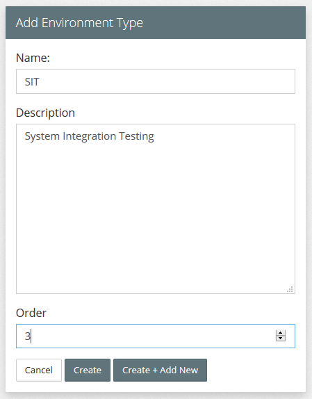
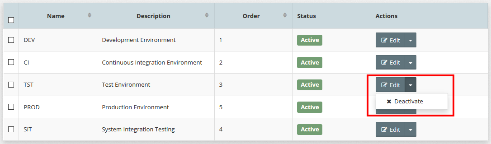

# Environment Types
During the lifetime of a project, code will be built and promoted to various staging environments, such as Development (DEV), System Integration Testing (SIT), User Acceptance Testing (UAT), Pre-Production (PRE), and Production (PROD).

Each of these environments is aligned with different stages of the Software Development Lifecycle (SDLC) and is intended for a specific purpose, for example:
* ** DEV** - Used by developers to develop and unit test there code prior to checking into source control. 
* **BLD / CI ** - Build environment, where committed code is built and unit testing is performed.
* **SIT** - Used to test a system's integration points with  other systems.
* **UAT**-  Business stakeholders test the system against their  business requirements
* **PRE** - Used to test the deployment process, prior to release into production.
* **PROD** - Production environment, where systems finally get deployed to.

For each environment, we need to be able to control who has access to it, and what type of actions they can perform against the environment, for example:

* Who can (re-)provision a platform instance?
* Who is allowed to perform platform configuration changes?
* Who is able to stop/start a platform instance?
* Who is able to deploy / promote code into an environment?

Within MYST any resource that is environment specific, such as a Platform Model, Platform Instance or Application Model is tagged to an Environment Type, this in conjunction with Role Based Access Control (RBAC) allows us to control who can perform which actions in which environment.

In addition target hosts (see Pre-Existing Infrastructure Providers) can be tagged to one or more Environment Types. When we create a platform model, only the hosts tagged to the same  Environment Type as the platform model can be selected within the model.

Environment Types are also used within Application Blueprints to specify which environments and in which order applications should be promoted through.

## List Environment Types
To see a list of defined Environment Types, click  `Infrastructure` > `Environment Types`. This will display a list similar to the one below.

## Creating a New environment type
Click `+ Create New`, this will open the **Add Environment Type** dialogue. Specify the 

* **Name** - Short hand name for the Environment, such as SIT, UAT or PROD
* **Description** - A longer description of the environment (e.g. System Integration Test)
* **Order** - Used to specify the order in which code is deployed in the SDLC

Click `Create` to Save the new Environment Type.

## Edit Environment Type
To edit the Environment Type; click on the `Edit` button for the corresponding Environment Type, this will open the **Edit Environment Type** dialogue.

Here you can modify the Name, Description, Order and Status of the Environment Type.

## Activate / Deactivate Environment Type
By default, when you create an Environment Type, it is in an active state. Meaning we can create new MyST Resources that are tagged to that Environment.

To prevent any new resources being tagged to an Environment, we can deactivate the Environment Type.

**Note**: 
* Deactivating an existing environment type does not affect resources that are currently mapped to the environment type.
* A deactivated Environment Type can be reactivated at any time.

To deactivate an environment; click on the  **Actions** drop-down menu for the corresponding Environment Type and select `Deactivate` as illustrated below.

To activate a deactivated environment; click on the  **Actions** drop-down menu for the corresponding Environment Type and select `Activate`.