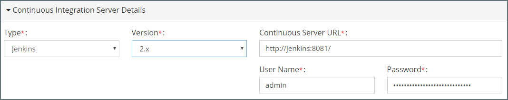

## {{ page.title }}

A continuous delivery profile in MyST is used to configure how MyST should connect to the other components involved in build and deployment process, specifically:
* **Version Control System** - This contains information about the source code management system used for managing artifact source code.
* **Continuous Integration Server** - This is the CI Server, for example, Jenkins, TeamCity, Bamboo that is used to build the artifacts from source code.
* **Binary Repository** - This is the Software Repository, for example, Artifactory, Nexus or Archiva that is used to store the binaries produced by the build.

From the side menu navigate to `Infrastructure` > `Continuous Delivery Profile`, this will display the current Continuous Delivery Profile in view mode. Click on `Edit` in the top right-hand corner of the screen. 

### Configure Version Control System
For the Version Control System, we need to specify the following details:
* **Type** - This can be one of SVN or GIT
* **Version** - This is the release version of the Version Control System we are connecting to.
* **Base URL** - This is the base URL for connecting to the source code repository.
* **User Name** - This is the username to connect to the source code repository.
* **Password** - This is the user credentials for connecting to the source code repository.

### Configure Continuous Integration Server
For the Continuous Integration Server, we need to specify the following details:
* **Type** - This can be one of Jenkins or TeamCity
* **Version** - This is the release version of the CI Server we are connecting to.
* **Base URL** - This is the base URL for connecting to the CI Server.
* **User Name** - This is the username to connect to the CI Server.
* **Password** - This is the user credentials for connecting to the CI Server.

### Configure Binary Repository
For the Binary Repository, we need to specify the following details:
* **Type** - This can be one of Artifactory, Nexus or Archiva.
* **Version** - This is the release version of the binary repository we are connecting to.
* **Repository URL** - This is the base URL for connecting to the binary repository.
* **User Name** - This is the username to connect to the binary repository.
* **Password** - This is the user credentials for connecting to the binary repository.

Once we have configured our Version Control System, Continuous Integration Server, and Binary Repository click `Save` to save the details.