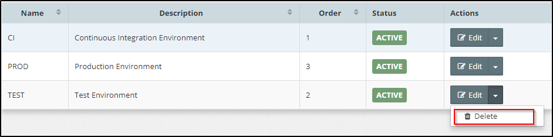

## {{ page.title }}
During the lifetime of a project, code will be built and promoted to various staging environments, such as Development \(DEV\), System Integration Testing \(SIT\), User Acceptance Testing \(UAT\), Pre-Production \(PRE\), and Production \(PROD\).

**Environment Types** are designed to help categorize Oracle Middleware Platform Instances for governance purposes. This categorization can help to manage who has access to instances, and what type of actions they can perform against the instance. For example:

* Who can provision and re-provision a platform instance?
* Who is allowed to perform platform configuration changes?
* Who is able to stop/start a platform instance?
* Who is able to deploy/promote code into an environment?

Within MyST, any resource that is environment specific, such as a Platform Model, Platform Instance, Stream Stage or Application Model, is tagged to an Environment Type. This, in conjunction with Role Based Access Control \(RBAC\), allows us to control who can perform which actions in which environment.

In addition, target hosts \(see Pre-Existing Infrastructure Providers\) can be tagged to one or more Environment Types. When we create a Platform Model, only the hosts tagged to the same Environment Type as the Platform Model can be selected within the model. This makes it simple to restrict the infrastructure that a given Platform can be targeted to.

### List Environment Types

To see a list of defined Environment Types, click  `Infrastructure > Environment Types`. This will display a list similar to the one below.

### Creating a New environment type

Click `+ Create New`, this will open the **Add Environment Type** dialog. Specify the following values:

* **Name** - Shorthand name for the Environment, such as SIT, UAT or PROD
* **Description** - A longer description of the environment \(e.g. System Integration Test\)
* **Order** - Used to indicate the promotion flow for a piece of code to be deployed as it progresses through the Software Development Lifecycle. This can be overridden for each Release Pipeline.
**Allow draft provisioning** - If checked, this would allow platform configuration in `draft` state to be applied to instances created for this environment type. This is mainly intended to be used by developers / platform architects while they are creating their initial platform configuration in a trial-and-error mode.


Note that environments earmarked for draft provisioning cannot be added as `stages` of a release pipeline.


Click `Create` to save the new Environment Type.

### Edit Environment Type

To edit the Environment Type click on the `Edit` button for the corresponding Environment Type. This will open the **Edit Environment Type** dialog.

Here you can modify the Name, Description and Order of the Environment Type. Once done, click `Modify` to confirm your changes.

### Deleting Environment Type

By default, when you create an Environment Type, it is in an active state. This means that we can create new MyST Resources that are tagged to that Environment.

To stop using this environment type, you can delete it using the `Delete` button as illustrated below.

<% hint %>
You cannot delete an Environment Type if it is already associated with any hosts / platform models, etc.
<% endhint %>