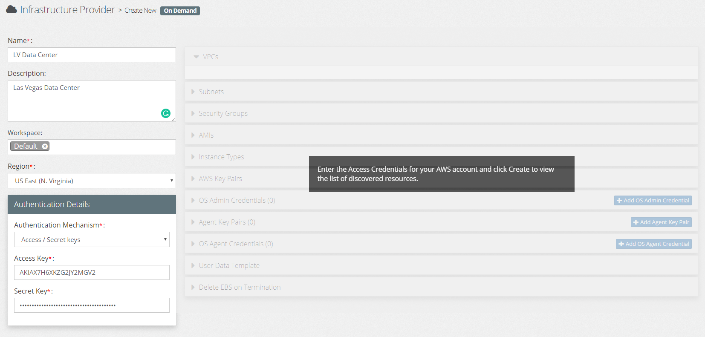
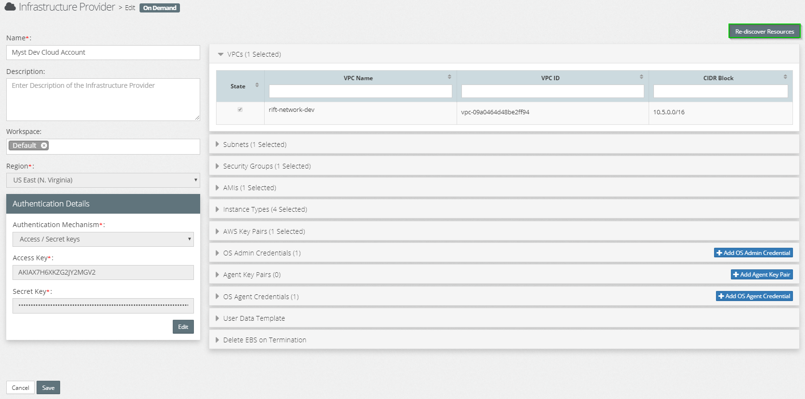

## {{ page.title }}

An On-Demand (AWS) infrastructure provider is one where hosts onto which the Oracle Middleware will be installed are created on-demand as part of the process of provisioning the Oracle Middleware platform. This approach relies upon an Amazon Machine Image (AMI), which is a Virtual Machine template, for creation of target hosts that underpin the Oracle Middleware platforms.

For EC2 instances, you are not _required _ to pre-register hosts in the Infrastructure Providers since these are delivered through Infrastructure-as-a-Service. 
However, if you _want_ to pre-register the hosts, say if different teams are responsible for provisioning the target VM and for provisioning the Middleware, then you can easily do so with the Pre-Existing Infrastructure feature.

### Create On Demand(AWS) Infrastructure
Click `Create New` and select `On Demand(AWS)` from the options provided. This will open the **Create New On Demand** dialog. Here we need to specify the following values:

* **Name:**  Shorthand name for the On Demand Infrastructure Provider
* **Description:**  A longer description of the On Demand Infrastructure Provider
* **Region:**  Select the region to which geographic area your AWS belong.
* **Authentication Mechanism:**  Select the Access / Secret Keys Authentication Mechanism and provide valid Access key and Secret key. 

Click on create. Once you click on create you can see all the information like VPCs, Subnets, Security Groups, AMIs, Instance Types and AWS Key Pairs present in the region with given Authentication Mechanism.

* **VPC(Virtual Private Cloud):**  Select the virtual network where you want to launch or create your Infrastructure.
* **Subnets:**  Select the subnet from the available subnets against the VPC selected.
* **Secuirty Groups:**  Select the Security Group that's created for that VPC selected.
* **AMI(Amazon Machine Images):**  AMI provides the information required to launch an Infrastructure like an operating system, an application server, and applications and permissions that control which AWS accounts can use the AMI to launch instances. Select the AMI based on your requirement.
* **Instance Types:**  Instance Type specifies the hardware of the host computer used for your instance. Each instance type offers different compute, memory, and storage capabilities. Select the instance type based on your requirement.
* **AWS Key Pairs:**   This is the private key content that is accessed securely to access your infrastructure. Select valid AMI and provide the private key content.
* **OS Admin Credentials:** Reserved for future functionality.
* ** Agent Key Pairs:** Used to define all the required key pairs used to connect to the hosts within the Infrastructure Providers. Each Myst Key Pair contains the private key for key pairs that we can use in credentials for the hosts that are part of our Infrastructure Provider.  

  Once we have defined a key pair, we can use it in one or more OS Agent Credentials and OS Admin Credentials.

* **OS Agent Credentials:**  The OS agent credentials is the set of credentials that Myst uses to connect to and execute jobs on the target hosts. Each Credential consists of a username and credential, which can be either a Key Pair or Password.
* **User Data Template:** User Data Template holds the user data which will be run only once during the initial boot of the instance. This can be a set of instructions that has to be run on the instance. To know more about it go through
  * [User Data](infrastructure/providers/on-demand/aws/user-data/README.md)
  
  
* **Delete EBS on Termination:** When an instance is terminated, Amazon Elastic Compute Cloud (Amazon EC2) uses the value of the DeleteOnTermination attribute for each attached EBS volume to determine whether to preserve or delete the volume when the instance is terminated. By default, the DeleteOnTermination attribute for the root volume of an instance is set to true, but it is set to false for all other volume types. To preserve the root volume when an instance is terminated, change the DeleteOnTermination attribute for the root volume to false.

    Once we have defined an OS Agent Credential, we can use it in one or more Hosts. 

#### Add OS Agent Credential
To add an OS Agent Credential, click `Add OS Agent Credential`, specify the following values:

* **Name:**  Shorthand name for the OS Agent Credential
* **SSH User Name:**  The SSH User Name that will be used to connect to the host
* **Connect Using:**  Specifies the type of credentials used to authenticate the SSH user, can be  either `Key Pair` or `Password`
* **Key Pair:**  If `Key Pair` is specified, then select the Key Pair to use from the Drop Down.
* **Password:**  If `Password` is specified, then enter the password to be used to authenticate the user.
* **Run as different user:**  Select this to use **sudo** to enable the Myst agent to run as a different user.
* **Other User Name:**  If `Run as different user` is set to `Yes`. Specify the user account under whose identity the Myst agent will perform all tasks.

    Once we have defined an OS Agent Credential, we can use it in one or more Hosts. 

Click **Save** to save your infrastructure provider.

### Managing the Details

If you want to edit the information click on the On Demand Infrastructure provider you want to change and click on `Re-discover resources`.

Once the changes are made click on **save**.

To create and Provision a Platform Model with this Infrastructure Provider follow the following steps
* [Platform Model On-Demand](/platform/models/on-demand-aws/README.md)

