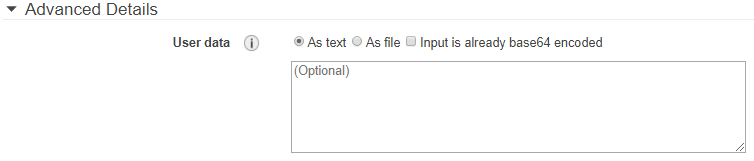

## {{ page.title }}

###  USER DATA


User Data is a set of instructions or commands which will be executed(if given) during the launch of the instance. These instructions are executed only during the initial bootstrap, but not every time when we restart(stop and start) instance.

** Why User Data **

A lot of times during launching a new instance there can be a set of common tasks to perform as part of an initial instance setup procedure. For example if you are launching a lot of instances that are being used as web servers you may want to install Apache on a Linux machine.

The User Data field allows to specify these commands in a command line format which will then execute when the instance is initially launched.

#### Formats of User Data

* As Text
* As File

##### As Text




In this format the commands are entered in the text box, starting with hashbang(#) and followed by the commands that are to be executed.

##### As File

In this format the user data is written in a file and the file is uploaded instead of giving the data.

**Note:**
In both the formats user data size is limited to 16K KB. If you need to enter the commands greater than 16K KB size, you need to enter the input which is base64 encoded and tick the “Input is already base64 encoded” checkbox.


While setting user data be aware of following :

* User data must be base64-encoded. The Amazon EC2 console can perform the base64-encoding for you or accept base64-encoded input.

* User data is limited to 16 KB. This limit applies to the data in raw form, not base64-encoded form.

* User data must be base64-encoded. The Amazon EC2 console can perform the base64 encoding for you or accept base64-encoded input.

* If you stop an instance, modify its user data, and start the instance, the updated user data is not executed automatically when you start the instance.

User Data commands is different for Windows and Linux Machines.

#### User Data for Linux Machines

As we already aware user data of text format starts with hashbang.
Below example shows the installation of Apache during the launch of instance.


```
#!/bin/bash

yum update -y
yum install -y httpd.x86_64
systemctl start httpd.service
systemctl enable httpd.service

```

#### User Data for Windows Machines

* To execute the user data commands in windows using Command Prompt, commands should be placed between start and end of script tags i.e <script></script>
Below example updates the server timezone at launch.

```
<script>
REM Set timezone
tzutil /s "Singapore Standard Time"
</script>

```

* To execute the user data commands in windows using Power Shell, commands should be placed between start and end of script tags i.e <powershell></powershell>
Below example updates the server timezone at launch.

```
<powershell>
tzutil /s "Singapore Standard Time"
</powershell>

```

## User Data Usage in MyST

####Example:

#### Creating a user while provisioning AWS instance using User Data:

User data generally starts with "##cloud-config".
Below is the user data which helps to create a 'testuser' while provisioning aws instance.

```
#cloud-config
users:
  - name: testuser
  
```
Once the provision is successful, connect to the linux machine and execute the bellow command 

```
id testuser

```
if you get something like below

```
uid=54322(testuser) gid=54322(testuser) groups=54322(testuser)

```

It says that the 'testuser' is successfully created.
