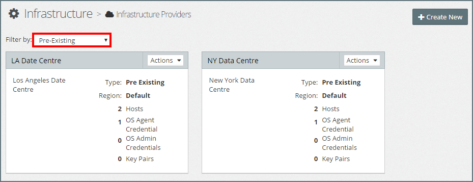
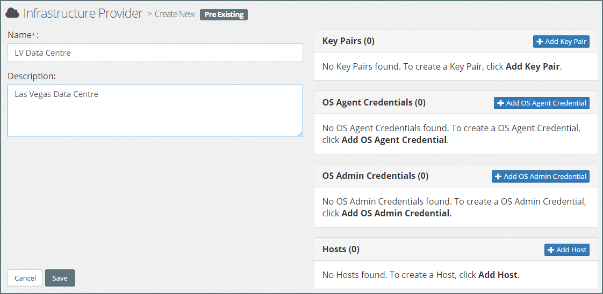
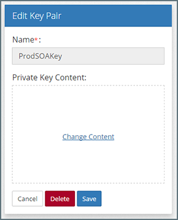

## {{ page.title }}

Within MyST, a Pre-Existing Infrastructure Provider is used to capture the list of virtual or physical hosts that are available to provision our Oracle Middleware environment to. 

During the Provisioning process, MyST connects to each of the target hosts via SSH to perform some of the initial install and configuration tasks. 

1. MyST connects to the host where the WebLogic Admin Server will be installed and downloads the MyST Agent.
2. The MyST agent will perform the initial install and configuration tasks. These tasks are performed locally by the MyST agent on the Admin Host.
3. The MyST Agent on the Admin Server will connect remotely via SSH to the other target hosts in the WebLogic Domain and perform install and configuration tasks remotely.

The credentials that MyST uses to connect to and execute jobs on each of the hosts via SSH are known in MyST as the **OS Agent Credentials**. These credentials consist of a username and password or username and key pair. 


When creating these credentials in MyST, the username should be the operating system user we configured as per the Host Prerequisites.


MyST Studio has support for creating the **OS Agent Credential** if it does not exist on the target hosts. In order to do this, you need to provide a privileged user account known as **OS Admin Credential**. 

If your MyST Studio host definition does not already have OS agent credentials configured, provide a user name and password or key pair in this section, and then add details of the OS admin credentials. 

MyST Studio connects to the host using the **OS Admin Credentials**, and creates the **OS Agent Credentials** with the username and password you provide here. Only the OS Agent Credentials will be used to run any actions from MyST Studio.

### List Infrastructure Providers
To see details of the defined Infrastructure Providers, click  `Infrastructure` > `Infrastructure Providers`. By default, this will display details of **All** Infrastructure Providers. We can filter this by selecting `Pre-Existing` in the `Filter by` drop down as shown below.

### Create Pre-Existing Infrastructure
Click `Create New` and select `Pre Existing` from the options provided. This will open the **Create New Pre Existing** dialog. Here we need to specify the following values:

* **Name** - Shorthand name for the Pre-Existing Infrastructure Provider
* **Description** - A longer description of the Pre-Existing Infrastructure Provider

For each infrastructure provider, we can add one or more:

* **Key Pairs:** Used to define all the required key pairs used to connect to the hosts within the Infrastructure Providers. Each MyST Key Pair contains the private key for key pairs that we can use in credentials for the hosts that are part of our Infrastructure Provider.  

  Once we have defined a key pair, we can use it in one or more OS Agent Credentials and OS Admin Credentials.

* **OS Agent Credentials:**  The OS agent credentials is the set of credentials that MyST uses to connect to and execute jobs on the target hosts. Each Credential consists of a username and credential, which can be either a Key Pair or Password.

    Once we have defined an OS Agent Credential, we can use it in one or more Hosts.

* **OS Admin Credentials:** Reserved for future functionality.

* **Hosts:** List of physical hosts that are available as part of the infrastructure provider. 

Click **Save** to save your infrastructure provider.

### Managing Key Pairs
Key pairs are used by OS Agent and OS Admin users to authenticate when connecting to the hosts within the Infrastructure Providers. Each MyST Key Pair contains the private key for the key pairs, which is provided as a credential when connecting to a target host. 

#### Add Key Pair
To add a key pair, click `Add Key Pair`, enter a name, add the private key content, and click `Add`. MyST will return us to the Pre-Existing Infrastructure editor, click `Save` to confirm our changes.

> The key value format must be PEM and the key must not have a pass-phrase.

#### Edit Key Pair
To edit a key pair, click on the name of the key pair within the Infrastructure Provider, this will open the **Edit Key Pair** dialog.

Here you can modify the content of the Private Key; to do this click `Change Content` and you will be prompted to enter the Private Key content. Once done, click `Save` to confirm your changes.

#### Delete Key Pair
To delete a key pair, open the Edit Key Pair dialog and click `Delete`. MyST will return us to the Pre-Existing Infrastructure editor, click `Save` to confirm our changes.

> We can only delete Key Pairs that are not assigned to any OS Agent Credentials or OS Admin Credentials.

### Managing OS Agent Credentials
The OS agent credentials is the set of credentials that MyST uses to connect to and execute jobs on the target hosts. Each Credential consists of a username and credential, which can be either a Key Pair or Password.

#### Add OS Agent Credential
To add an OS Agent Credential, click `Add OS Agent Credential`, specify the following values:

* **Name** - Shorthand name for the OS Agent Credential
* **SSH User Name** - The SSH User Name that will be used to connect to the host
* **Connect Using** - Specifies the type of credentials used to authenticate the SSH user, can be  either `Key Pair` or `Password`
* **Key Pair** - If `Key Pair` is specified, then select the Key Pair to use from the Drop Down.
* **Password** - If `Password` is specified, then enter the password to be used to authenticate the user.
* **Run as different user** - Select this to use **sudo** to enable the MyST agent to run as a different user.
* **Other User Name** - If `Run as different user` is set to `Yes`. Specify the user account under whose identity the MyST agent will perform all tasks.

Click `Add` to save the new OS Agent Credential. MyST will return us to the Pre-Existing Infrastructure editor, click `Save` to confirm our changes.

> If `Run as different user` is set to `Yes`, MyST will initially authenticate with the target host using the SSH username (for example `myst`). Once authenticated, the MyST agent will use [sudo](https://en.wikipedia.org/wiki/Sudo) to perform all actions under the user account specified by `Other User Name` (for example `oracle`).

### Managing Hosts
Within MyST, **Hosts** are the logical representation of the Virtual, Physical, Container or Cloud based servers that host the Oracle Middleware Server instances that make up our Oracle Middleware Platform.

MyST can use pre-existing Virtual, Physical or Container-based hosts as the target for hosting Oracle Middleware platforms. With this approach, MyST is dependent on a system administrator or a Configuration Management solution like Puppet or Chef to pre-configure the host before it is used as a target by MyST.

#### Add Hosts
To add a new host, click `Add Host`. MyST will open the `Add Host` dialog, specify the following values:
* **Name**: Name within MyST used to refer to the host
* **Host Name**: Network address of the host, can also be the IP Address
* **SSH Port**: The SSH Port of the target host, defaults to 22.
* **Compute Definition**: Used to specify the Operating System of the target host.
* **Environment(s)**: Hosts must be tagged to one or more Environments. When we create a platform model, only the hosts tagged to the same  Environment Type as the platform model can be selected within the model.
* **OS Agent Credential**: The set of credentials that MyST uses to connect to the target host and execute any commands.
* **Configure OS Agent Credentials**: Select `No`. This is provided for future capability.
* **OS Admin Credentials**: Select OS Admin Credential. This is provided for future capability.

Once we have specified the host details, click `Add`. MyST will return us to the Pre-Existing Infrastructure editor, click `Save` to confirm our changes.

#### Edit Hosts
To edit a host, click on the name of the host within the Infrastructure Provider, this will open the `Edit Host` dialog.

Here we can modify the host configuration as required. Once done, click `Save` to confirm your changes. MyST will return us to the Pre-Existing Infrastructure editor, click `Save` to confirm our changes.

#### Delete Hosts
To delete a host, open the Edit Host dialog and click `Delete`. MyST will prompt for confirmation, click `Yes` to delete the host definition. MyST will return us to the Pre-Existing Infrastructure editor, click `Save` to confirm our changes.

