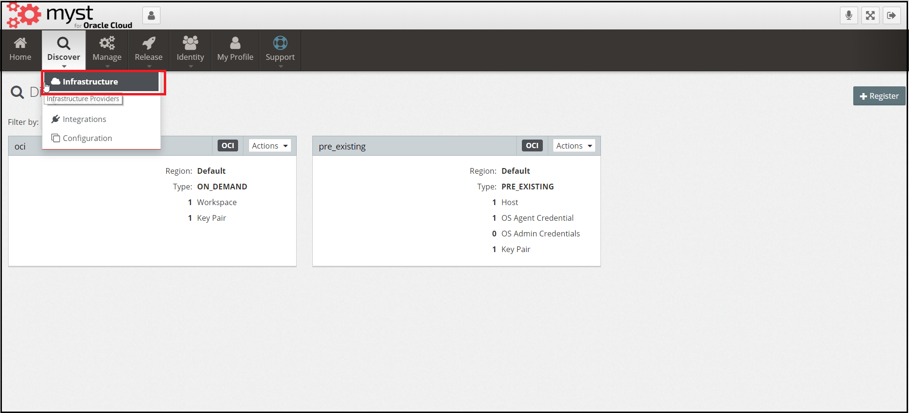
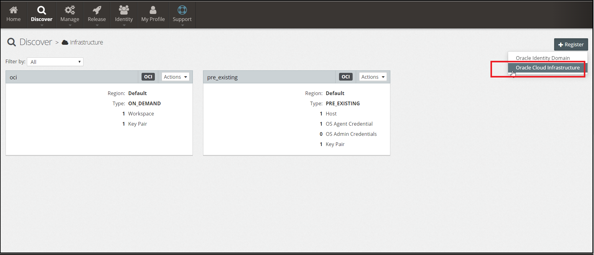
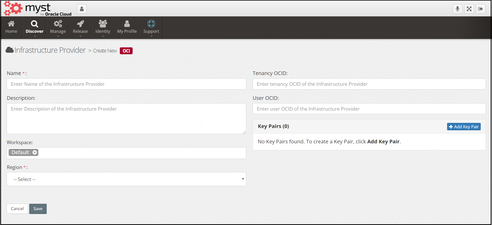
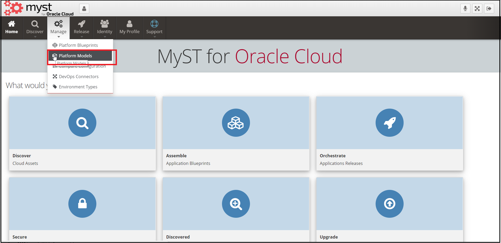
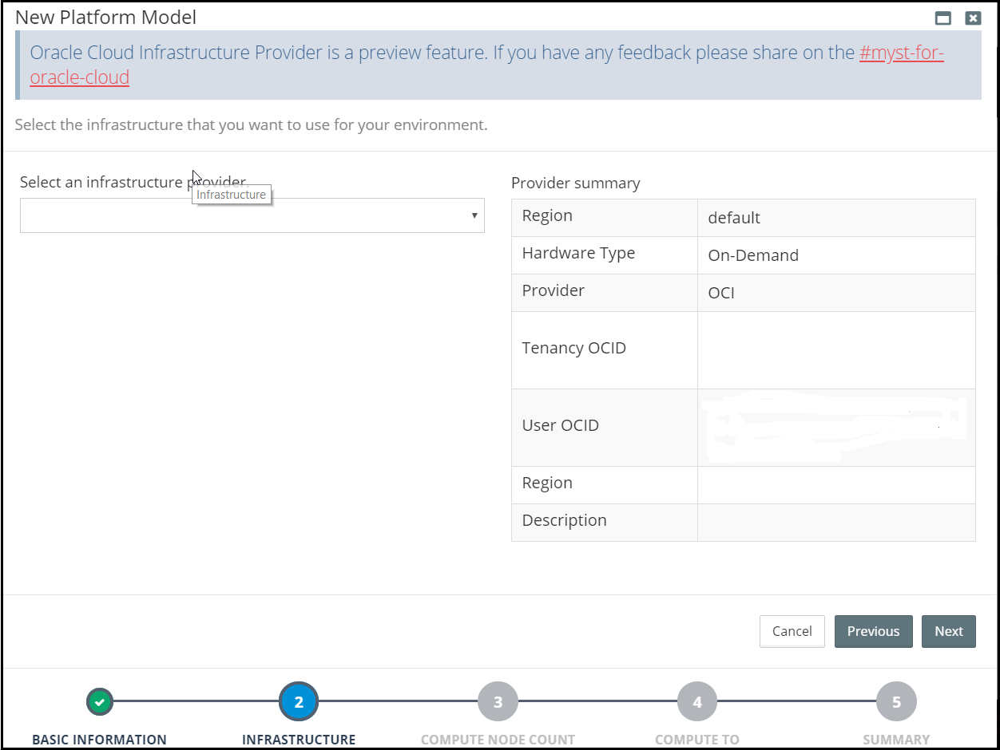
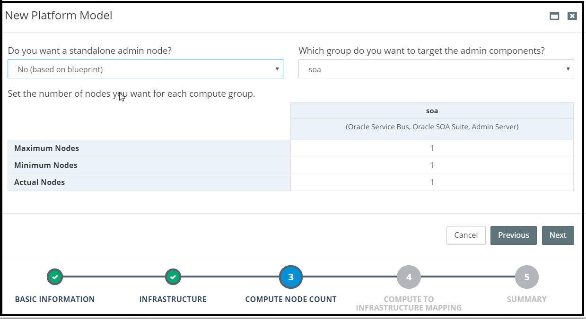
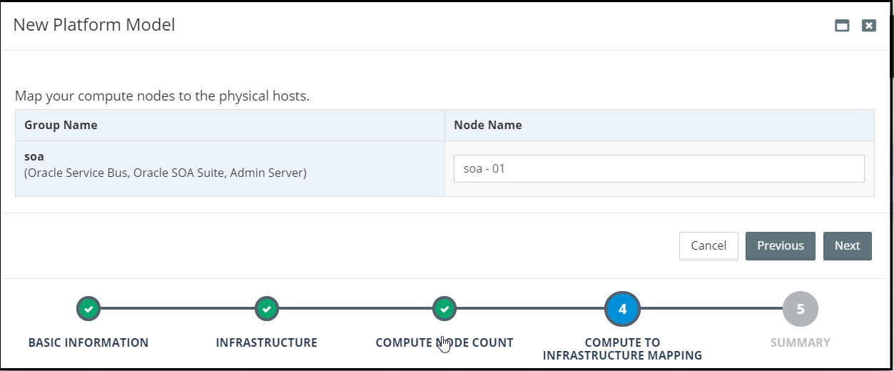
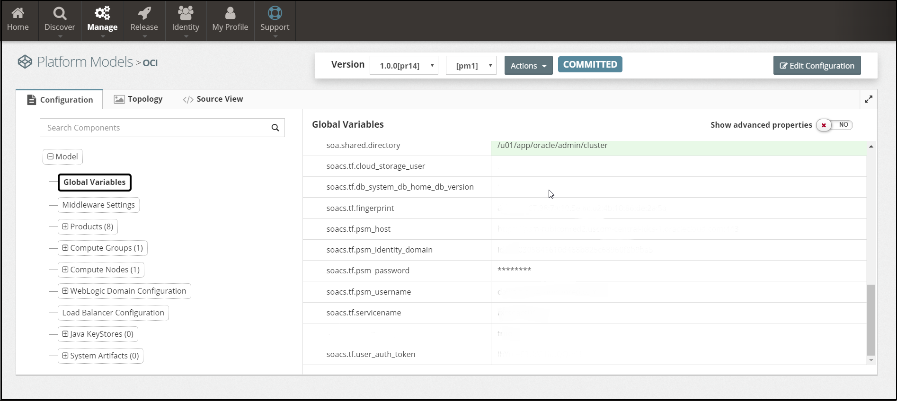
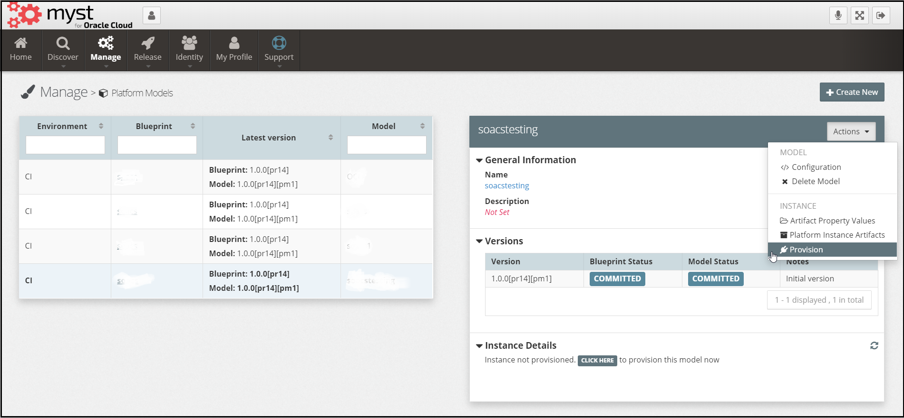
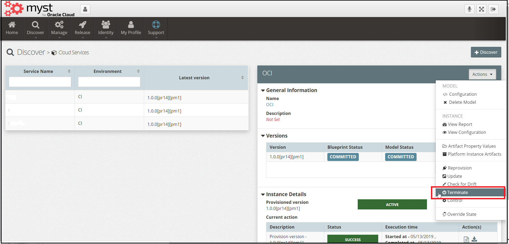

# Can I provision OCI infrastructure for Oracle SOA Cloud Service?

**Oracle Cloud Infrastructure** provides security, predictability of on-premises infrastructure to deliver high-performance, high availability, cost-effective infrastructure services and dedicated server access. OCI provides both Bare Metal  and Virtual Machines unlike OCI Classic which only provides Virtual Machine.

 **SOA CS** is useful when people wants to lift their existing on-premises solution into the cloud and where B2B features such as EDI are needed. 

#### **Why Migrate to Oracle Cloud Infrastructure**

   **Oracle Cloud Infrastructure** is Oracle's more modern infrastructure platform that's based on the latest cloud technologies and standards which provides better performance than **Oracle Cloud Infrastructure Classic**. OCI in terms of costs, it has lower costs. Most importantly, Oracle continues to invest in Oracle cloud Infrastructure, including the addition of new regions, services, and features.

**Topology that gets created by default**

​    After successful provision topology gets created with default VCN,  Compartments, Subnets, Database, Jumpbox etc

* **VCN **: A VCN is a customizable private network in Oracle Cloud Infrastructure. VCN provides you with complete control over your network environment which includes assigning your own private IP address space, creating subnets, creating route tables, and configuring stateful firewalls. A single tenancy (an Oracle Cloud Infrastructure account) can have multiple VCNs, thereby providing grouping and isolation of related resources. 

* **Compartments** : Compartments allow you to organize and control access to your cloud resources. A compartment is a collection of related resources (such as instances, virtual cloud networks, block volumes) that can be accessed only by certain groups that have been given permission by an administrator. A compartment should be thought of as a logical group and not a physical container. 

* **Subnets** : A subnet is a subdivision of your VCN. The subnet directs traffic according to a route table. For this tutorial, you'll access the instance over the internet using its public IP address, so your route table will direct traffic to an internet gateway. The subnet also uses a security list to control traffic in and out of the instance.

* **Database** : The Database service offers autonomous and user-managed Oracle Database solutions. Autonomous databases are preconfigured, fully-managed environments that are suitable for either transaction processing or for data warehouse workloads. User-managed solutions are bare metal, virtual machine, and Exadata DB systems that you can customize with the resources and settings that meet your needs.

  You can quickly provision a user-managed DB system or autonomous database. You have full access to the features and operations available with the database, but Oracle owns and manages the infrastructure.

* **Jumpbox**  :  A jump box functions like a proxy server and it is a way to isolate access to private network.  It is usually a computer that is connected to two networks and has two network cards. One network card is configured with an external IP address that is accessible from the Internet. The second network card provides an internal IP address that is only accessible to computers on the internal network. The jump box is then configured to correctly route traffic between the two networks. 

The following are the steps we follow to provision OCI infrastructure for Oracle SOA Cloud Service:

**Discover existing SOA CS environment** 

   To discover existing SOA CS environment please refer to [Discover existing SOA CS](https://www.myst.cloud/soacs/howto) for the procedure.

**Create Infra Provider **

   To create On Demand OCI provider navigate to `Discover` > `Infrastructure`. This will display a list of existing infrastructures.

next `Register` > `Oracle Cloud Infrastructure` will land you on **Oracle Cloud Infrastructure** create page.

 

In the initial dialog, we need to specify the following details about our On Demand OCI:

- **Name :** Shorthand name of On Demand OCI provider.
- **Description :** A longer description of the OCI provider (optional).
- **Workspace:**  This defines the Workspaces to which  it belongs. See Role-Based Access Control for further details.
- **Region:** Region is a localized geographic area and there will be one or more data centers which are called                    domains. If any of the domain fails the other exists. It is very unlikely to say that both fails simultaneously. We give information of which region to host OCI. Select region from the list. 
-  **TenancyOCID:**  Get the tenancy OCI from the Oracle Cloud Infrastructure Console on the Tenancy details page and provide your OCID for your infrastructure.
- **UserOCID:** Open User menu and click User Settings from your console.Get the UserOCID from users list and provide it for your OCI.
- **KeyPair:** Give your relevant key pair by add key pair and give name and private key content.

Once done click save

 **Create a new model with the OCI infra provider**

​     To create model with configured OCI infrastructure navigate to `Manage` -> `PlatformModels` -> `Create New`

In the initial dialog, we need to specify the following details about our Platform Model:

**Platform Blueprint** - The SOA CS Blueprint that we will use for our SOA CS Model.Select SOA CS blueprint from the drop down.
**Platform Blueprint Version** - The version of the SOA CS blueprint that we will use for our SOA CS Model.
**Environment Type** - The Environment Type for the SOA CS Model.
**Name** - Shorthand name for the SOA CS Model.
**Description** - A longer description of the SOA CS Model
**Workspaces** - This defines the Workspaces to which the SOA CS Model belongs. See Role-Based Access Control for further details.
Once we have entered the basic details about our SOA CS Model click Next.

**Select Infrastructure Provider**

Next, we need to specify the created OCI  Provider for our SOA CS Model. From the corresponding drop-down, select a OCI provider. MyST will provide the provider summary configured for OCI.

​        once done, click next

**Specify Compute Group Size**

For each Compute Group defined within the SOA CS Blueprint we need to specify the number of nodes to use.

In addition, we can also specify whether we want to have a stand-alone admin server, in which case it will be created within its own compute group. MyST will default to what is specified in the SOA CS Blueprint.

If we specified a stand-alone Admin Server in the SOA CS, and then choose to override that, then we will also need to specify which compute group we want to target the Admin Server to.

Once done, click `Next`.

**Map to Servers**

Provide the name for your Nodes

Once done, click next

**Review the Summary**

MyST will display a Summary screen showing all the key inputs specified in the SOA CS Model Wizard.

Once done, click `Finish`. MyST will create the corresponding SOA CS Model and take you to the SOA CS Model Editor where you can make additional changes if required. 

**Adding global variables as needed**

  To configure global variables in your SOA CS model follow the specific pattern **soacs.tf.*** MyST will consider  (*)  part as your key and value as value to your environment variables. In addition to the configuration provided in the SOA CS blueprint and SOACS model, it requires few more properties to be globally configured. To configure navigate to `Actions`->`Configuration`>`GlobalVariables`>`EditConfiguration` and provide the following properties

- **soacs.tf.fingerprint** : Fingerprint for the user key, can be found in OCI User's console.
- **soacs.tf.psm_host** : PSM Host for SOACS (e.g. [https://psm-rubiconred2.uscom-central-idcs-1.oraclecloud.com:443](https://psm-rubiconred2.uscom-central-idcs-1.oraclecloud.com/))
- **soacs.tf.psm_identity_domain** : PSM Identity Domain for SOA CS (e.g. idcs-[a0305841610d468b825c68960f8b9ba5](https://bitbucket.org/rubiconred/rift/commits/a0305841610d468b825c68960f8b9ba5)).
- **soacs.tf.cloud_storage_user**: Username with access to the container storage (Eg. admin.bucket).
- **soas.tf.psm_password** : PSM Password for SOA CS.
- **soacs.tf.psm_username** : PSM Username for SOA CS.
- **soacs.tf.servicename** : Name of the SOA CS domain (Eg. rxrsoacs04).
- **soacs.tf.user_auth_token** : User authentication token.  

**Clicking Provision**

Next, to provision navigate to `Actions` > `provision` > Finish.  

**Clicking Terminate**

Once successfully provisioned if you want to terminate your instance navigate to `Actions` > `Terminate` > `Fnish`.

**Advanced**

 

you can customize the terraform. To get customized terraform applied, place your file in /usr/local/tomcat/conf/fusioncloud/infrastruture-providers/oci

