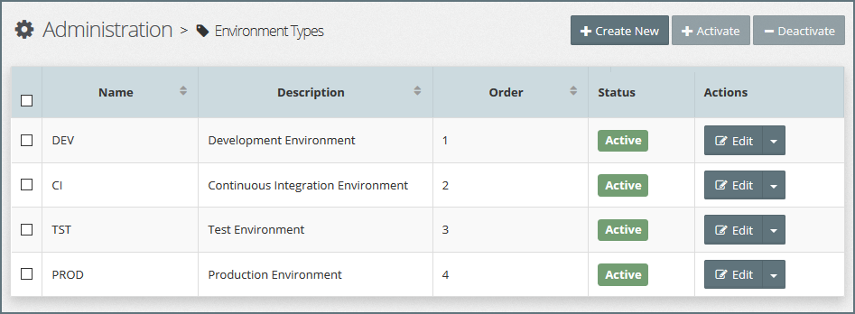

## 2.1 Environment Types

During the lifetime of a project, code will be built and promoted to various staging environments, such as Development \(DEV\), System Integration Testing \(SIT\), User Acceptance Testing \(UAT\), Pre-Production \(PRE\), and Production \(PROD\).

**Environment Types** are designed to help categorise Oracle Middleware Platform Instances for governance purposes. This categorisation can help to manage who has access to instances, and what type of actions they can perform against the instance, for example:

* Who can provision and re-provision a platform instance?
* Who is allowed to perform platform configuration changes?
* Who is able to stop/start a platform instance?
* Who is able to deploy / promote code into an environment?

Within MyST any resource that is environment specific, such as a Platform Model, Platform Instance, Stream Stage or Application Model is tagged to an Environment Type, this in conjunction with Role Based Access Control \(RBAC\) allows us to control who can perform which actions in which environment.

In addition target hosts \(see Pre-Existing Infrastructure Providers\) can be tagged to one or more Environment Types. When we create a platform model, only the hosts tagged to the same Environment Type as the platform model can be selected within the model. This makes it simple to restrict the infrastructure that a given Platform can be targeted to.

### List Environment Types

To see a list of defined Environment Types, click  `Infrastructure` &gt; `Environment Types`. This will display a list similar to the one below.

### Creating a New environment type

Click `+ Create New`, this will open the **Add Environment Type** dialogue. Specify the following values:

* **Name** - Short hand name for the Environment, such as SIT, UAT or PROD
* **Description** - A longer description of the environment \(e.g. System Integration Test\)
* **Order** - Used to indicate the promotion flow for a piece of code to be deployed as it progresses through the Software Development Lifecycle. Though this can be overridden for each Release Pipeline. TODO: Need to update based on https://rubiconred.jiveon.com/thread/4344

Click `Create` to Save the new Environment Type.

### Edit Environment Type

To edit the Environment Type; click on the `Edit` button for the corresponding Environment Type, this will open the **Edit Environment Type** dialogue.

Here you can modify the Name, Description, Order and Status of the Environment Type. Once done, click `Save` to confirm your changes.

### Activate / Deactivate Environment Type

By default, when you create an Environment Type, it is in an active state. Meaning we can create new MyST Resources that are tagged to that Environment.

To prevent any new resources being tagged to an Environment, we can deactivate the Environment Type.

**Note**:

* Deactivating an existing environment type does not affect resources that are currently mapped to the environment type.
* A deactivated Environment Type can be reactivated at any time.

To deactivate an environment; click on the  **Actions** drop-down menu for the corresponding Environment Type and select `Deactivate` as illustrated below.

To activate a deactivated environment; click on the  **Actions** drop-down menu for the corresponding Environment Type and select `Activate`.

