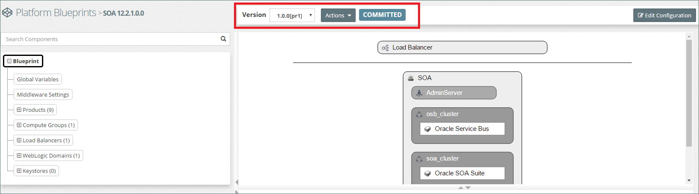
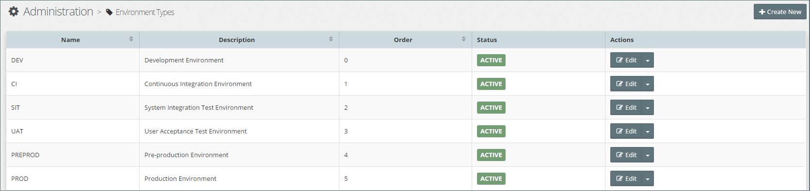
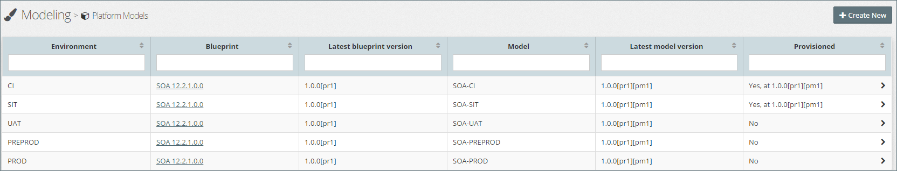
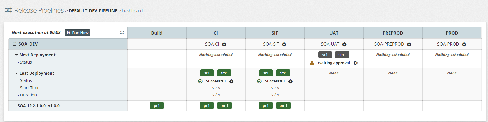
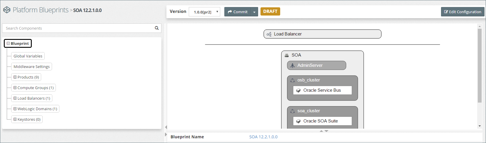
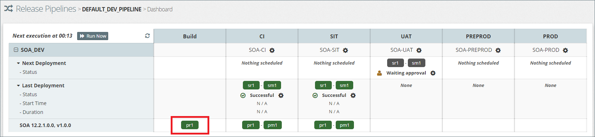
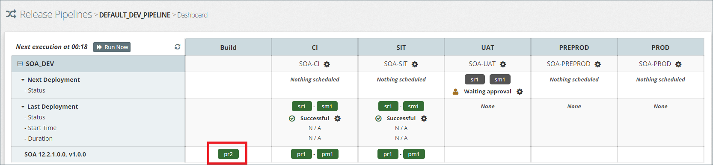
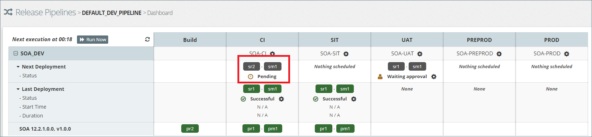
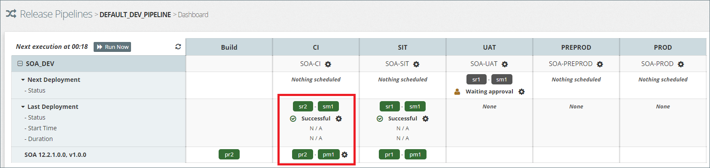

##Platform Blueprints and Model Version Control
Within MyST, Platform Blueprints and Models are put under *version control*, allowing us to easily propose, review, test, promote and deploy configuration changes. 

###Platform Blueprint Versions
Over the Platform Lifecycle we can have multiple **versions** of a Platform Blueprint, though typically we would have a maximum of two versions under development at any point in time, one for main development (like a trunk in version control) and another one optionally for patches (like a production fix branch in version control).

We can make multiple **revisions** to a version of a Platform Blueprint. Though not mandated by MyST, it is expected that we would work on a single version of a Platform Blueprint until it gets promoted to Production, at which point we would set it's state to `FINAL` and start working on a newer version.

When working on a new revision, the revision is initially in a `DRAFT` state. Whilst in a draft state, MyST allows us to save configuration in draft form repeatedly, overwriting the previous draft, without actually committing or applying them to any Platform Instance. 

Once we are happy with our changes, MyST allows us to explicitly commit the revision permanently to source control (which can then be applied to a Platform Instance). If we make any subsequent changes, then MyST will automatically create a newer revision.

> Note: MyST allows us to go back to any previous committed revision.

In MyST, a platform blueprint version obeys the naming convention, `1.0.0[pr3]`. Here, `1.0.0` is the version of the blueprint, `pr` is the standard prefix for a platform blueprint revision and `3` is the current revision number for it.

###Platform Model Versions
For each Platform Instance that we want to create, we need to create a corresponding Platform Model in MyST. So for example if we wanted to create a DEV, TST and PROD environment, we would create three Platform Models.

For **each version** of a Platform Blueprint, we can have exactly **one version** of each Platform Model associated with it. Remember, the Platform Model is meant to track environment specific changes to the configuration over time (passwords, endpoints, memory settings, etc). Changes to this configuration can also be independently tracked through revisions, which again can be in draft state and then subsequently in committed state for them to become eligible for applying to the target environment (assuming it does not allow drafts).

In MyST, a Platform Model version obeys the naming convention, `1.0.0[pr3][pm4]`. Here, `1.0.0[pr3]` just refers to the Platform Blueprint version and its current revision, `pm` is the standard prefix for a Platform Model revision and `4` is the current revision number for it.

Please note that the Platform Model can be revised independently of revisions to the Platform Blueprint and there is no hard relationship between them. The association exists between the Platform Model version and the Platform Blueprint version while the revisions evolve independently.

###Draft, Committed and Final States
Platform Blueprint and Models in MyST can be in one of three states:

1. **Draft** - Means that the current revision of the Platform Blueprint / Model version being viewed is still in a draft state and is not committed, hence will not be acted upon by a release pipeline (see below). It also implies that this revision cannot be applied to any environments (unless they allow drafts which is an exception rather than the rule).

2. **Committed** - Means that the current revision of the Platform Blueprint / Model version being viewed has been committed, hence will be acted upon by a release pipeline if configured to do so. It also implies, in the case of a Platform Blueprint that this revision can be applied to all environments. Any subsequent changes will automatically be saved in a new revision.

3. **Final** - Means that the current version of the Platform Blueprint / Model being viewed is finalized (most likely because it has been promoted all the way to production). Any subsequent changes to configuration will have to be made in a new version.

### Platform Blueprint Development Lifecycle
Since MyST allows us to treat configuration as code, it allows us to follow a similar process when promoting platform configurations from DEV through the various staging environments and into Production.

This when developing the inintial Platform Blueprint or if making a significant change then the developer may want the ability to test changes prior to commiting them in DEV or SANDBOX environment.

####  Platform Blueprint Development
By default Platform Blueprint / Model revisions in a draft state, cannot be applied to any environment, this is to prevent unfinished changes from accidentally being applied. 

However when developing the intial Platform Blueprint or if making a significant change then the blueprint developer may want to frequently save and test there changes in DEV or SANDBOX environment, without the need to commit these changes each time.

To support this scenario, MyST will allow us to configure an Environment Type as allowing draft revisions to be applied.

#### Promoting Platform Blueprints
Once a revision to a Platform Blueprint has been committed, we will typically want to promote this to our first staging environment, validate and test it in that environment, and once passed promote it to the next staging environment 

If at any stage, the Platform Blueprint fails validation, we would update the Platform Blueprint to fix the issue and commit the change to version control. We would then re-start the process of promoting the latest revision of our Platform Blueprint though each of our staging environments until the Platfrom Blueprint is sucessfully promoted into Production.

MyST provides to methods for promting Platform Blueprints through each environment, they can either be triggered manually as required. Or alternatively we can use a Release Pipeline for managing the process.

With a Release Pipeline we can define the stages that a Platform 

As a first step towards continuous delivery, one normally would set up a continuous integration server and a CI environment where code gets deployed to every time a commit happens. Similarly, every configuration change can be and should be applied continuously to a CI environment on a commit. For this, MyST plays the role of a CI server for configuration where it polls for committed code and configuration changes periodically and then applies these changes to the target CI environment.

Not only this, it also provides a full fledged release pipeline where both configuration and code can move forward and get promoted into higher environments, either automatically or through a manual approval and click-button deployment process.

From a platform lifecycle point of view, there is considerable significance of having a release pipeline tracking and applying configuration changes.

Firstly, it implies that a release pipeline should only automatically apply and promote committed changes to environments. Draft changes should not make way through the pipeline.

#### Publishing Platform Blueprints

###Tying it all together - An example

We have a platform blueprint, `SOA 12.2.1.0.0`, having one version, `1.0.0` and the latest revision of `1` in `COMMITTED` state, i.e. `1.0.0[pr1]`.

We have 5 environments, `CI`, `SIT`, `UAT`, `PREPROD` and `PROD`, all of which **do not** allow draft configuration to be provisioned / applied to them (default behaviour)

We have 5 Platform Models for the above Platform Blueprint, one for each of the 5 environments. All of them have only `1` revision for the `1.0.0` blueprint version in `COMMITTED` state, i.e. `[pm1]` which when combined with the Platform Blueprint would read as `1.0.0[pr1][pm1]`.

We have an active release pipeline, `DEFAULT_DEV_PIPELINE`, tracking configuration changes through the 5 environments above.

As can be seen from above the CI and SIT stage are already provisioned while the UAT stage is pending approval.

Now make any change to the Platform Blueprint and save it. This will generate revision `pr2` for the Platform Blueprint in `DRAFT` state. Take care to not use the `Save+Commit` option to commit the change.

If we go back to the release pipeline dashboard, it will continue to show `pr1` as the latest revision for the Platform Blueprint. This is because we have not yet committed `pr2`.

If we now commit revision `pr2` and return to the dashboard. It will now show `pr2` as the latest revision available in the build column.

If we wait for the pipeline to execute (or click `Run Now` to force execute it), we can see that the new revision automatically gets applied to the `CI` stage.

This shows how only **committed revisions** of Platform Blueprints / Models are considered by the release pipeline for promotion.

In a similar manner, we can make a change to the Platform Model for the `CI` or `SIT` stage and see that these will not be applied by the pipeline until the changes are committed.

