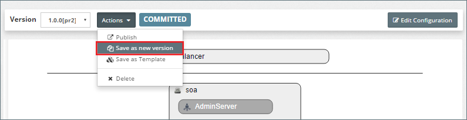
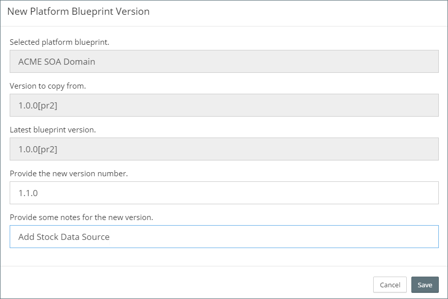
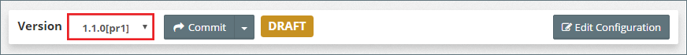
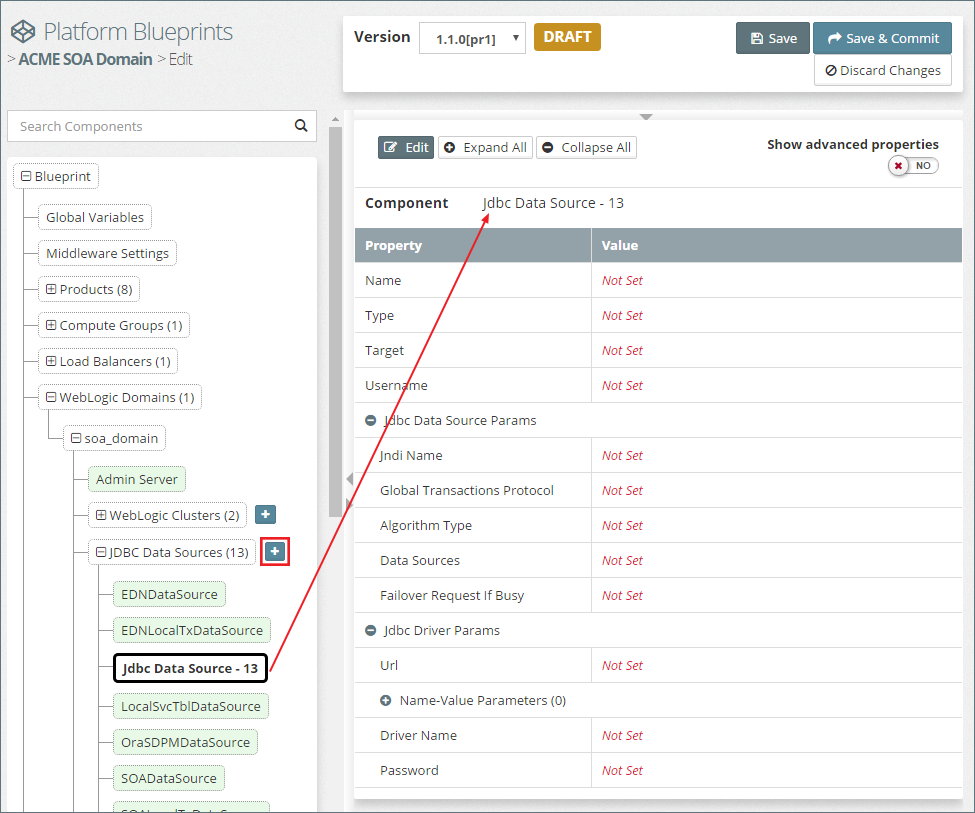
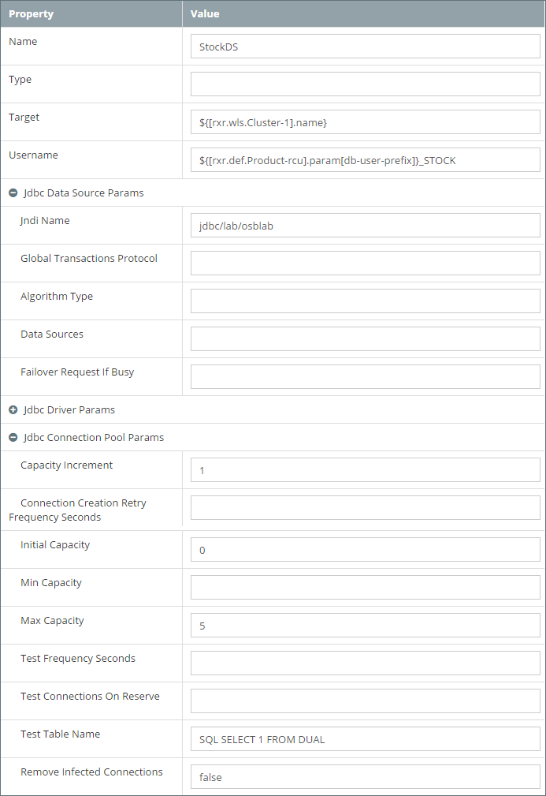
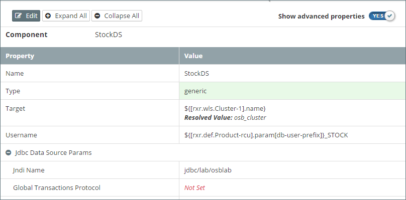

## Update Platform Configuration
To make configuration changes to a Platform Instance, we need to first update it's *platform definition* as specified by it's Platform Blueprint and Platform Model. Once we happy with our revised *platform definition* we can run a platform update. MyST will automatically determine and
 perform the required steps to apply the necessary changes.

For the purpose of this section, we are going to walk through the process of adding a new Data Source to our Platform Instance. This involves the following steps:

1. Adding a Data Source to our Platform Blueprint  
2. Adding environment specific details to our Platform Model  
3. Performing an optional dry run to verify our changes  
4. Performing an update against the Platform Instance to apply our changes

###Update Platform Blueprint

When we update a Platform Blueprint we can either do this as a revision to the current blueprint, assuming it's state is not FINAL, or create a new version of the Platform Blueprint. For our example, we are going to create a new version.

#### Create New Version of a Platform Blueprint
From the side menu navigate to`Modeling` > `Platform Blueprint`, this will display a list of existing Platform Blueprints. Click on the `Actions` drop-down in the top right-hand corner of the Platform Blueprint we want to view / edit and select `Open`. This will open the Platform Blueprint in the `Platform Editor` in view mode.

To create a new version of a Platform Blueprint, ensure the correct version of the Platform Blueprint is selected in the `Control Bar`, next click on the `Actions` drop-down and select `Save as new version` (outlined in red below).

This will open the `New Platform Blueprint Version` dialogue. This will confirm the selected Platform Blueprint and version that we are going to base our new version on. 

Here we need to specify the version number for our new Platform Blueprint. In addition, we can specify some notes that detail the reason for the new version. These notes will appear in the version history for any Platform Instance once updated to this version of the Platform Blueprint.

Once complete, click `Save`. This will create the new version of our Platform Blueprint and return us to the `Platform Editor`. Here we can see that the `Control Bar` displays the version (outlined in red below) of our new Platform Blueprint and that it has a status of `DRAFT`.

#### Adding a Data Source
Click on `Edit Configuration`. In the tree view expand the domain and click on the `+` icon next to JDBC Data Sources (outlined in red). This will create a new Data Source, `Jdbc Data Source - 13` in the example below.

Select the new data source in the tree view, MyST will display it current configuration. We will see that initially none of its properties have been set.

> Note: An alternative way of creating a new Data Source is to select an existing data source, right click on it and select clone.

Click on `Edit` to put component into edit mode. For the purpose of our example, we will set the properties shown in the screen shot below.

| Property | Value |
| -------- | ----- |
| Name | StockDS |
| Target | ${[rxr.wls.Cluster-1].name} |
| Username | ${[rxr.def.Product-rcu].param[db-user-prefix]}_STOCK |
| Jndi Name | jdbc/lab/osblab |
| Driver Name | oracle.jdbc.OracleDriver
 |
| Capacity Increment | 1
 |
| Initial Capacity | 0 
|
| Max Capacity | 5 
|
| Test Table Name | SQL SELECT 1 FROM DUAL 
|
| Remove Infected Connections | false |

We have set the value of 
* `Target` to the MyST property `${[rxr.wls.Cluster-1].name}` 
* `Username` to `${[rxr.def.Product-rcu].param[db-user-prefix]}_STOCK`

Click `Save` on the component and MyST will now display the resolved value for `Target` 

We should now see that the `Target` has been resovled to `osb_cluster` and that the `Username` is left unresolved as `${[rxr.def.Product-rcu].param[db-user-prefix]}_STOCK`. This is because the RCU prefix will be set in our Platform Models and is not available from the Blueprint.

Finally click `Save & Commit`

#### Performing a Dry Run
When we run an platform update, we have the option of specifying whether we first want to performa a dry run. With a dry run, MyST doesn't perform the actual changes, rather it goes through the process of determining what changes need to be applied (in exactly the same way it does when making the actual changes) and then produces a report detailing the changes that will be made.

This allows us to quickly validate the changes to be applied are as expected, and if not, then go-back and make the appropriate corrections to our Platform Blueprint and or Platform Model.

From within the Platform Instance Summary window, click on the `Actions` drop-down and select `Update`, MyST will open the Platform Instance Update dialogue.

First the Platform Instance we need to specify whether we want to update to:
* A newer revision of the current Platform Blueprint Version
* A newer version of the Platform Blueprint / Model

xx

To perform a Dry  

This means incremental configuration changes are simple
to make and propagate across all environments. Users just
update the required target state; MyST will determine and
perform the required steps to apply the necessary changes.
With MyST there is no need to maintain complicated scripts or
workflows for each configuration change, thereby eliminating
human errors and simplifying on-going maintenance.
