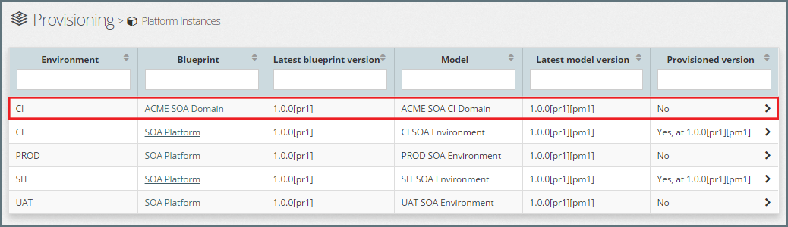
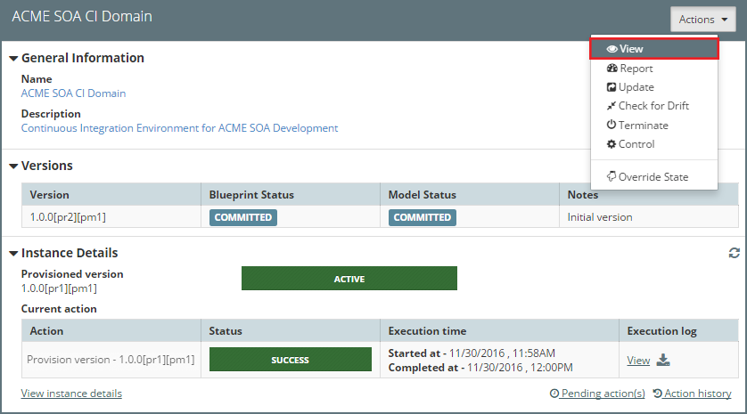
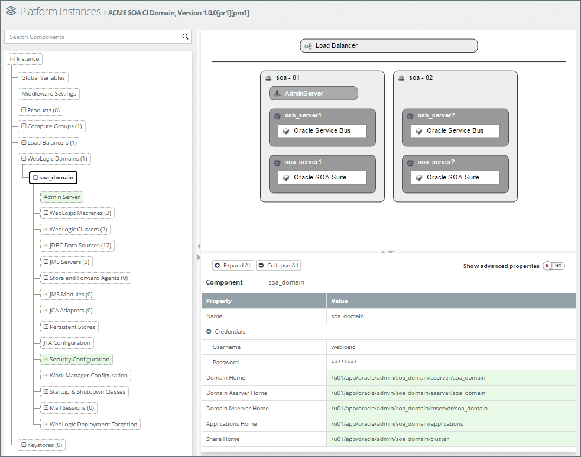
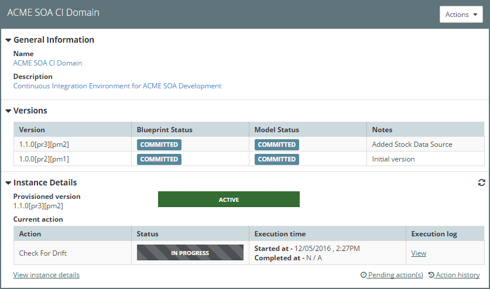
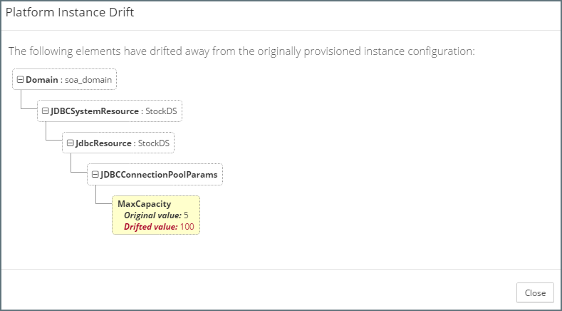
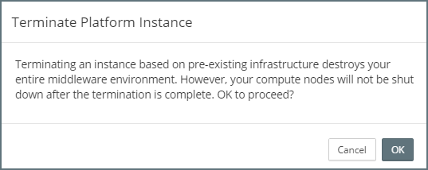
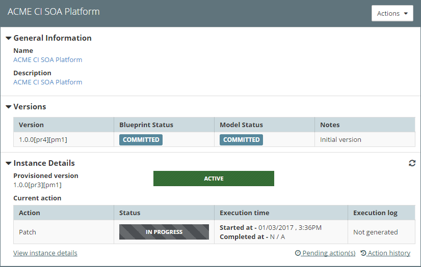

## {{ page.title }}

In this section we detail how to use MyST to perform common platform administration tasks, including how to:
* View Platform Instance Configuration
* Report on Platform Instance
* Start, Stop and Restart a Platform Instance
* Check for and Correct Configuration Drift
* Terminate and Re-Provision a Platform Instance
* Patching a Platform Instance
* Overriding the state of a Platform Instance

In addition, we also cover the mechanism MyST uses to queue actions against a Platform Instance as well how to view the Action History as well as the current Pending Actions.

All of these activities are performed from the `Platform Instance Summary` window. We can access this from the side menu by navigating to`Provisioning` > `Platform Instances`, this will display a list of existing Platform Instances. 

Select the corresponding Platform Instance (outlined in red above), MyST will display summary information about the state of the Platform Model and Instance Details as shown below.

The **Platform Instance Summary** is broken into three sections; *General Information*, *Versions* and *Instance Details*. Each section provides key information about the Platform Instance as detailed below.

The **General Information** section provides the following information:
* **Name** - This is the name of the Platform Instance as defined by the Platform Blueprint

* **Description** - This is the description of the Platform Instance as defined by the Platform Model

The **Versions** section lists each version of the Platform Blueprint, for each version of the Platform Blueprint it provides the following information:
* **Version** This shows the latest revision of the Platform Blueprint and Platform Model.

* **Blueprint Status** - The status of the latest revision of the Platform Blueprint, this can be Draft, Committed or Final.

* **Model Status** - The status of the latest revision of the Platform Model, this can be `Draft`, Committed or Final.
* **Notes** - The Platform Model Version Notes.

The **Instance Details** section provides the following information:
* **Provisioned Version** - This is the current version of the Platform Instance.

* **Instance State** - This shows the current state of the Platform Instance. It can be one of:
    * Active
    * Provisioning In Progress
    * Provisioning Failed
    * Termination In Progress
    * Terminated
    * Termination Failed

* **Current Action** - This shows details of the current action being performed (or the last action if completed). This includes:
 * Action - This is the action being performed, for example, Provisioning, Start, Stop, etc.
 * Action Status - Which could be In Progress, Success or Failed
 * Execution time - The start and stop time of the action
 * Execution log - clicking on `view` will open a window allowing us to view the action execution log. If the action is still in progress, then this will automatically update as the action is performed.

Clicking on `Pending action(s)` will show the list of currently queued actions (see [Queuing Actions](tbc) for further details) whilst clicking on `Action History` will show us the list of actions performed against the Platform Instance.

The `Actions` drop-down allows us to select and perform the various management activities against the Platform Instance.

### View Platform Instance Configuration
MyST allows us to view the current configuration of each of our Platform Instance. From within the Platform Instance Summary window, click on the `Actions` drop-down and select `View`. 

MyST will open the Platform Instance in the `Platform Viewer`. From here we can browse the full configuration of the Platform Instance. The Platform Viewer is split into three core sections:

1. **Tree View** - Displays a hierarchical view of the Platform Instance. That can be used to navigate the Platform Instance configuration. Selecting a component in the tree view will display a list of properties defined for that component in the properties view.

2. **Topology View** - Helps to visualize the configuration that is defined in the Platform Instance. Selecting a component in the topology diagram will display a list of properties defined for that component in the properties view.

3. **Property View** - Displays the list of properties and corresponding values defined for the selected component in your Platform Instance. 

See the documentation on the [Platform Viewer / Editor](tbc) for more details on how to navigate and interpret the configuration information.

### Platform Instance Report
The Platform instance report provides a summary report of all the key configuration information for our Platform Instance.

To access this select the corresponding Platform Instance, then click on the `Actions` menu and select `Report`, MyST will open the Platform Instance Report as shown below.

> Note: By clicking on the header for each section, we can close and expand that part of the report as required.

### Start, Stop and Restarting Platform Instance
MyST allows us to easily Start, Stop and Restart Platform Instance. When performing these actions, we can choose to perform these actions against the entire cluster or we can choose to perform the action on specific nodes within the cluster.

#### Stoping a Platform Instance
From within the Platform Instance Summary window, click on the `Actions` drop-down and select `Control`, MyST will open the Platform Instance Control dialogue.

Select `Stop` as the action to perform (outlined in red above). By default, MyST will apply this action to all nodes within the cluster. If we only want to stop specific nodes, then first remove the nodes that we don't want to perform this action on.

Enter any notes as to why we are performing the action and click `Execute`.

MyST will queue the action in the list of Pending Actions for the Platform Instance and when ready proceed to stop the Platform Instance.

#### Starting a Platform Instance
To start a Platform Instance we follow the same process for stopping a Platform Instance, but select `Start` as the action to perform.

#### Restarting a Platform Instance

To restart a Platform Instance we follow the same process for stopping a Platform Instance, but select `Restart` as the action to perform.

### Check for and Correct Configuration Drift
Configuration drift is caused by inconsistent configuration across different environments. Configuration drift occurs naturally in data center environments when changes due to manual adhoc changes.

MyST's approach to managing incremental change, allows us to define, test, promote and track configuration changes across all environments and thus prevent configuration drift from occurring.

However, this does not stop someone from directly using the WebLogic console to perform manual changes. When this occurs, we want the ability to detect such a change, and then either use MyST to restore the Platform Instance to its correct state or alternatively if the change is required, then update the Platform Blueprint to incorporate the change so it can be applied consistently across all environments.

Note: Many MyST users restrict their users from making configuration changes via the WebLogic console to prevent these scenarios' from occuring.

#### Check for Drift
MyST's Check for Drift capability allows us to check the configuration of the Platform Instance as defined by its Platform Blueprint / Model against the actual WebLogic domain and report on differences.

From within the Platform Instance Summary window, click on the `Actions` drop-down and select `Check for Drift`, MyST will initiate the check for drift process.

Once completed, click on `View` execution log. MyST will display the results.

In the above report, we can see that the value of the property `MaxCapacity` has drifted to 100. 

#### Reset Drift
From within the Platform Instance Summary window, click on the `Actions` drop-down and select `Control`, MyST will open the Platform Instance Control dialogue.

Select `Reset Drift` as the action to perform (outlined in red above) add any `Action Notes` and click `Execute`. MyST will queue the Reset Drift action for execution and return us to the summary view of the Platform Model and Instance.

Once the `Reset Drift` action has completed, click on `View` under `Execution log`. This will open a window showing the result of the Drift, as shown below.

This will show details of all the changes made to correct any configuration drift. We can see from the log (outlined above) that MyST has reset the MaxCapacity property on the *StockDS* Data Source.

With MyST, we can run `Check for Drift`

### Terminate and Re-Provision a Platform Instance
MyST allows us to terminate and re-provision our Platform Instances. This can be useful for a number of reasons:
* Reset a Platform Instance to a previous known state, for example, re-provision the Platform Instance based on an earlier version of the Platform Blueprint.
* Temporarily re-purpose the infrastructure, knowing we can re-provision the platform instance when required at a future date.
* Re-provision corrupted environment, for example, if we suspect the underlying file system has been corrupted, we can re-provision the platform instance.

#### Terminate a Platform Instance
From within the Platform Instance Summary window, click on the `Actions` drop-down and select `Terminate`, MyST will open the `Terminate Platform Instance` dialogue and prompt for confirmation to proceed.

Click `OK`. MyST will queue the Terminate action for execution and return us to the summary view of the Platform Model and Instance.

Once terminated the status of the Platform Instance will be updated to `TERMINATED` and the Instance Details will indicate `Instance Not Provisioned`.

Even though the Platform Instance has been terminated, we still have access to the `Action History` of the terminated instance.

#### Terminate AWS On-Demand
When terminating a Platform Instance running on infrastructure of type AWS On-Demand, MyST will also provide you with the option of terminating the AWS Instances

If we select this option, MyST will terminate the AWS EC2 instances that were provisioned on-demand when the original Platform Instance was provisioned.

#### Re-Provisioning a Terminated Platform Instance
MyST allows us to re-provision any previously terminated Platform Instance. 
From the side menu navigate to`Modeling` > `Platform Models`, this will display a list of existing Platform Models. 

To re-provision a terminated Platform Instance, select the corresponding Platform Model, MyST will display the Platform Model and Instance summary. Click on the `Actions` menu and select `Provision`.

MyST will open the `New Platform Instance` dialogue. Here we can select which version of the Platform Instance we want to re-provision. Once selected, enter any `Provisioning Notes` and click `Finish`.

### Patching a Platform Instance
MyST allows us to easily patch a Platform Instance. When performing these actions, we can choose to perform these actions against the entire cluster or we can choose to perform the action on specific nodes within the cluster.

Before applying a patch to a Platform Instance, we must first add the patches to the Platform Blueprint - see [Chapter 4.2 - Patching](../../part4/4.2.patching/4.2.0.patching.md) for further details.

From within the Platform Instance Summary window, click on the `Actions` drop-down and select `Control`, MyST will open the Platform Instance Control dialogue.

Select `Patch` as the action to perform (outlined in red above). By default, MyST will apply this action to all nodes within the cluster. If we only want to patch specific nodes, then first remove the nodes that we don't want to perform this action on.

Specify whether a server restart is required to apply the patch, then enter any notes as to why we are performing the action and click `Execute`.

MyST will queue the action in the list of Pending Actions for the Platform Instance and when ready proceed to patch the Platform Instance.

<!-- TO DO
### Overriding the State of a Platform Instance
-->
