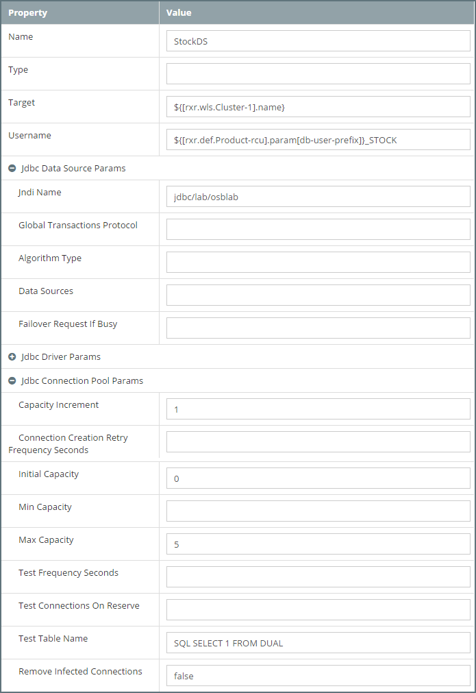
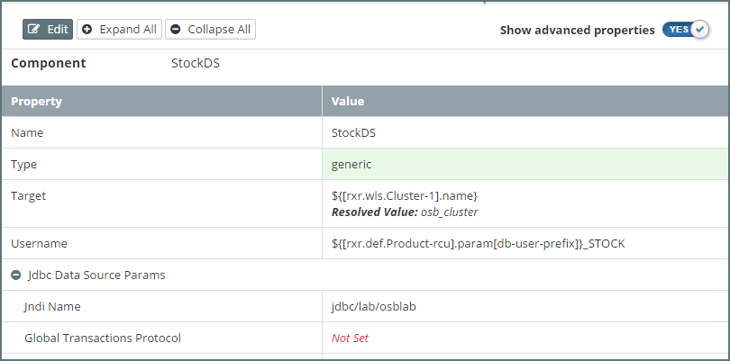

## Configuring JDBC Data Sources
Configuring JDBC Data Sources in MyST is a two stage process. 
* First step is to define the Data Source in the Platform Blueprint, here we define the common and default configuration details for the Data Source. 
* Second step is to define the environment specific details in each of the Platform Models. For example the database URL and connection credentials.

### Configuring Data Source in Platform Blueprint

#### Add Data Source to Platform Blueprint
To add a new data source in the Platform Blueprint, open the Platform Blueprint Editor and navigate to `Blueprint > WebLogic Domains > [domain_name] > JDBC Data Sources`. Expand this component to see a list of currently defined data sources.

Click on the `+` icon next to JDBC Data Sources (outlined in red). This will create a new Data Source, `Jdbc Data Source - 13` in the example below.

> Note: An alternative way of creating a new Data Source is to select an existing data source, right click on it and select `Clone`.


Select the new data source in the tree view, MyST will display it current configuration. Initially none of its properties will be set. Click `Edit` to put the Data Source into edit mode and enter the required values as detailed in [JDBC Data Source Properties]().

#### Edit Data Source in Platform Blueprint
To edit an existing data source in the Platform Blueprint, open the Platform Blueprint Editor and navigate to `Blueprint > WebLogic Domains > [domain_name] > JDBC Data Sources`. Expand this component to see a list of currently defined data sources and select the data source you wish to edit.



Click `Edit` to put the Data Source into edit mode and enter the required values as detailed in [JDBC Data Source Properties]().

#### Delete Data Source from Platform Blueprint
To delete an existing data source from a Platform Blueprint, open the Platform Blueprint Editor and navigate to `Blueprint > WebLogic Domains > [domain_name] > JDBC Data Sources`. 

Expand this component to see a list of currently defined data sources. Select an existing data source, right click on it and select `Delete`.

### Configuring a JDBC Data Source
This section details all the properties that you can set for a JDBC data source in the MyST platform blueprint. Many of these properties are optional, if a property is `Not Set` then WebLogic will use the default value.

Most properties are of type `String`, where this is **not** the case, the type is indicated. Property values of type passwords are automatically encrypted by MyST.

For each JDBC data source we need to specify the following top level properties:
* **Name** - Enter a name for this JDBC data source.
* **Type** - The type of data source. Supported types are generic, multi or gridlink. This value defaults to generic.
* **Target** - Comma-separated list of JDBC target, which can be either the ServerName or the ClusterName. It is recommended that the target be defined as a MyST property reference rather than a direct value. For example `${[rxr.wls.Cluster-1].name}`.
* **Username** - User name used to connect to the database. This may or may not be a generic value. If it changes per-environment, you do not need to set it in your Platform Blueprint.

#### Jdbc Data Source Params
Under `Jdbc Data Source Params` we can specify the following properties:
* **JNDI Name** - Enter the JNDI path to where this JDBC data source will be bound.
* **Global Transactions Protocol** - Use this property to enable non-XA connections from the data source to participate in global transactions.
* **Algorithm Type** - Use this property only when using **Multidatasource**. The algorithm type defines the whether you want an active-active (load balancing) or an active-passive (failover) configuration. Supported types are `Load-Balancing` or `Failover`.
* **Data Sources** - Use this only when using `Multidatasource`. Comma-separated list of data sources. If the `Algorithm Type` is set to Failover, the connection request is sent to the first data source in this list. In case the connection fails, the request is sent to the next data source in this list.
* **Failover Request If Busy** - Use this only when using `Multidatasource` and if the `Algorithm Type` is set to Failover. Set this property to `true` if you want to failover the connection request to the next data source if all the connections in the active data source are in busy. `Type: Boolean (true or false)`

#### Jdbc Driver Params
Under `Jdbc Driver Params` we we need to specify the following properties:
* **Url** - The JDBC connection URL. 
* **Driver Name** - The fully qualified class name of the JDBC driver class used to create the physical database connections. Ensure that this driver class supports the transaction behaviour you have configured in `Global Transactions Protocol`.
* **Password** - The password used to connect to the database. This should be unique per environments, so should be specified in the Platform Model.
* **Name-Value Parameters** - Optional list of properties passed to the JDBC driver. Use this to pass property values that are not defined in MyST. For each property we need to define the following attributes:
    * **Key** - The property id
    * **Value** - The property value

#### Jdbc Connection Pool Params
Under Jdbc Connection Pool Params we can specify the following properties (if not specifed WebLogic will use deafult values):
* **Capacity Increment** - The number of additional connections created when new connections are added to the connection pool. `Type: Integer`
* **Connection Creation Retry Frequency Seconds** - The number of seconds between attempts to establish connections to the database. `Type: Integer`
* **Initial Capacity** - The minimum number of physical connections to create when creating the connection pool. `Type: Integer`
* **Min Capacity** - The minimum number of physical connections that this connection pool maintains. `Type: Integer`
* **Max Capacity** - The maximum number of physical connections that this connection pool can contain. `Type: Integer`
* **Test Frequency Seconds** - The number of seconds between when WebLogic Server tests unused connections. (Requires that you specify a Test Table Name.) Connections that fail the test are closed and reopened to re-establish a valid physical connection. If the test fails again, the connection is closed. When set to 0, periodic testing is disabled. `Type: Integer`
* **Test Connections On Reserve** - The maximum number of physical connections that this connection pool can contain. `Type: Boolean (true or false)`
* **Test Table Name** - The name of the database table to use when testing physical database connections. This name is required when you specify a Test Frequency and enable Test Reserved Connections.
* **Remove Infected Connections** - When set to true (which is the default value), the physical connection is not returned to the connection pool after the application closes the logical connection. Instead, the physical connection is closed and recreated. When set to false, when the application closes the logical connection, the physical connection is returned to the connection pool and can be reused by the application or by another application. `Type: Boolean (true or false)`
* **Seconds To Trust An Idle Pool Connection** - The number of seconds within a connection use that WebLogic server trusts that the connection is still viable and will skip the connection test, either before delivering it to an application or during the periodic connection testing process. `Type: Integer`

#### Jdbc Oracle Params
Under `Jdbc Oracle Params` we can specify the following properties:
* **Fan Enabled** - Applicable only to RAC configurations. `Type: Boolean (true or false)`
* **Ons Nodes** - JDBC Oracle parameters for ONS client configuration.

Database Type - Select the DBMS of the database that you want to connect to. If your DBMS is not listed, select Other.

Click on `Edit` to put component into edit mode. For the purpose of our example, we will set the properties shown in the screen shot below.

### Configure environment specific properties in Platform Model
For each Platform Model we need to define the environment specific values for each Data Source, this typically comprises the following properties:
* **Url** - This is the URL URL for the database that we want our Data Source to connect to.
* **Username** - User name used to connect to the database.
* **Password** - The password used to connect to the database.

When it comes to defining the `Url` and `Username`, one option is to use MyST properties to minimize the number of specific property values we need to define within the Platform Model.

For example, we could define username as 
```
Username = ${[rxr.def.Product-rcu].param[db-user-prefix]}_MYDB
```

The RCU prefix defined in the Platform Model will then be prepended to `_MYDB` to create the Username. So for example if the RCU prefix was `SIT` we would get the username `SIT_MYDB`.

In addition, if we are creating multiple data sources against the same database, another option is to define a global variable in the Platform Blueprint, for example `dbURL` which we can then reference in each Data Source that connects to that database as follows:
```
Url = ${var.dbURL}
```

We would of course need to set the value of `dbURL` in the Platform Model, but would  only need to set this once, irrispective of how many data sources referenced this.

In addition, we may want to override the settings in the Platform Blueprint as they may differ between environment, for example we may have smaller connection pools


Click on `Edit Configuration`. In the tree view expand the domain and then expand the list of Data Sources within our domain. We can see that it includes the data source that we added to our Platform Blueprint.

Select the new data source in the tree view, MyST will display it current configuration as defined in the Platform Blueprint. We should now see that `Username` has been resolved to `CI_STOCK`, this is because the RCU prefix is set in our Platform Model.


The only values we need to specify for our Data Source in the Platform Model are:
* **Database URL** - This is the URL for the database that we want our Data Source to connect to.
* **Password** - This is the password for corresponding `Username` for connecting to   the database.


Click on `Edit Configuration` and enter these values. 


Once done, click `Save` to save these values within the Data Source and then click `Save & Commit` to save the Platform Model and commit our changes.

It's worth noting that we have used MyST properties to define the value of the following two properties.
* `Target` to the MyST property `${[rxr.wls.Cluster-1].name}`
* `Username` to `${[rxr.def.Product-rcu].param[db-user-prefix]}_STOCK`

Click `Save` on the component. We should now see that `Target` has been resovled to `osb_cluster` and that `Username` is left unresolved as `${[rxr.def.Product-rcu].param[db-user-prefix]}_STOCK`. This is because the RCU prefix will be set in our Platform Models and is not available from the Blueprint.



Finally click `Save & Commit`.


### Example JDBC Data Source Configurations

#### Creating a JDBC Data Source for Oracle Database

#### Creating a JDBC Data Source for Oracle RAC

#### Creating a JDBC Data Source for Microsoft SQL Server

#### Creating a JDBC Data Source for IBM DB2
