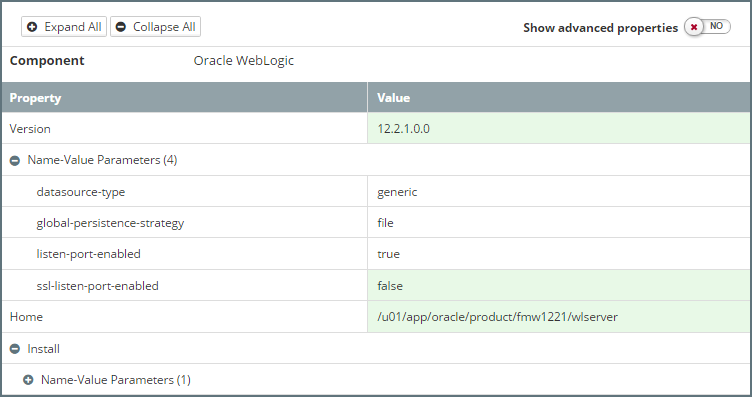

## Setting up Persistent Stores
The persistent store provides a built-in, high-performance storage solution for WebLogic Server subsystems and services that require persistence, such as: 
* Java Messaging Service (JMS)
* Store-and-Forward (SAF) Service
* Transaction Logs (TLogs)

WebLogic supports persistence to a file-based store or to a JDBC-enabled database.

### Defining the Global Persistence Strategy
One of the key design decisions when creating our Platform Blueprint is whether to use a file-based or a JDBC-enabled database persistent store. This is specified in step 4 of the Platform Bluerint wizard as shown below.

To view the global persistance strategy for a Platform Blueprint, open the Platform Blueprint Editor and navigate to `Blueprint > Products`. Select the `Oracle WebLogic` component to display its properties. 

Under `Name-Value Parameters` we will see the property `global-persistence-strategy` as illustrated below.

#### File System Persistence Strategy
When we select a File System Persistence Strategy, MyST will automatically create the required file stores to support the selected product components. For example, if we created a Platform Blueprint with the components SOA Suite and OSB, the following  File Peristence Stores would be created:

| Name | Target | Notes |
| ---- | ------ | ----- |
| mds-owsm | AdminServer ||
| mds-soa | AdminServer ||
| UMSJMSFileStore_auto_*[n]* | osb_server*[n]* | One per OSB Managed Server |
| WseeFileStore_auto_*[n]* | osb_server*[n]* | One per OSB Managed Server |
| FileStore_auto_*[n]* | osb_server*[n]* | One per OSB Managed Server |
| UMSJMSFileStore_auto_*[n]* | soa_server*[n]* | One per SOA Managed Server |
| BPMJMSFileStore_auto_*[n]* | soa_server*[n]* | One per SOA Managed Server |
| SOAJMSFileStore_auto_*[n]* | soa_server*[n]* | One per SOA Managed Server |

Where `[n]` is rep

When we install products or components that require JMS Servers, MyST will automatically 

install products or components such as SOA Suite, OSB, and BAM, the following JMS servers and persistence stores are configured out-of-the-box.

#### Database Persistence Strategy
 persisting the Transaction Logs in the database

##### Required Patches
WebLogic 10.3.6 and later support persistence to a JDBC-enabled database. However, before we begin, we need to apply the following patches.

##### WebLogic 10.3.6 Patches

| Patch ID | File | Notes |
| -------- | ---- | ----- |
| WPI2 | p19565095_1036_Generic.zip | Create domain using WLST produces incorrect JMSSERVER name in 50% of the invocations.
 |
| IHFB | p16063328_1036_Generic.zip | BEA-149500 ERROR WITH JDBC TLOG STORE
| BADF | p16104758_1036_Generic.zip | LIFECYCLESHUTDOWNSEQUENCETEST fails with the ILLEGALSTATEEXCEPTION error.
 |

##### WebLogic 12.1.3 Patches

| Patch ID | File | Notes |
| -------- | ---- | ----- |
| 19565095 | p19565095_121300_Generic.zip | Creating a domain using WLST produces incorrect JMSSERVER name in 50% of the invocations. |

### Configure a File Persistence Store
To configure a File Persistence Store in the Platform Blueprint, open the Platform Blueprint Editor and navigate to `Blueprint > WebLogic Domains > [domain_name] > Persistence Stores > File Stores`. Expand this component to see a list of currently defined file stores.

Either select an existing File Store to edit or click on the `+` icon next to File Stores (outlined in red) to create a new File Store.

For each File Store we need to specify the following properties:
* **Name** - Name for the File Store.
* **Directory** - Pathname to the directory on the file system where the file store is kept.
* **Target** - Server instance on which to deploy the file store. It is recommended that the target be defined as a MyST property reference rather than a direct value. For example `${[rxr.wls.Cluster-1].name}`.

### Adding a Database Persistence Store
To configure a Database Persistence Store in the Platform Blueprint, open the Platform Blueprint Editor and navigate to `Blueprint > WebLogic Domains > [domain_name] > Persistence Stores > File Stores`. Expand this component to see a list of currently defined file stores.

Either select an existing File Store to edit or click on the `+` icon next to File Stores (outlined in red) to create a new File Store.

For each File Store we need to specify the following properties:
* **Name** - Name for the File Store.
* **Directory** - Pathname to the directory on the file system where the file store is kept.
* **Target** - Server instance on which to deploy the file store. It is recommended that the target be defined as a MyST property reference rather than a direct value. For example `${[rxr.wls.Cluster-1].name}`.