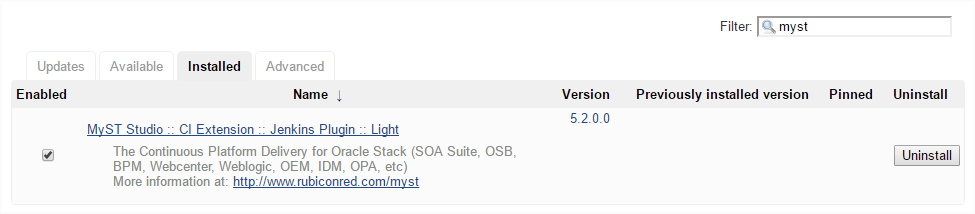

## Configure MyST Studio integration in Jenkins
As part of the build process we want Jenkins to publish details of each build to MyST Studio. 

Before we can configure a build job to to do this, we need to install and configure the MyST Studio plugin for Jenkins.

#### Install MyST Plugin
First download the MyST Studio plugin for Jenkins from the MyST Documentation site.

Once downloaded login into Jenkins and click `Manage Jenkins`. 

Then select `Manage Plugins` and 

#### Retrieve the API key from MyST Studio

#### Configure MyST Plugin
Within Jenkins, click on `Manage Jenkins` on the left hand side of the screen then select `Configure` System.

Scroll down to the MyST Studio Configuration section and enter the following information:
* **Studio Endpoint** - This is the URL for MyST Studio and takes the format `http://<myst-server-url>:<server-port>`. The defauly server port is 8085.
* **API Token** - This 	token is used to authorize communication between Jenkins and MyST Studio and is the API Key that we obtained from MyST Studio in the previous section.

Next, click `Connect` the MyST Studio plugin will attempt to connect with MyST Studio. If the connection is succesful, the message `Connected successfully` will be displayed.

Once done, click `Save` to save your configurations within Jenkins.