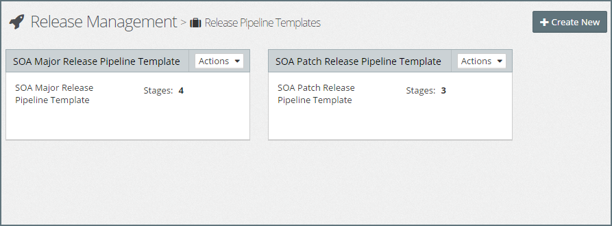
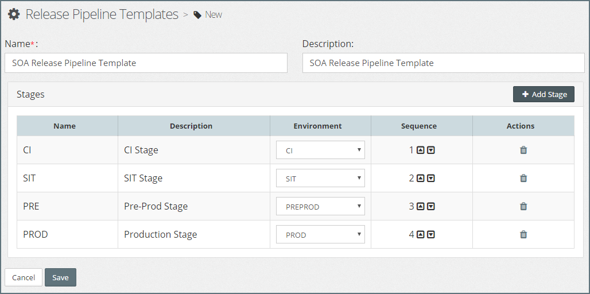
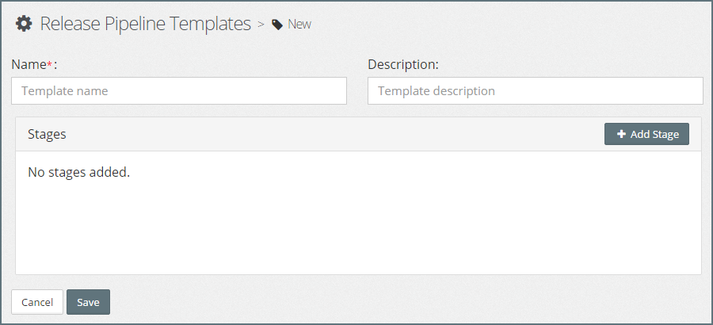

## Release Pipeline Templates
It is common practice for organizations to have a *"standard"* software delivery lifecycle (SDLC) that they follow for the implementation of Oracle Middleware projects. 

These may vary slightly based on the type of release. For example, we may follow one SDLC for *"project releases"*, but have a shorter SDLC for   for *"patch"* releases.

Pipeline Templates allow us to pre-define a set of ordered stages with promotion schemes defined for each stage. The value of Pipeline Templates, is they allow us to define a standard approach for each type of release.

So in the above example, we could define two templates, one for project releases and a second for patch releases.

### List Release Pipeline Templates
From the side menu navigate to`Release Management` > `Pipeline Template`, this will display a list of existing Release Pipeline Templates, similar to the one below.

### Creating a New Release Pipeline Template
Click `+ Create New`, this will open the **Release Pipeline Template** dialogue. Specify the following values:

* **Name** - Short hand name for the Pipeline Template.
* **Description** - A longer description of the Pipeline Template.

Next we need to define the stages in our Release Pipeline Template.

#### Add Stage
To add a stage, click `Add Stage`, this will open the **Stage** dialogue. Specify the following values:

* **Name** - Short hand name for the Pipeline Template.
* **Description** - A longer description of the Pipeline Template.
* **Environment** - 
* **Promotion Rules** - 

Once we have defined our stage, click `Save` to add the stage to our Release Pipeline Template.

> Note: We will need to repeat these steps for each stage we wish to add to our Pipeline Template. For example, if our software delivery lifecycle consists of four stages; CI, SIT, PRE and PROD we would add the corresponding stages to our Release Pipleline template.

#### Sequence Stages
By default, the stages in our Release Pipeline will be sequenced in the order that we created them.

If we wish to change the stage sequence, simply click on the up or down arrow next to the stage to move it to an earlier or later stage in the pipeline template.

Once we are happy with our Release Pipeline Template, click `Save` to Save the new Release Pipeline Template.

## Edit Release Pipeline Template.
To edit the Pipeline Template; click on the `Edit` button for the corresponding Pipeline Group, this will open the **Edit Release Pipeline Group** dialogue.

Here you can modify the Name and Description of the Pipeline Group. Once done, click `Save` to confirm your changes.

Click on `+ Create New` in the top right-hand corner of the screen. This will open the `Pipeline Template` editor.

