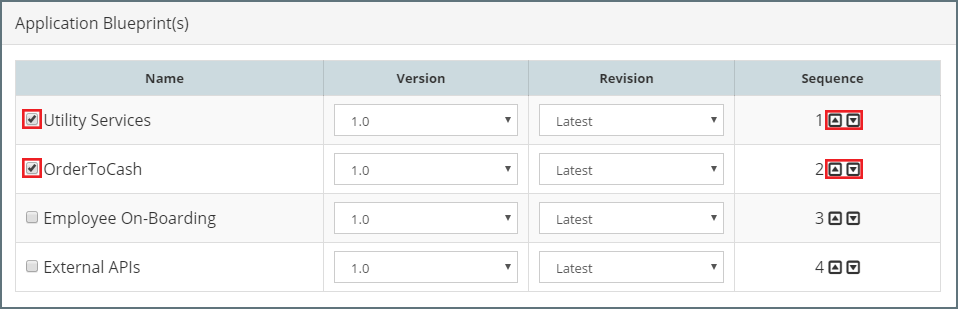

### List Release Pipelines
From the side menu navigate to`Release Management` > `Pipelines`, this will display a list of existing Release Pipelines, similar to the one below.

### Creating a New Release Pipeline
Click `+ Create New`, this will open the **Release Pipeline** dialogue. 

Specify the following values:

* **Name** - Short hand name for the Pipeline Template.
* **Description** - A longer description of the Pipeline Template.
* **Pipeline Template** - Select the Pipeline Template that we wish to base our Release Pipeline on. We can see that the list of Stages is automatically populated based on the selected template.
* **Pipeline Group** - Select the Release Pipeline Group to which the pipeline belongs. 

By default, the stages in our Release Pipeline, plus the sequence and configuration of each stages is pre-configured as defined by the Release Pipeline Template. We can edit these if required.

#### Add Stage
To add a stage, click `Add Stage`, this will open the **Stage** dialogue. Here we need to specify the Stage Name, Description, Stage Environment Type and Promotion Rules.

#### Edit Stage
To edit a stage, click on the pencil icon for the corresponding stage. This will open the  **Stage** dialogue. Here we can modify the Stage Name, Description and Promotion Rules.

#### Delete Stage
To delete a stage, click on the trash can icon for the corresponding stage. MyST will prompt for confirmation of the Delete action, click `Yes` to proceed with the deletion of the stage.

#### Sequence Stages
Release are promoted through each stages from left to right. If we want to change the stage sequence, simply click on the left or right arrow next to the stage (outlined in red in the above screenshot) to move it to an earlier or later stage in the pipeline.

## Release Streams
Within a Release Pipeline, a Stream is used define the Platform Blueprint and Application Blueprint(s) to be promoted through each stage.

A Release Pipeline can consist of one or more Release Streams. A Release Stream is targeted to an Oracle Middleware platform as defined by its Platform Blueprint and can contain zero or more Application Blueprints. 

A common use case for multiple Release Streams would be if you wanted to perform a release across multiple WebLogic domains such as a release to an ADF and SOA WebLogic Domain.

For each stream we would specify, zero or more Application Blueprints that we want to deploy.

### Add Streams
To add a stream to our Release Pipeline, click `Add Stream`. This will open the  Stream Editor. Here we need to specify the .
Specify the following values:

* **Name** - Short hand name for the Release Stream.
* **Description** - A longer description of the Release Stream.
* **Stream Type** - Select the Stream Type to which the stream belongs.
* **Platform Blueprint and Version** - See Configuring a Streams Platform Blueprint Version.
* **Application Blueprint(s)** - Select the Application Blueprints to be promoted through the stream

#### Configuring a Streams Platform Blueprint Version
For each stream we need to define its target Platform Blueprint and Version. Once defined MyST will only make available for deployment Platform Models / Instances that are based on the streams Platfom Blueprint and Version.

This is to ensure the Platform Instance deployed to at each stage of the Release Pipeline has the same configuration.

As its possible to have multiple revisions of the same Platform Blueprint version, MyST also allows us to specify how we want MyST to handle a scenario, where a Platform Instance is not on the latest committed revision of the Platform Blueprint version. 

This is controlled with the `Behavior` option, which can be one of:
* **Update** - MyST will update the Platform Instance to the latest committed revision of the specified version of the Platform Blueprint & Model. The update action will be performed prior to deploying any Application Blueprints to the Platform Instance.
* **None** - MyST will not perform any platform specific actions against the Platform Instance.

#### Configuring a Streams Application Blueprints
For each stream we need to define the set of Application Blueprints whose deployment and promotion we want to manage as part of the release pipeline.

Within the `Application Blueprint(s)` section of the `Stream` editor, select the required Application Blueprints from the list of Application Blueprints. 

For each application Blueprint we need to specify:
* **Version** - Specifies the version of an Application Blueprint to be deployed.
* **Revision** - Each time there is a new revision of an artifact contained within an Application Blueprint, MyST will create a new revision of the Application Blueprint. Within a Release Stream, we can configure MyST to always use the latest revision of an Application Blueprint or pin a specific revision of an Application Blueprint to the stream.
* **Sequence** - This defines the sequence in which Application Blueprints are deployed. To change the order, simply click on the up or down arrow next to the Application Blueprint (outlined in red above) to move it to an earlier or later stage in the deployment.

#### Configuring Platform Models / Instances
For each stream we need to specify the target platform for each stage in the Release Pipeline. The target platform is the Platform Instance to which MyST will apply the Platform Configuration changes as defined by the Platform Blueprint as well as deploy and configure the artifacts defined by the Application Blueprints.

For each Stream / Stage combination, we will see a drop down in the Release Pipeline (as outlinned in red below). From this we can select the Platform Model

* **Platform Blueprint and Version** - The drop down list will be automatically filtered to only show Platform Models based on the Platform Blueprint and Version as specified in the stream configuration.
* **Environment Type** - The drop down list will be automatically filtered to only show Platform Models for the stage environment type as specified in the stage configuration.

If we wish to change the stage 

### Post Deployment Actions

