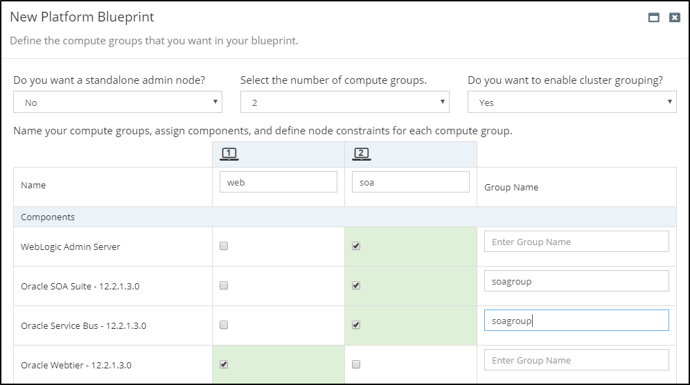

## {{ page.title }}

Rubicon Red MyST uses a declarative approach to automation, meaning users simply define the **target state** of the Oracle Middleware infrastructure to be deployed which, at the push of a button, is automatically provisioned by MyST.

Within MyST, the target state is captured in the _“platform definition”_, which is divided into two layers:

* First, the **Platform Blueprint**: this an environment agnostic specification used to define the platform topology and configuration of your Oracle Middleware. This provides an abstraction layer over the underlying infrastructure, allowing you to define a single Blueprint for all environments.

* Second, the **Platform Model**: this maps the Platform Blueprint to the target infrastructure and overlays the environment specific configurations.

For each platform instance, we create a separate platform model to define all the environment specific configuration information. This approach provides a number of benefits, including:

* **Consistency** - Configuration across all environments, from Development through to Production, is managed through a centralized *Platform Blueprint*.
* **Infrastructure Independence** - Enabling you to provision consistent middleware platforms across all environments regardless of infrastructure type, on premise and on cloud
* **Reliability** - Through *automation* MyST will reduce risk by bringing platforms to a desired state no matter what the initial state of the target platform is. This is known as *idempotency* 
* **Flexibility** - Environment specific overrides can be applied through *Platform Models*, allowing for configuration differences to be safely managed.
* **Governance** - Platform Blueprint and Platform Models are *version controlled*. Release Pipelines provide complete control in promoting configuration changes across environments. 
* **Simplicity** - Easy-to-use graphical editor for defining target state of Oracle Middleware configuration. There is no need to write scripts or have specialist skills in a programming language


Most Oracle Middleware products run on Oracle WebLogic Application Server. WebLogic supports the concept of a Domain to group related clusters and servers. Some organizations use separate domains for each business unit or capability, others use it to group computational workload. How it is used is up to the organization. 

For Oracle products that run on WebLogic, a Platform Blueprint represents a logical definition of a WebLogic domain. For this reason, it is typical for a separate blueprint to be created in MyST Studio for each unique WebLogic domain type in an enterprise (e.g. SOA, ADF)


There are three ways in which you can create a Platform Blueprint:
* **Wizard:** This guides the user through a simple process to capture the key design decisions for the Oracle Middleware topology and configuration and creates a corresponding Platform Blueprint.
* **Template:** Choose from a set of pre-defined Rubicon Red certified templates to build your blueprint or use a template that you have previously created.
* **Introspection:** Use MyST to discover and introspect an existing WebLogic Domain and create a corresponding Platform Blueprint.

## Creating a Platform Blueprint using the Wizard
MyST Studio provides a wizard which guides the user through the end-to-end process of designing your Platform Blueprint. The wizard is used to capture key design decisions, such as:

 * Which Oracle Middleware product, version and components do want in your platform? 
 * What topology do you want? For example, do you want
   * A separate web-tier layer?
   * Separate layers per product component?
   * An isolated admin server?
 * What constraints do you want to add to your platform? For example, what is:
   * The minimum and maximum cluster size?
   * The target operating system?
 * What additional platform capabilities do you want to configure? For example:
   * Do you want encrypted listen addresses for your WebLogic Servers?
   * Do you want to persist TLogs and JMS Stores to the database or file system?
   * Do you require GridLink data sources for Oracle Middleware product schemas?

Based on the answers provided, MyST will generate an Oracle EDG Compliant Platform Blueprint which can then be used to install and configure your Oracle Middleware Platform.

### Launching the Platform Blueprint Wizard
From the side menu navigate to`Modeling` > `Platform Blueprint`. This will display a list of existing Platform Blueprints. Click on `Create New` in the top right-hand corner of the screen. This will launch the `New Platform Blueprint` wizard.

In the initial dialog, we need to specify the following details about our Platform Blueprint:

* **Name** - Shorthand name for the Platform Blueprint
* **Description** - A longer description of the Platform Blueprint
* **Workspaces** - This defines the Workspaces to which the Platform Blueprint belongs. See Role-Based Access Control for further details.
* **Initial Version** - Specifies the initial version of the Platform Blueprint. See Platform Blueprint and Model Versioning for further details.

Finally, we need to specify how we want to create the Platform Blueprint. Keep the default selection of `Wizard`. Then click `Next`.

### Specify Oracle Middleware Components
The next stage is to select which Oracle Middleware components are to be included within our Platform Blueprint. First, select the Oracle Middleware Product Catalog in which we are interested, this could be one of:
* Integration and Process Management
* Social Business and Collaboration
* Business Intelligence
* Identity Management

Next specify the Oracle Middleware version (for example 11.1.1.7, 12.1.3, 12.2.1.0, 12.2.1.3). For the specified Oracle Middleware Product Catalog and Version, MyST will list the components that are available for inclusion within the Platform Blueprint.

Finally select the required Oracle Middleware components to be included within your Platform Blueprint. You will notice that MyST automatically selects any mandatory components, for example, if you select Oracle B2B then Oracle SOA Suite will automatically be selected. 

 
Each Platform Blueprint can only include components from a single Product Catalog. Components that are supported in multiple Product Catalogs (e.g. Web Services Manager) appear in all the applicable Product Catalogs.


Once all components have been specified, click `Next`.

### Specify Compute Groups

#### Introduction to Compute Groups
Within MyST, Compute Groups are used to specify the logical topology of our WebLogic Domain.

When we layout out our WebLogic Domain, it is common to target different component types, such as the Web Tier, Oracle Service Bus and Oracle SOA to different groups of virtual or physical servers.  

In Production, for example, we could have a WebLogic Domain consisting of four Oracle Service Bus managed servers, two SOA managed servers and a web-tier consisting of two Oracle HTTP servers.  

It is also common for Non-Production environments, such as Continuous Integration (CI), System Integration Testing (SIT) and Pre-Production (PRE) to vary in size. For example, we may have a 4 node OSB cluster in Prod and Pre-Prod, with a two node OSB cluster in UAT and SIT and just a single node OSB and SOA (cluster) for CI.  

As we have already mentioned, a core objective of MyST is to enable you to use a single Platform Blueprint for all these environments, so we can ensure that each of these environments has an identical configuration and prevent issues caused by configuration drift.  

Compute groups in MyST allow us to specify the rules for targeting component-types to specific groups of servers, as well as specify the default, minimum and maximum number of nodes in the compute group, with the actual number of nodes in the compute group being specified as part of the Platform Model, but within the constraints specified by the Platform Blueprint. This provides the flexibility required to use a single Platform Blueprint across all environments.  

The other consideration when specifying our domain topology, is whether to have a stand-alone admin node, in other words, whether to deploy it to its own compute group, or include it within an existing compute group.  

As the admin server cannot be clustered, when selecting a stand-alone admin node, MyST will set the maximum number of nodes to one. When including it within an existing compute group, MyST will only provision the admin server to the first node in the compute group.


If you select a stand-alone admin server in the Platform Blueprint, you still have the option of overriding this in the Platform Model. This provides an additional level of flexibility, as you may want a stand-alone admin server in Production, but to co-locate it with another managed server in some environments in order to save resources.
 

#### Define Compute Group
To define the Compute Groups that we want in our Platform Blueprint, we first need to specify the following values:

* **Stand-alone Admin Node** - From the drop-down, select whether you want to have a stand-alone admin server (`Yes`) or include it within an existing Compute Group (`No`)
* **Number of Compute Groups** - From the drop-down, select the required number of Compute Groups.

For each Compute Group, we need to specify the following values:
* **Name** - Provide a short name (such as web, soa, osb) for the Compute Group.
* **Components** - Click on the appropriate check boxes to add the required components to a Compute Group. Note: A component can only belong to a single Compute Group, so selecting it for one Compute Group will automatically deselect it from its previous Compute Group.
* **Node Constraints** - Specify the default, minimum and maximum number of nodes in the Compute Group. When creating a Platform Model, it will use the default value for the number of nodes. This can then be modified with the minimum and maximum constraints.

Finally, we need to select from the drop-down the target compute definition for all target hosts that will be used within each Compute Group.

#### Cluster Grouping

By default, MyST follows the Oracle Enterprise Deployment Guide and hosts individual components within separate WebLogic clusters.

However, there may be instances where you might want to host more than one component in the same WebLogic cluster. To allow for this, you can choose `Yes` for `Enable Cluster Grouping` in this step and associate a logical label for the components you want to group together.

Here, we have enabled cluster grouping and associated the label, `soagroup` with both Oracle SOA Suite and Oracle Service Bus. This will result in them being co-hosted inside the same cluster as shown below


Note that cluster grouping is not supported for all product combinations as of now. The only combinations which we support are
1. Oracle SOA Suite + Oracle Service Bus
2. Oracle SOA Suite + Oracle Enterprise Scheduler
3. Oracle Service Bus + Oracle Enterprise Scheduler


Once done, click `Next`.

### Specify Other Key Configurations
The final stage is to specify a number of other key configuration decisions for the Platform Blueprint. 

MyST will default these options based on the most common configurations, we should update these details as required for our Platform Blueprint. These are:

* **WebLogic Domain Name** - Specify an appropriate WebLogic Domain Name.
* **Enable Standard Listen Ports** - This option is selected by default and can only be disabled if you enable SSL Listen Ports.
* **Enable SSL Listen Ports** - Select this option to enable SSL listen ports for the WebLogic Servers in the domain.
* **Enable Administration Port** - Select this option to enable the SSL administration port for  all WebLogic Servers in the domain.
* **Administration Port** - Specify the port number for the SSL administration port (can only be set if the Administration Port is enabled).
* **JDBC Data Source Type** - This option is used to specify the Data Source Type for Oracle Middleware specific schemas which are created by the Oracle Middleware Repository Creation Utility (RCU). If using Oracle RAC, then select a GridLink Data Source, otherwise use a Generic Data Source.
* **Persistence Strategy** - Use this to specify whether TLOGs and JMS Stores are held on the File System or in the Database.

Once done, click `Next`.

### Review the Summary
MyST will display a Summary screen showing all the key inputs specified in the Platform Blueprint Wizard. 

Once done, click `Finish`. MyST will create the corresponding Platform Blueprint and take you to the Platform Blueprint Editor where you can make additional changes if required. See [Editing Platform Blueprints](/platform/definitions/editor/README.md) for further details.

## Creating a Platform Blueprint from a Pre-Defined Template
MyST comes with a catalog of certified Platform Templates, with _"built-in"_ best practices for enterprise deployment of Oracle Middleware. We can use these to create our initial Platform Blueprint.

MyST also allows us to [create our own Platform Templates](/platform/templates/README.md), which can be used to create our initial Platform Blueprint. This can be useful if we have multiple domains in Production for the same Product Components. For example, we may have multiple SOA domains each designated to a particular line of business. Platform Templates allows us to capture a base "Platform Blueprint" that can be re-used to create the Platform Blueprint for each domain.

### Launching the Platform Blueprint Wizard
From the side menu navigate to`Modeling` > `Platform Blueprint`, this will display a list of existing Platform Blueprints. Click on `Create New` in the top right-hand corner of the screen. This will launch the `New Platform Blueprint` wizard.

In the initial screen, we need to specify the following details about our Platform Blueprint:

* **Name** - Shorthand name for the Platform Blueprint
* **Description** - A longer description of the Platform Blueprint
* **Workspaces** - This defines the Workspaces to which the Platform Blueprint belongs. See [Role Based Access Control](/administration/README.md) for further details.
* **Initial Version** - This specifies the initial version of the Platform Blueprint. See [Platform Blueprint and Model Versioning](/platform/definitions/version-control/README.md) for further details.

Finally, we need to specify that we want to use a **template** to create the Platform Blueprint. Select `Template`and click `Next`.

### Select Template
The next stage is to select which template to use for our Platform Blueprint. 

From the drop-down, select the required Platform Template. MyST will display the Platform Template description, allowing you to verify that the correct template has been selected. Once selected, click `Next`.

### Review the Summary

MyST will display a Summary screen showing all the key inputs specified in the Platform Blueprint Wizard.

Once done, click `Finish`. MyST will create the corresponding Platform Blueprint and take you to the Platform Blueprint Editor where you can make additional changes if required. See [Editing Platform Blueprints](/platform/definitions/editor/README.md) for further details.

## Other ways of creating a Platform Blueprint

1. **Using Introspection** - There are scenarios where we might want to reverse-engineer our platform blueprints from pre-existing environments. For such situations, MyST allows one to **introspect** the platform and discover the existing configuration and create a blueprint out of it. See [Introspecting Existing Instances](/platform/introspection/README.md) for further details.
2. **Upgrading from an existing blueprint** - This option allows us to upgrade configuration from a lower middleware version to a higher middleware version and create a new blueprint based on the higher version. See [Upgrading Instances](/platform/upgrade/README.md) for further details. 