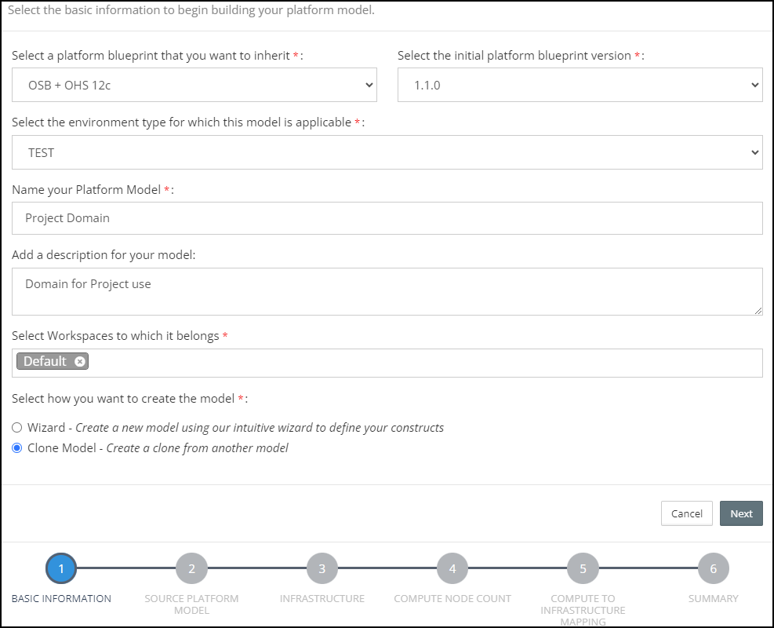
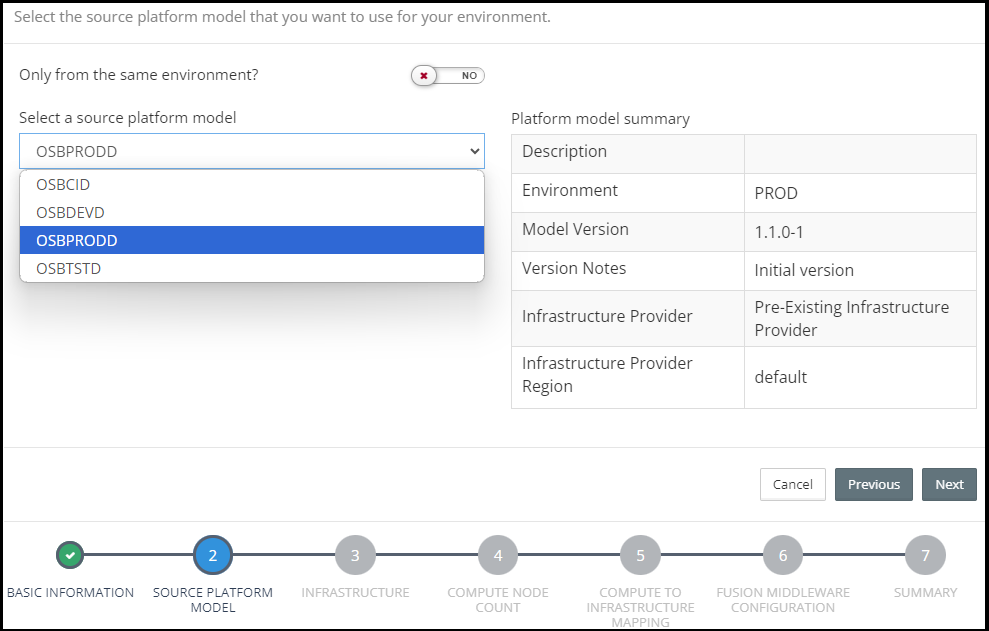
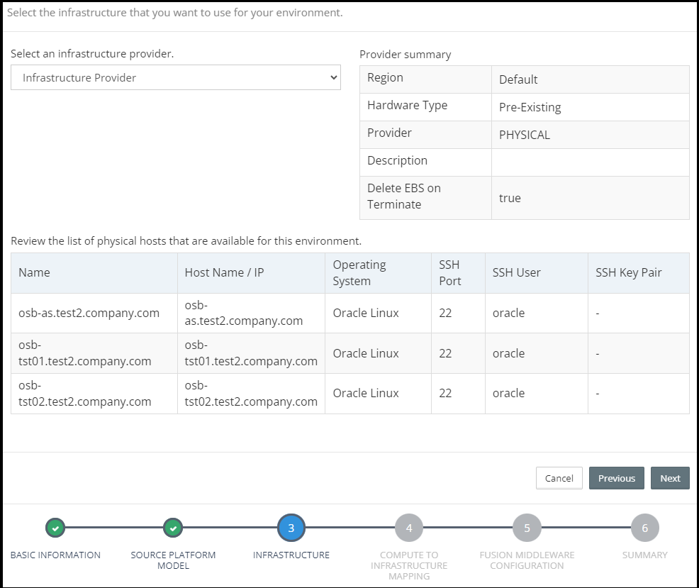
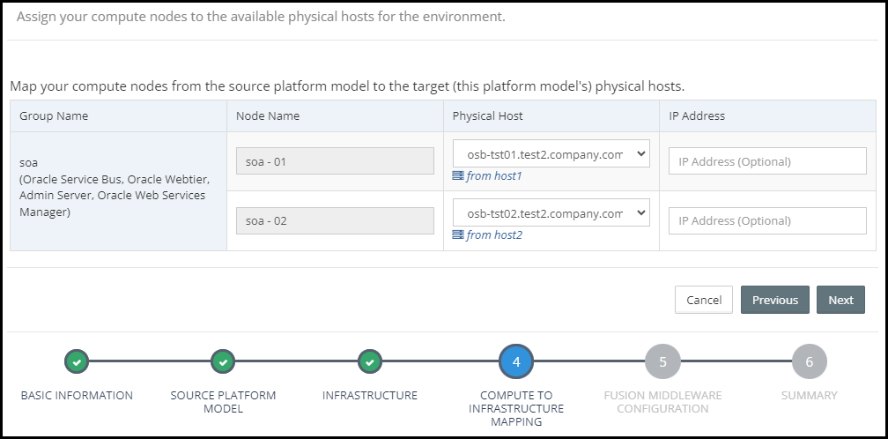
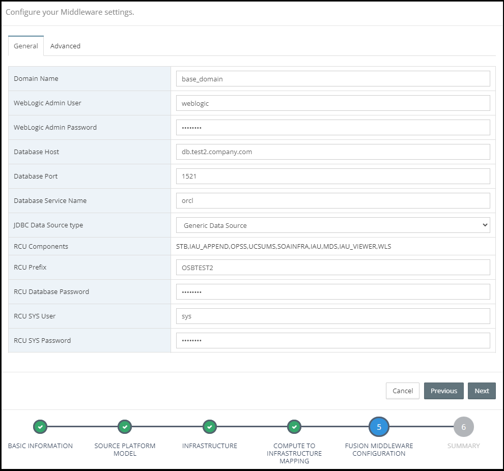
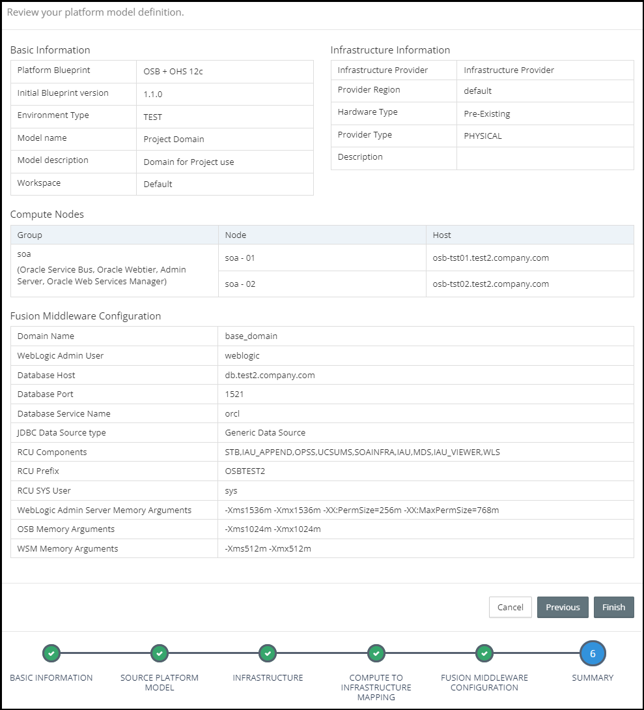
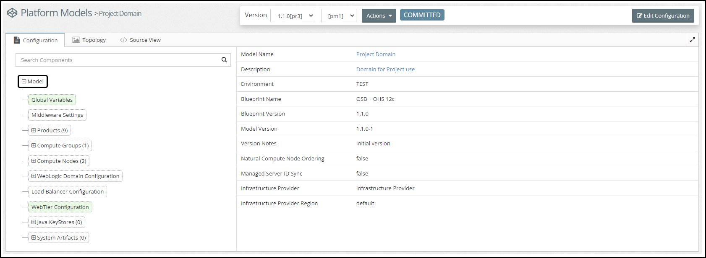

## {{ page.title }}

Myst allows us to clone an existing Platform Model and provide new environment specific information. The cloned Platform Model inherits from the same Platform Blueprint and will carry across all the source Platform Model specific details. We simply follow the wizard process to create the cloned Platform Model.

This supports a number of use cases, including:

* **Side-By-Side Upgrade** - We can clone an existing environment, update product versions, then use this to automatically provision an equivalent upgraded environment in minutes.

* **Lift and Shift to the Cloud** - We can clone an existing 11g/12c environment and then use Myst to provision an equivalent environment to the cloud.

* **Replicate Environments** - We can clone an existing 11g/12c environment, for example Test, and then use this to provision equivalent/or  a duplicate environment for:

    * **reproducing** a particular issue
    * conduct **performance** and/or **load** testing
    * provide an environment for a **short term** or **project** that is isolated from the 'main' release path

The end-to-end process consists of three simple steps and can be performed in minutes.

### Define the new Platform Model's target Infrastructure

Before we can clone an existing Platform Model, we need to provide details of the physical or virtual servers that the new WebLogic domain is to be provisioned to, plus SSH connection details.

From the side menu navigate to `Infrastructure` > `Infrastructure Providers`, this will display a list of existing Infrastructure Providers. 

From here, there are two options for Infrastructure Provider:

* Open the required [Pre-existing Infrastructure](/infrastructure/providers/pre-existing/README.md) or simply add a new one and provide the new WebLogic host(s) and SSH connection details. The [Pre-existing Infrastructure](/infrastructure/providers/pre-existing/README.md) page provides more instructions on how to set up pre-existing infrastructure.
* Create or utilise [On-Demand Infrastructure](/infrastructure/providers/on-demand/aws/README.md) on AWS with details on how to set up and configure available on our [On-Demand Infrastructure](/infrastructure/providers/on-demand/aws/README.md) page.

### Platform Model Basic Information including Identifying the WebLogic Domain to Clone 

For the purpose of this documentation, we are going to clone our existing OSB+OHS 12c environment running on two VMs, that consists of a 2 node OSB Cluster and 2 node OHS Cluster, and provision an on-demand replica for a project that is just about to start.

From the side menu navigate to `Modeling` > `Platform Models`, this will display a list of existing Platform Models. Click on `Create New` in the top right-hand corner of the screen. This will launch the `New Platform Model` wizard.

In the initial dialog we need to specify the following details about our Platform Model:

* **Platform Blueprint** - The Platform Blueprint that we will use for our Platform Model.
* **Platform Blueprint Version** - The version of the Platform Blueprint that we will use for our Platform Model.
* **Environment Type** - The Environment Type for the Platform Model.
* **Name** - Shorthand name for the Platform Model.
* **Description** - A longer description of the Platform Model
* **Workspaces** - This defines the Workspaces to which the Platform Model belongs. See Role-Based Access Control for further details.

Finally, we need to specify that we want to use **Clone Model** to create the Platform Model. Select `Clone Model` and click `Next`.

### Source Platform Model Selection

Based on the selections of `Platform Blueprint` and `Platform Blueprint Version`, the **Source Platform Model** screen shows a list of Platform Models that can be chosen. This can be filtered to show platforms only from the same `Environment Type`, selected in the previous step.

A small summary of the Source Platform Model is shown on the right.

### Select Infrastructure Provider

Next, we need to specify the Infrastructure Provider for our Platform Model. From the corresponding drop-down, we've selected a Pre-Existing Infrastructure Provider called **Infrastructure Provider**. Myst will list all the target hosts within the Pre-Existing Infrastructure provider for the Platform Model Environment Type.

Once done, click `Next`.

### Map to Pre-Existing Servers

The next step is to map each Node to a corresponding Pre-Existing Host in the selected infrastructure provider.

Myst will list out each node required by the Platform Model. Against each node there will be a drop down box, including the target hosts for the specified environment type that are available to be mapped to the node. So go ahead and select each target host.

> Note: the corresponding host from the `Source Platform Model` is shown underneath each drop down box. 

### Specify Platform Model Configurations

The final stage is to specify configuration properties that are specific to the Platform Model.

For the Platform Model, we need to specify the following details:

* **Domain Name** - This is the WebLogic Domain name, it will default to the value specified in the Platform Blueprint, but can be overridden in the Platform Model.
* **WebLogic Admin User** - Enter the WebLogic Admin user, it defaults to Weblogic.
* **Weblogic Admin Password** - Enter the password to be used for the WebLogic Admin User.
* **Database Host** - The host name for the database that will host the RCU schemas. 
* **Database Port** - The port number for the database.
* **Database Service Name** - The service name / SID of the database. 
* **JDBC Data Source type** - This option is used to specify the Data Source Type for Oracle Middleware specific schemas which are created by the Oracle Middleware Repository Creation Utility (RCU). This will default to the value specified in the Platform Blueprint but can be overridden here.
* **RCU Components** - This details the RCU specific schemas that will be created. This is pre-populated based on the Oracle Middleware Components specified in the Platform Blueprint, this is for information purposes only and can't be modified.
* **RCU Prefix** - Specify the RCU Prefix to be used. The prefix is prepended to and separated from the schema name with an underscore (_) character.
* **RCU Database Password** Enter the password to be used for each of the schema owners created by RCU.
* **RCU SYS User** - Enter the user name for the RCU database. This should be a username with DBA or SYSDBA privileges, for example, SYS.
* **RCU SYS Password** - Enter the password for the RCU Sys User.

> Note: All passwords stored by Myst are encrypted.

### Review the Summary

Myst will display a Summary screen showing all the key inputs specified in the Platform Model Wizard. 

Once done, click `Finish`. Myst will create the corresponding Platform Model and take you to the Platform Model Editor where you can make additional changes if required. See [Editing Platform Models](/platform/definitions/README.md) for further details. 

Alternatively, if you just want your new Platform Model to be up and running, click on `Actions` > `Provision` to start [Provisioning the Platform Instance](/platform/provisioning/README.md).

