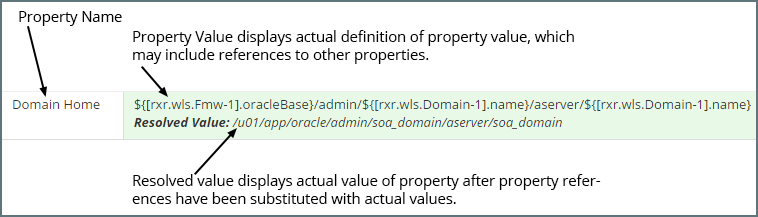

## {{ page.title }}

MyST holds the configuration details of a Platform Blueprint and Platform Model in a hierarchical or tree-like structure. The Platform Editor is used to view and edit Platform Blueprints and Platform Models.

### Opening a Platform Blueprint in the Platform Editor
From the side menu navigate to`Modeling` > `Platform Blueprints`, this will display a list of existing Platform Blueprints. Click on any one of the blueprints. This will open the it in the `Platform Editor` in view mode.

### Opening a Platform Model in the Platform Editor

From the side menu navigate to `Modeling` > `Platform Models`, this will display a list of existing Platform Models. Select the Platform Model you are interested in and MyST will display summary details about the Platform Model and its corresponding instance as shown below.

Click on the `Actions` drop-down in the top right-hand corner and select `Configuration`. This will open the model in the `Platform Editor` in view mode.

### Platform Editor Layout

The Platform Editor is split into the following core sections:

1. **Control Bar** - Displays the version, revison and state of the platform configuration, and allows us to perform contextual actions such as editing. See [here](/platform/definitions/editor/control-bar/README.md) for more details.
2. **Configuration View**
This presents a rich user interface for navigating through the various portions of the configuration and viewing / changing them. It is split into two parts:
   1. **Tree View** - Displays a hierarchical view of the top level configuration elements. This can can be used to easily navigate through the configuration as well as add and remove components from it. See [here](/platform/definitions/editor/tree-view/README.md) for more details.
   2. **Properties View** - Displays the list of properties and corresponding values defined for the selected component in the tree. See [here](/platform/definitions/editor/properties-view/README.md) for more details.
3. **Topology View** - Helps to visualize the topology of the platform. This can be used to get a high-level picture of the physical architecture of the platform. See [here](/platform/definitions/editor/topology-view/README.md) for more details.
4. **Source View** - This presents the raw JSON data which backs the platform configuration. This is a read-only view and is intended to be used in conjunction with the REST APIs for programmatic configuration changes. See [here](/platform/definitions/editor/source-view/README.md) for more details.

#### Full-screen mode

It is possible to switch the configuration section into full-screen mode by clicking on the `resize` control in the configuration bar (highlighted in red above)

---------------------------------------------------------

When defining the value of a property, we can reference the value of one or more other properties, see [MyST Property Overview](). Once in **Edit** mode, the Property Viewer will display the property definition for calculating the property value, which may include references to other property values. Underneath that, MyST will display the actual resolved (or calculated) value of the property after property references have been substituted with actual values, as shown below.

To edit a property, within the TreeView browse to the component where you want to make changes and click `Edit`(outlined in red below).

This will allow you to edit the property definitions for each property within the selected component. Once you have finished making your changes, click `Save`.


Important

> Saving changes at the component level only saves the changes with the current editing session. The Platform Editor allows you to make all the changes you need to the Platform Blueprint or Model, and save them to the MyST Repository all at once by clicking `Apply Changes` Alternatively, clicking `Discard Changes` will discard all the changes made within the current `Edit Session`. 


Any edits made to a Property Definition which have not yet been saved to the MyST Repository are highlighted in yellow to indicate this.



Every time you apply changes to a blueprint version, a new revision is automatically created of the blueprint. From the  editor, we can only view the latest revision of the blueprint. If the latest revision of the blueprint is not the same as the last revision used to provision or change an instance, we will need to update the Platform Model before the new revision changes are applied.


### Property Expansion in MyST
To make editing and maintenance of Platform Blueprints easier, MyST supports property expansion when defining the value of a property. This allows us to define the value of a property based on the value of one or more other properties.

When a string of the format `${some.property}` appears in a property value it will be expanded to the value of the specified property.

For example, if we have the following properties:
* `oracle.base` - Defines the Oracle Home directory for installing the Oracle Middleware Platform. 
* `oui.inventory.directory` - Defines the Oracle Universal Installer (OUI) Inventory Directory

The default location for (OUI) Inventory Directory is to place this in the sub-directory `oraInventory` under the Oracle Home. MyST enables us to set the value of the property `oui.inventory.directory` to  `${var.oracle.base}/oraInventory`.

#### Referencing MyST Properties
When referencing a MyST property, in order to uniquely identify it, we need to specify the full path of the property within the Platform Blueprint or Model.

The simplest way to derive the expression to reference a property is to locate the property we wish to reference within the Property Viewer and click on the Property Name. MyST will open a speech bubble containing the expression to reference the property as shown below.


The Platform Editor needs to be in Edit mode in order to be able to view a property reference expression.


#### Understand the MyST Property Path
In general, a dot notation is used to traverse the property hierarchy. For example, `a.b.c` would mean locate `c` within `b` within `a`. 

The following table lists the property path for the top-level components in the Platform Blueprint and the Platform Model.

| Component| Property Path|
| -- | --------- |
| Global Variables | var |
| Middleware Settings | rxr.wls.Fmw-1 |
| Products | rxr.def |
| Compute Groups | rxr.infra |
| Load Balancers | rxr.infra |
| WebTier Configuration | rxr.infra |
| WebLogic Domain | rxr.wls |
| Keystores | rxr.def |

#### Referencing a `property` value within a `component`
A component is a complex type consisting of a pre-defined collection of object types. To reference a `property` value within a component we used the following syntax:

`<component-property-path>.<property-key>`

Where
* `<component-property-path>` - Is the path to the component containing the property.
* `<property-key>` - Is the key for the property whose value we are referencing within the component.

For example, within a Platform Blueprint or Model, we have the `Middleware Settings` component, to reference the `version` property value, we would use the expression: 

`${[rxr.wls.Fmw-1].version}`

In this example:
* `rxr.wls.Fmw-1` is the `<component-property-path>` as defined in the table.
* `version` is the `<property-key>`.
 
#### Referencing a child `component` within a parent `component`
Reference a child component within a parent component we use the following syntax:

`<parent-component-property-path>.<component-key>`

Where:  
* `<parent-component-property-path>` - Is the path to the component containing the child component.
* `<component-key>` - Is the key for the component that we are referencing within the parent component.

#### Referencing a `component` within a `list`
A list is a complex type consisting of a list of zero, one or more components of the same type. 
To reference a component within a list we use the following syntax:

`[<parent-component-property-path>.<list-component-type>-<component-key>]`

Where
* `<parent-component-property-path>` - Is the path to the component containing the list.
* `<list-component-type>` - Is the component type held in the list
* `<component-key>` - Is the key for the component that we are referencing within the list. 

For example, a Platform Blueprint contains a list of Products (for example Java, SOA, Service Bus, RCU) that will be installed. In this example, if we want to reference the RCU component, we would use the expression:

`[rxr.def.Product-rcu]`

Where
* `<parent-component-property-path>` is `rxr.def` as defined in the xxxx table.
* `Product` is the `<list-component-type>`.
* `rcu` is the `<component-key>` for the RCU product component in the list 

To reference the RCU product version we would use the expression:   

`${[rxr.def.Product-rcu].version}`

For many lists, the component key defaults to the index number of the object stored in the list. For example, a WebLogic Domain contains a list of WebLogic Clusters. In this example: 
* The WebLogic Domain is the object containing the list. So `<parent-component-property-path>` is `rxr.wls`
* `Cluster` is the component type stored in the list.
* `1` is the component key for the first cluster, `2` the component key for the second cluster, and so on.

Thus the component property path to the second cluster in the list would be expressed as `[rxr.wls.Cluster-2]`. To reference the cluster name we would use the expression:  
`${[rxr.wls.Cluster-2].name}`

#### Referencing a property value within a property of type `paramList`
As we mentioned earlier, a component is a complex type consisting of a **pre-defined** collection of object types. However, we often want to add additional properties to a component, that aren't defined in advance. 

We can do this using a paramList. A paramList is a list of zero, one or more `property` types. The list of properties is not fixed and can be added to using the Platform Editor.

To reference a `property` value within a`paramList` we use the following syntax:

`<paramList-property-path>.param[<property-key>]`

Where
* `<parent-component-property-path>` - Is the path to the component containing the `paramList`
* `<property-key>` - Is the key for the property stored in the paramList

For example, the Oracle SOA Suite Product object contains a Name-Value Parameter list, that contains a number of `string` properties, such as audit-level and base-port. To reference the base-port value we would use the expression:  

`${[rxr.def.Product-soa].param[base-port]}`

#### Referencing a `global variable` value
MyST supports the notion of global variables. These are essentially held as a paramList. To reference a global `property` value within a component we used the following syntax:  

`${<var>.<property-key>}`

Where
* `<var>` - Is the path to the component containing the property.  
* `<property-key>` - Is the key for the property whose value we are referencing within the component.

For example, to reference the value of global variable `install.directory`, we would use the expression:
  
`${var.install.directory}`

<!-- TODO ### Create new Platform Blueprint Version -->

<!-- TODO ### Create new Platform Model Version-->