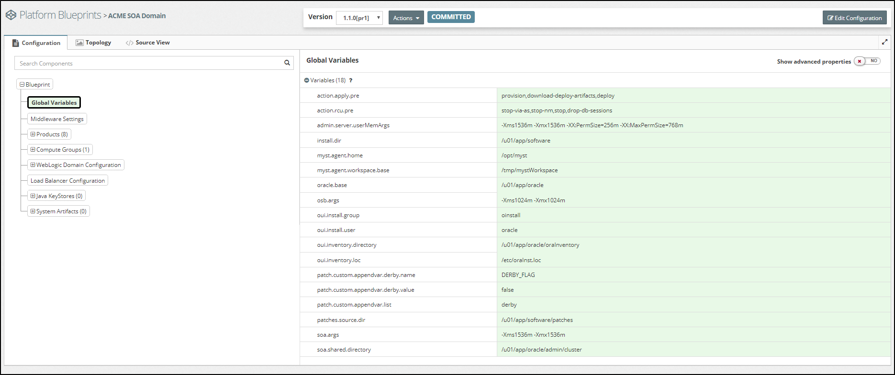
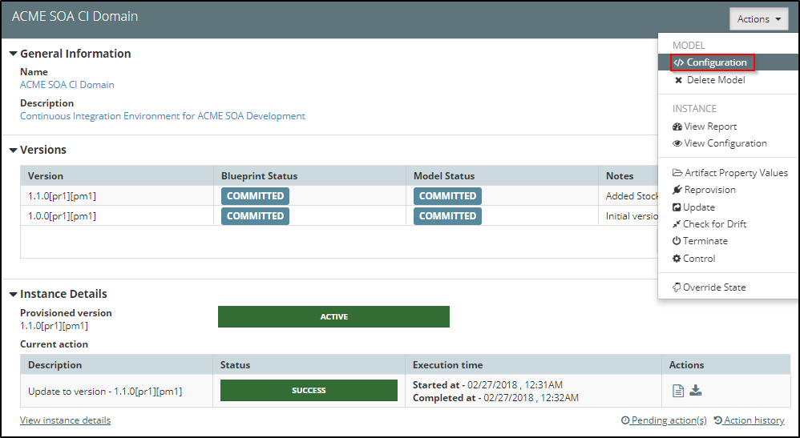
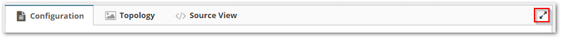

## {{ page.title }}

MyST holds the configuration details of a Platform Blueprint and Platform Model in a hierarchical or tree-like structure. The Platform Editor is used to view and edit Platform Blueprints and Platform Models.

### Opening a Platform Blueprint in the Platform Editor
From the side menu navigate to`Modeling` > `Platform Blueprints`, this will display a list of existing Platform Blueprints. Click on any one of the blueprints. This will open the it in the `Platform Editor` in view mode.

### Opening a Platform Model in the Platform Editor

From the side menu navigate to `Modeling` > `Platform Models`, this will display a list of existing Platform Models. Select the Platform Model you are interested in and MyST will display summary details about the Platform Model and its corresponding instance as shown below.

Click on the `Actions` drop-down in the top right-hand corner and select `Configuration`. This will open the model in the `Platform Editor` in view mode.

### Platform Editor Layout

The Platform Editor is split into the following core sections:

1. **Control Bar** - Displays the version, revison and state of the platform configuration, and allows us to perform contextual actions such as editing. See [here](/platform/definitions/editor/control-bar/README.md) for more details.
2. **Configuration View**
This presents a rich user interface for navigating through the various portions of the configuration and viewing / changing them. It is split into two parts:
   1. **Tree View** - Displays a hierarchical view of the top level configuration elements. This can can be used to easily navigate through the configuration as well as add and remove components from it. See [here](/platform/definitions/editor/tree-view/README.md) for more details.
   2. **Properties View** - Displays the list of properties and corresponding values defined for the selected component in the tree. See [here](/platform/definitions/editor/properties-view/README.md) for more details.
3. **Topology View** - Helps to visualize the topology of the platform. This can be used to get a high-level picture of the physical architecture of the platform. See [here](/platform/definitions/editor/topology-view/README.md) for more details.
4. **Source View** - This presents the raw JSON data which backs the platform configuration. This is a read-only view and is intended to be used in conjunction with the REST APIs for programmatic configuration changes. See [here](/platform/definitions/editor/source-view/README.md) for more details.

#### Full-screen mode

It is possible to switch the configuration section into full-screen mode by clicking on the `resize` control in the configuration bar (highlighted in red above)