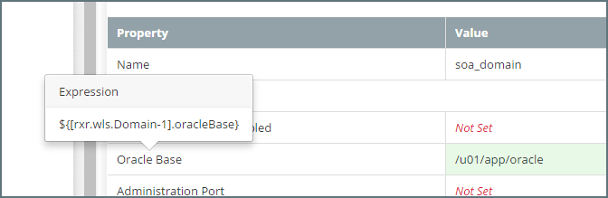

## {{ page.title }}

MyST holds the configuration details of a Platform Blueprint and Platform Model in a hierarchical or tree-like structure. The Platform Editor is used to view and edit Platform Blueprints and Platform Models.

### Opening a Platform Blueprint in the Platform Editor
From the side menu navigate to`Modeling` > `Platform Blueprints`, this will display a list of existing Platform Blueprints. Click on any one of the blueprints. This will open the it in the `Platform Editor` in view mode.

### Opening a Platform Model in the Platform Editor

From the side menu navigate to `Modeling` > `Platform Models`, this will display a list of existing Platform Models. Select the Platform Model you are interested in and MyST will display summary details about the Platform Model and its corresponding instance as shown below.

Click on the `Actions` drop-down in the top right-hand corner and select `Configuration`. This will open the model in the `Platform Editor` in view mode.

### Platform Editor Layout
The Platform Editor is split into the following core sections:

1. **Control Bar** - Displays the version, revison and state of the platform configuration, and allows us to perform contextual actions such as editing.
2. **Configuration View**
This presents a rich user interface for navigating through the various portions of the configuration and viewing / changing them. It is split into two parts:
   1. **Tree View** - Displays a hierarchical view of the top level configuration elements. This can can be used to easily navigate through the configuration as well as add and remove components from it.
   Selecting a component in the tree view will display a list of properties defined for that component in the `Property View`.
   2. **Property View** - Displays the list of properties and corresponding values defined for the selected component in the tree.
3. **Topology View** - Helps to visualize the topology of the platform. This can be used to get a high-level picture of the physical architecture of the platform.
4. **Source View** - This presents the raw JSON data which backs the platform configuration. This is a read-only view and is intended to be used in conjunction with the REST APIs for programmatic configuration changes.

### Control Bar

The Control Bar displays the version, revision and state of the platform configuration. For further details on versioning, see [Platform Version Control](/platform/definitions/version-control/README.md).

By default the Platform Editor is opened in read-only mode. We can perform several actions from the control bar by clicking on buttons in the bar itself or within the button drop-down besides the revision number. These are outlined in red above. Only the relevant actions are shown based on the appropriate state of the configuration.

The table below describes all the actions and also highlights under which conditions each one of them is applicable. 

| Action | Applies To | State | Description |
| -------- | ---------- | --------- | ------------ |
| *Commit* | Blueprint / Model | Draft | Commits the current revision of the configuration with a comment |
| *View Previous Commit* | Blueprint / Model | Any | In case of more than one revision, this action lets one go to the configuration of the previous commit. We can start editing as well based on this, thereby effectively using this as the baseline of the newer revision and overwriting any changes made in the current one.
| *View Commit History* | Blueprint / Model | Any | Shows the entire commit history for a version of the blueprint / model along with the comments for each revision. We can click on any of the older revisions to open its configuration. Similar to above, we can also use this as the baseline for the latest revision. |
| *Delete Draft* | Blueprint / Model | Draft | Discards the current draft revision and reverts back to the previously committed one |
| *Edit Configuration* | Blueprint / Model | Draft / Committed | Switches the user interface into `edit mode`, exposing all controls for making changes to configuration. In case, the current revision is committed, this will auto-increment the revision number in `edit mode`. |
| *Save* | Blueprint / Model | Draft | Saves changes made to the current revision permanently. However, this does not increment the revision number and hence is a way of periodically saving work without committing every time. |
| *Save & Commit* | Blueprint / Model | Draft | Saves changes made to the current revision permanently and also commits the revision, thereby making it eligible for performing platform updates. Subsequent changes will have to be made in a newer revision. |
| *Discard Changes* | Blueprint / Model | Draft | Discards all changes made in the current edit session and restores the last saved configuration. |
| *Save as new version* | Blueprint | Committed / Final | Creates a new version of a platform blueprint based on the selected version. |
| *Save as Template* | Blueprint | Committed / Final | Saves the active blueprint configuration as a platform template so that it can be reused for other blueprints. |
| *Delete / Delete Version* | Blueprint / Model | Any | Deletes the current version of the configuration in case it has not been applied to a platform instance. |
| *Publish* | Blueprint | Committed | Publishes the blueprint version and marks it as `Final` so that it is locked for future editing. |
| *Create Model* | Model | N / A | Creates a new configuration of the model for a blueprint version which does not have one already created. We can base this on any previous configuration version of the model. |

### Configuration View

The configuration view is where we navigate through the various portions of the configuration and view / change them. It is split into two parts:

#### Tree View

The Tree View provides a hierarchical view of the platform configuration. It groups components logically and allows us to easily search and traverse through the top level confiuration elements as well as add and remove elements from it.

The different parts of the tree user interface are numbered in the image above. We will now explain what they mean and how each one can be used.

1. **Search Bar** - This can be used to type and search for components within the tree. Once we start typing text, the matching components will get filtered out and the search text will be highlighted in yellow for each one of them.

  

  See how when typing `jdb`, only JDBC Data Sources and JDBC Stores get shown and the search text `jdb` is highlighted for each one of them. Also note, how the parent nodes of the matched ones get auto-expanded. In this example see how Persistent Stores got auto-expanded to reveal JDBC Stores.

 
 The node expansion when we type in text is just temporary. If we clear the search text, we will notice how the tree gets restored back to the state where it was originally at. As in, it would show the nodes in collapsed or expanded state based on how we had originally clicked them. 
 

2. **Selected Node** - Nodes in the tree could either be actual configuration elements or just logical categories for ease of visualization. Only actual configuration elements are selectable. When we click on any such node, it gets highlighted in bold with a black outline and the `Properties View` displays properties specific to that node.

  > The browser URL at this stage can also be bookmarked in you case we want to open this view directly with the same component pre-selected. 

3. **Computed Configuration** - Any component shown in a green background represents something which MyST has automatically computed and that which the user has not explicitly defined / overriden. For example, in the image, the `AdminServer` node has been auto-computed by MyST based on the other user-defined inputs.

4. **Add New Component** - For any component types which are collections, e.g. JDBC Data Sources, WebLogic clusters etc. and that which are editable, MyST provides us with this `+` control which when clicked can add a new component of that type. In the image above, when we click on the `+` button, MyST will prompt us with a modal dialog to capture the WebLogic cluster name and based on that will add a new cluster to the model and select it.

5. **Context Menu** - For any components which are collections, e.g. JDBC Data Sources, MyST provides us with a context menu to take certain actions. These actions include `Remove` to remove the component from the model and `Clone` to create a similar component based on the current one.

6. **Categories** - These are just logical grouping of similar configuration and themselves do not represent any configuration elements. For example, in the image above, `Startup & Shutdown Classes` is just a group which consists of the configuration of individual startup and shutdown classes within it.

7. **Expanding / Collapsing** - Clicking on the plus sign (`+`) of a node will expand it to show any child components and make it collapsible by revealing the minus sign (`-`). Needless to say, clicking this will collapse the component and hide the child components. 

At the top level, platform configuration consists of the following components:

* **Global Variables** - List of zero, one or more key-value pairs which could represent simple variables or in some cases flags and even full-blown configuration elements.
* **Middleware Settings** - The high level Fusion middleware configuration such as the the middleware version, the middleware home directory, etc.
* **Products** - The core products that make up the platform, such as Java, WebLogic, Oracle SOA Suite, etc.
* **Compute Groups** - The heteregenous grouping of compute nodes. It is assumed that each node in a group will have similar confiugration.
* **Compute Nodes** - The physical or virtual machines that host the platform. These are mapped to the actual hosts from the infrastructure provider.
* **WebLogic Domain Configuration** - The entire configuration of the WebLogic domain. Typically, the elements here are what we end up configuring inside WebLogic through the admin console.
* **WebTier Configuration** - The Oracle HTTP Server configuration in case it has been selected as a product. This would include module config file locations, virtual host definition, routing rules, etc.
* **Load Balancer Configuration** - In case a load balancer is present, this just represents a list of frontend definitions which can be referenced by other components such as managed servers, etc.
* **Java KeyStores** - Reusable definitions for Java keystores (JKS files) which can be referenced by managed servers, node managers, etc. for specifying their SSL requirements (identity, trust, etc.)
* **System Artifacts** - Artifacts which are deployed as part of the platform provisioning lifecycle. Examples include any custom SQL scripts to run one-off, any libraries to be copied into the WebLogic domain directory, etc. Typically these represent those artifacts which may well be considered a part of the platform itself rather than being separately handled through release management.

#### Property View
The `Property View` displays the properties and values for the selected component. A component may also contain other components. For example, the screenshot below shows the properties for the *soa_domain* component. This contains the component `Credentials` which has the properties `Username` and `Password`.

To expand a component within the property view click on the `+` symbol, and to collapse a component click on the `-` symbol. Alternatively to expand or collapse all components within the property view click on the corresponding `Expand All` or `Collapse All` button.

By default, MyST only shows the core properties for a component. To see all properties, select `Show advanced properties` (outlined in red above).

MyST auto-computes many of the property values in accordance with Oracle Enterprise Deployment Guide.  The auto-computed values are highlighted in green, if we choose to change any of these, then MyST will display the user entered property in white.

### Editing Properties
To edit either a Platform Blueprint or Platform Model, click `Edit Configuration`. This will put the Platform Editor in **Edit** mode. 

When defining the value of a property, we can reference the value of one or more other properties, see [MyST Property Overview](). Once in **Edit** mode, the Property Viewer will display the property definition for calculating the property value, which may include references to other property values. Underneath that, MyST will display the actual resolved (or calculated) value of the property after property references have been substituted with actual values, as shown below.

To edit a property, within the TreeView browse to the component where you want to make changes and click `Edit`(outlined in red below).

This will allow you to edit the property definitions for each property within the selected component. Once you have finished making your changes, click `Save`.


Important

> Saving changes at the component level only saves the changes with the current editing session. The Platform Editor allows you to make all the changes you need to the Platform Blueprint or Model, and save them to the MyST Repository all at once by clicking `Apply Changes` Alternatively, clicking `Discard Changes` will discard all the changes made within the current `Edit Session`. 


Any edits made to a Property Definition which have not yet been saved to the MyST Repository are highlighted in yellow to indicate this.



Every time you apply changes to a blueprint version, a new revision is automatically created of the blueprint. From the  editor, we can only view the latest revision of the blueprint. If the latest revision of the blueprint is not the same as the last revision used to provision or change an instance, we will need to update the Platform Model before the new revision changes are applied.


### Property Expansion in MyST
To make editing and maintenance of Platform Blueprints easier, MyST supports property expansion when defining the value of a property. This allows us to define the value of a property based on the value of one or more other properties.

When a string of the format `${some.property}` appears in a property value it will be expanded to the value of the specified property.

For example, if we have the following properties:
* `oracle.base` - Defines the Oracle Home directory for installing the Oracle Middleware Platform. 
* `oui.inventory.directory` - Defines the Oracle Universal Installer (OUI) Inventory Directory

The default location for (OUI) Inventory Directory is to place this in the sub-directory `oraInventory` under the Oracle Home. MyST enables us to set the value of the property `oui.inventory.directory` to  `${var.oracle.base}/oraInventory`.

#### Referencing MyST Properties
When referencing a MyST property, in order to uniquely identify it, we need to specify the full path of the property within the Platform Blueprint or Model.

The simplest way to derive the expression to reference a property is to locate the property we wish to reference within the Property Viewer and click on the Property Name. MyST will open a speech bubble containing the expression to reference the property as shown below.


The Platform Editor needs to be in Edit mode in order to be able to view a property reference expression.


#### Understand the MyST Property Path
In general, a dot notation is used to traverse the property hierarchy. For example, `a.b.c` would mean locate `c` within `b` within `a`. 

The following table lists the property path for the top-level components in the Platform Blueprint and the Platform Model.

| Component| Property Path|
| -- | --------- |
| Global Variables | var |
| Middleware Settings | rxr.wls.Fmw-1 |
| Products | rxr.def |
| Compute Groups | rxr.infra |
| Load Balancers | rxr.infra |
| WebTier Configuration | rxr.infra |
| WebLogic Domain | rxr.wls |
| Keystores | rxr.def |

#### Referencing a `property` value within a `component`
A component is a complex type consisting of a pre-defined collection of object types. To reference a `property` value within a component we used the following syntax:

`<component-property-path>.<property-key>`

Where
* `<component-property-path>` - Is the path to the component containing the property.
* `<property-key>` - Is the key for the property whose value we are referencing within the component.

For example, within a Platform Blueprint or Model, we have the `Middleware Settings` component, to reference the `version` property value, we would use the expression: 

`${[rxr.wls.Fmw-1].version}`

In this example:
* `rxr.wls.Fmw-1` is the `<component-property-path>` as defined in the table.
* `version` is the `<property-key>`.
 
#### Referencing a child `component` within a parent `component`
Reference a child component within a parent component we use the following syntax:

`<parent-component-property-path>.<component-key>`

Where:  
* `<parent-component-property-path>` - Is the path to the component containing the child component.
* `<component-key>` - Is the key for the component that we are referencing within the parent component.

#### Referencing a `component` within a `list`
A list is a complex type consisting of a list of zero, one or more components of the same type. 
To reference a component within a list we use the following syntax:

`[<parent-component-property-path>.<list-component-type>-<component-key>]`

Where
* `<parent-component-property-path>` - Is the path to the component containing the list.
* `<list-component-type>` - Is the component type held in the list
* `<component-key>` - Is the key for the component that we are referencing within the list. 

For example, a Platform Blueprint contains a list of Products (for example Java, SOA, Service Bus, RCU) that will be installed. In this example, if we want to reference the RCU component, we would use the expression:

`[rxr.def.Product-rcu]`

Where
* `<parent-component-property-path>` is `rxr.def` as defined in the xxxx table.
* `Product` is the `<list-component-type>`.
* `rcu` is the `<component-key>` for the RCU product component in the list 

To reference the RCU product version we would use the expression:   

`${[rxr.def.Product-rcu].version}`

For many lists, the component key defaults to the index number of the object stored in the list. For example, a WebLogic Domain contains a list of WebLogic Clusters. In this example: 
* The WebLogic Domain is the object containing the list. So `<parent-component-property-path>` is `rxr.wls`
* `Cluster` is the component type stored in the list.
* `1` is the component key for the first cluster, `2` the component key for the second cluster, and so on.

Thus the component property path to the second cluster in the list would be expressed as `[rxr.wls.Cluster-2]`. To reference the cluster name we would use the expression:  
`${[rxr.wls.Cluster-2].name}`

#### Referencing a property value within a property of type `paramList`
As we mentioned earlier, a component is a complex type consisting of a **pre-defined** collection of object types. However, we often want to add additional properties to a component, that aren't defined in advance. 

We can do this using a paramList. A paramList is a list of zero, one or more `property` types. The list of properties is not fixed and can be added to using the Platform Editor.

To reference a `property` value within a`paramList` we use the following syntax:

`<paramList-property-path>.param[<property-key>]`

Where
* `<parent-component-property-path>` - Is the path to the component containing the `paramList`
* `<property-key>` - Is the key for the property stored in the paramList

For example, the Oracle SOA Suite Product object contains a Name-Value Parameter list, that contains a number of `string` properties, such as audit-level and base-port. To reference the base-port value we would use the expression:  

`${[rxr.def.Product-soa].param[base-port]}`

#### Referencing a `global variable` value
MyST supports the notion of global variables. These are essentially held as a paramList. To reference a global `property` value within a component we used the following syntax:  

`${<var>.<property-key>}`

Where
* `<var>` - Is the path to the component containing the property.  
* `<property-key>` - Is the key for the property whose value we are referencing within the component.

For example, to reference the value of global variable `install.directory`, we would use the expression:
  
`${var.install.directory}`

<!-- TODO ### Create new Platform Blueprint Version -->

<!-- TODO ### Create new Platform Model Version-->