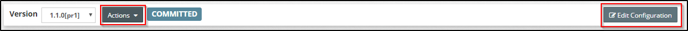

## {{ page.title }}

The Control Bar displays the version, revision and state of the platform configuration and allows us to take actions on the configuration. For further details on versioning, see [Platform Version Control](/platform/definitions/version-control/README.md).

By default the Platform Editor is opened in read-only mode. We can perform several actions from the control bar by clicking on buttons in the bar itself or within the button drop-down besides the revision number. These are outlined in red above. Only the relevant actions are shown based on the appropriate state of the configuration.

The table below describes all the actions and also highlights under which conditions each one of them is applicable. 

| Action | Applies To | State | Description |
| -------- | ---------- | --------- | ------------ |
| *Commit* | Blueprint / Model | Draft | Commits the current revision of the configuration with a comment |
| *View Previous Commit* | Blueprint / Model | Any | In case of more than one revision, this action lets one go to the configuration of the previous commit. We can start editing as well based on this, thereby effectively using this as the baseline of the newer revision and overwriting any changes made in the current one.
| *View Commit History* | Blueprint / Model | Any | Shows the entire commit history for a version of the blueprint / model along with the comments for each revision. We can click on any of the older revisions to open its configuration. Similar to above, we can also use this as the baseline for the latest revision. |
| *Delete Draft* | Blueprint / Model | Draft | Discards the current draft revision and reverts back to the previously committed one |
| *Edit Configuration* | Blueprint / Model | Draft / Committed | Switches the user interface into `edit mode`, exposing all controls for making changes to configuration. In case, the current revision is committed, this will auto-increment the revision number in `edit mode`. |
| *Save* | Blueprint / Model | Draft | Saves changes made to the current revision permanently. However, this does not increment the revision number and hence is a way of periodically saving work without committing every time. |
| *Save & Commit* | Blueprint / Model | Draft | Saves changes made to the current revision permanently and also commits the revision, thereby making it eligible for performing platform updates. Subsequent changes will have to be made in a newer revision. |
| *Discard Changes* | Blueprint / Model | Draft | Discards all changes made in the current edit session and restores the last saved configuration. |
| *Save as new version* | Blueprint | Committed / Final | Creates a new version of a platform blueprint based on the selected version. |
| *Save as Template* | Blueprint | Committed / Final | Saves the active blueprint configuration as a platform template so that it can be reused for other blueprints. |
| *Delete / Delete Version* | Blueprint / Model | Any | Deletes the current version of the configuration in case it has not been applied to a platform instance. |
| *Publish* | Blueprint | Committed | Publishes the blueprint version and marks it as `Final` so that it is locked for future editing. |
| *Create Model* | Model | N / A | Creates a new configuration of the model for a blueprint version which does not have one already created. We can base this on any previous configuration version of the model. |