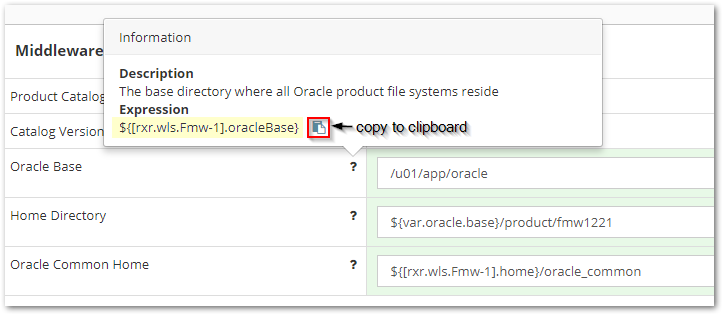

## {{ page.title }}

As we saw before, when defining the value of a property, we can reference the value of one or more other properties. This section goes a bit deeper into understanding the syntax of these property references.


### Not for Beginners
For all practical purpose, the expressions that MyST allows us to copy for each property should suffice and one never would really need to know how to use the references, so this section is intended for more advanced users and can be entirely skipped by those who are just getting started with MyST


### Property Expansion
To make editing and maintenance of Platform Blueprints easier, MyST supports property expansion when defining the value of a property. This allows us to define the value of a property based on the value of one or more other properties.

When a string of the format `${some.property}` appears in a property value it will be expanded to the value of the specified property.

For example, if we have the following properties:
* `oracle.base` - Defines the Oracle Home directory for installing the Oracle Middleware Platform. 
* `oui.inventory.directory` - Defines the Oracle Universal Installer (OUI) Inventory Directory

The default location for (OUI) Inventory Directory is to place this in the sub-directory `oraInventory` under the Oracle Home. MyST enables us to set the value of the property `oui.inventory.directory` to  `${var.oracle.base}/oraInventory`.

#### Referencing MyST Properties
When referencing a MyST property, in order to uniquely identify it, we need to specify the full path of the property within the Platform Blueprint or Model.

The simplest way to derive the expression to reference a property is to locate the property we wish to reference within the Property Viewer and click on the `?` against the Property Name. MyST will open a popover containing the expression to reference the property as shown below.

We can use the `copy to clipboard` icon (outlined above) to easily copy the property expression and then paste it wherever we need to reference it.


The Platform Editor needs to be in Edit mode in order to be able to view a property reference expression.


#### Understand the MyST Property Path
In general, a dot notation is used to traverse the property hierarchy. For example, `a.b.c` would mean locate `c` within `b` within `a`. 

#### Referencing a `property` value within a `component`
A component is a complex type consisting of a pre-defined collection of object types. To reference a `property` value within a component we used the following syntax:

`[<component-property-path>].<property-key>`

Where
* `<component-property-path>` - Is the path to the component containing the property.
* `<property-key>` - Is the key for the property whose value we are referencing within the component.

For example, within a Platform Blueprint or Model, we have the `Middleware Settings` component, to reference the `version` property value, we would use the expression: 

`${[rxr.wls.Fmw-1].version}`

In this example:
* `rxr.wls.Fmw-1` is the `<component-property-path>` as defined in the table.
* `version` is the `<property-key>`.
 
#### Referencing a child `component` within a parent `component`
Reference a child component within a parent component we use the following syntax:

`<parent-component-property-path>.<component-key>`

Where:  
* `<parent-component-property-path>` - Is the path to the component containing the child component.
* `<component-key>` - Is the key for the component that we are referencing within the parent component.

#### Referencing a `component` within a `list`
A list is a complex type consisting of a list of zero, one or more components of the same type. 
To reference a component within a list we use the following syntax:

`[<parent-component-property-path>.<list-component-type>-<component-key>]`

Where
* `<parent-component-property-path>` - Is the path to the component containing the list.
* `<list-component-type>` - Is the component type held in the list
* `<component-key>` - Is the key for the component that we are referencing within the list. 

For example, a Platform Blueprint contains a list of Products (for example Java, SOA, Service Bus, RCU) that will be installed. In this example, if we want to reference the RCU component, we would use the expression:

`[rxr.def.Product-rcu]`

Where
* `<parent-component-property-path>` is `rxr.def` as defined in the xxxx table.
* `Product` is the `<list-component-type>`.
* `rcu` is the `<component-key>` for the RCU product component in the list 

To reference the RCU product version we would use the expression:   

`${[rxr.def.Product-rcu].version}`

For many lists, the component key defaults to the index number of the object stored in the list. For example, a WebLogic Domain contains a list of WebLogic Clusters. In this example: 
* The WebLogic Domain is the object containing the list. So `<parent-component-property-path>` is `rxr.wls`
* `Cluster` is the component type stored in the list.
* `1` is the component key for the first cluster, `2` the component key for the second cluster, and so on.

Thus the component property path to the second cluster in the list would be expressed as `[rxr.wls.Cluster-2]`. To reference the cluster name we would use the expression:  
`${[rxr.wls.Cluster-2].name}`

#### Referencing a property value within a property of type `map`
As we mentioned earlier, a component is a complex type consisting of a **pre-defined** collection of object types. However, we often want to add additional properties to a component, that aren't defined in advance. 

We can do this using a `map`. A `map` is a list of zero, one or more `property` types. The list of properties is not fixed and can be added to on the fly using the Platform Editor.

To reference a `property` value within a`map` we use the following syntax:

`<paramList-property-path>.param[<property-key>]`

Where
* `<parent-component-property-path>` - Is the path to the component containing the `map`
* `<property-key>` - Is the key for the property stored in the paramList

For example, the Oracle SOA Suite Product object contains a Configuration Parameters map, that contains a number of `string` properties, such as audit-level and base-port. To reference the base-port value we would use the expression:  

`${[rxr.def.Product-soa].param[base-port]}`

#### Referencing a `Global Variable` value
MyST supports the notion of global variables. These are essentially held as a key-value map. To reference a global `property` value within a component we used the following syntax:  

`${<var>.<property-key>}`

where
* `<var>` - Is the path to the component containing the property.  
* `<property-key>` - Is the key for the property whose value we are referencing within the component.

For example, to reference the value of global variable `install.directory`, we would use the expression:
  
`${var.install.directory}`