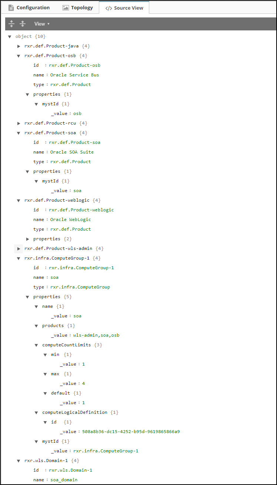
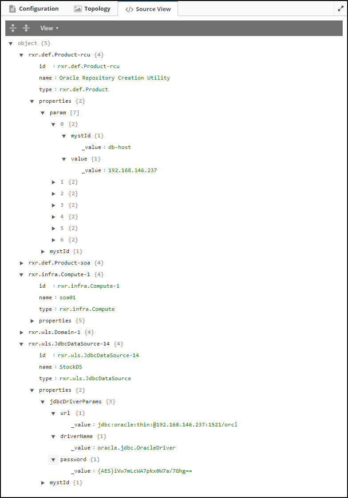
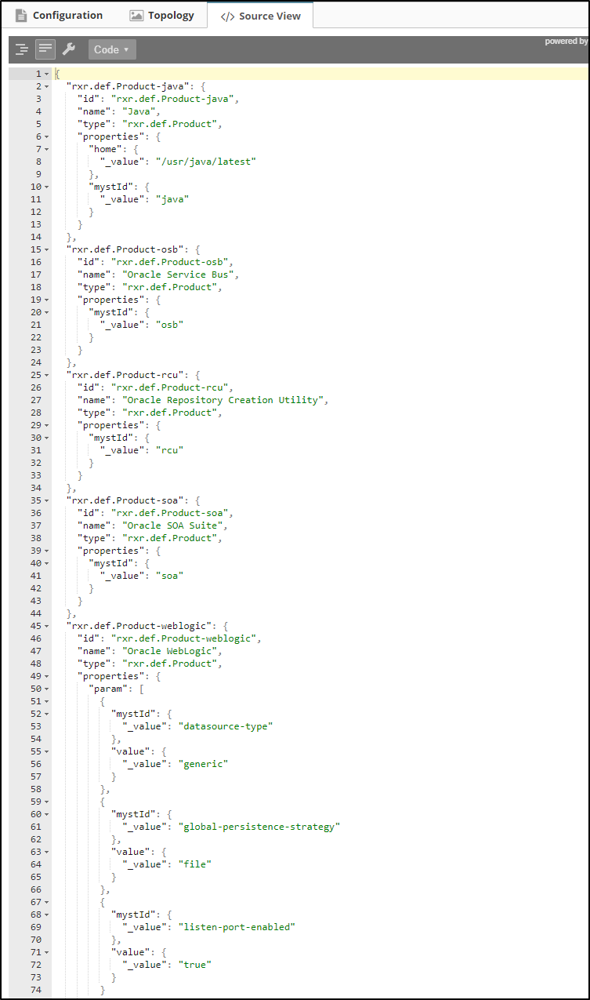
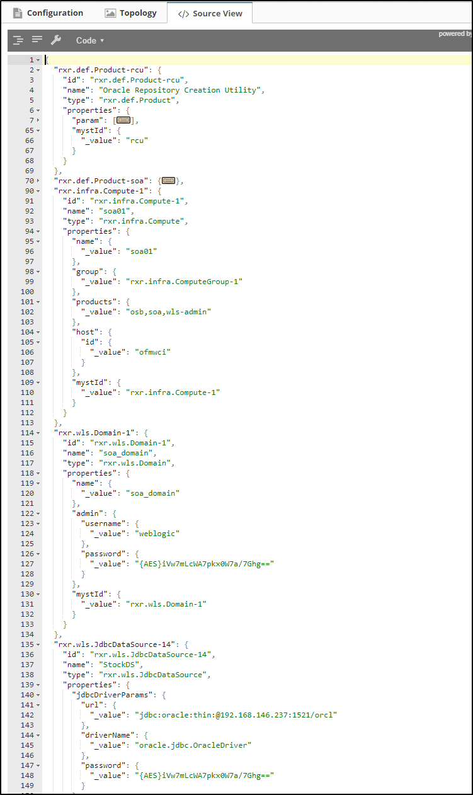

## {{ page.title }}

The Source View presents the raw JSON data which backs the platform configuration. This is a read-only view and is intended to be used in conjunction with the REST APIs for programmatic configuration.


The source view allows one to quickly see the raw configuration of the platform and is intended for advanced users who have good knowledge on how to use the MyST REST APIs to automate creation / modification of confiugration.


### Tree Mode

This representation shows a hierarchical view of the JSON data. It is more easily navigable than the code mode.

#### Platform Blueprint

#### Platform Model

### Code Mode

This representation shows the actual formatted JSON data. This can easily by copied and pasted into REST API calls.

#### Platform Blueprint

#### Platform Model



### Platform Model Configuration

It is important to note that the platform model in any other view always shows up in its entirety with all configuration inherited from the blueprint.

Hence, in any other view it is quite difficult to figure out which parts of the configuration belong solely to the model and are not derived from the blueprint. Thus, users can easily make mistakes and start putting things into the model which they should perhaps have added in the blueprint.

The `source view` however shows only the model configuration and does not show what it inherits from the blueprint. Hence, a quick glance at this view can easily help users reconcile mistakes in configuration as they can see exactly what is part of the blueprint and what is part of the model.

   