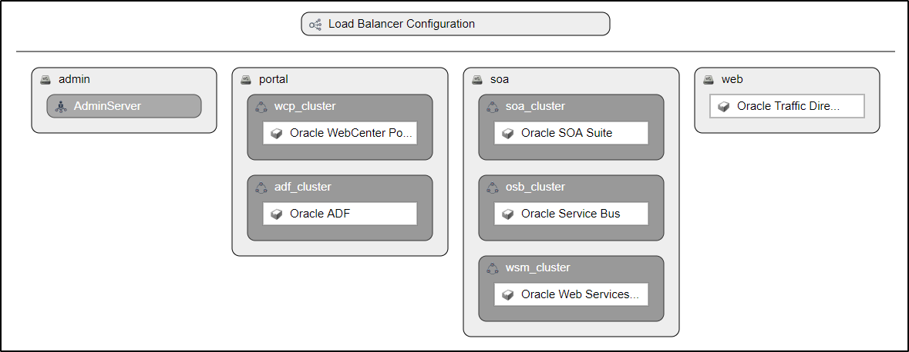
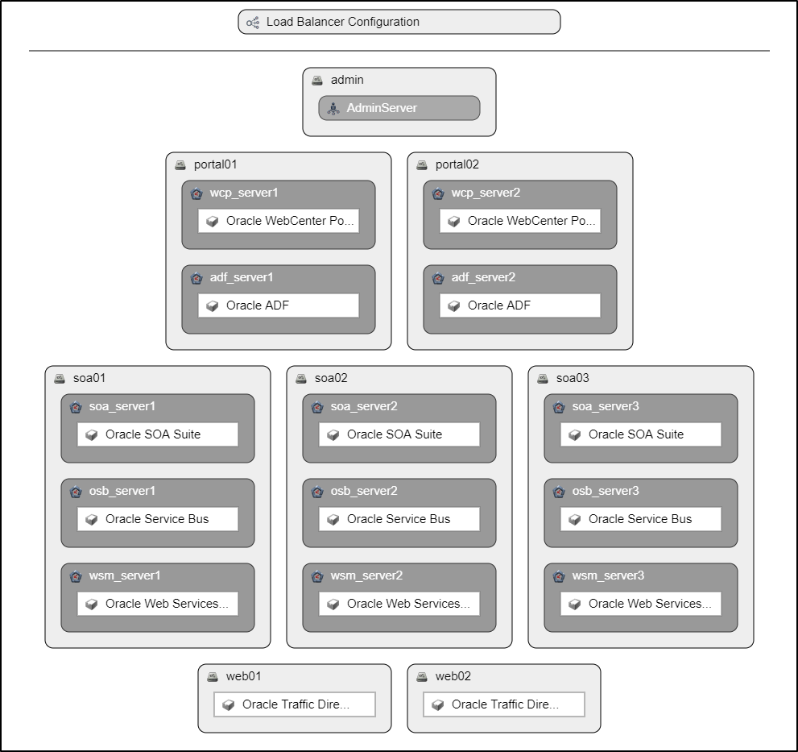

## {{ page.title }}

The Topology View presents a visual representation of the physical topology of the platform. This can be used to get a high-level picture of the physical architecture of the platform.
 

### Platform Blueprint

The example blueprint topology above can be described as having the following components:

 1. A `Load Balancer` for directing traffic to the actual application servers.
 2. An `admin` compute group which hosts the WebLogic `AdminServer` inside it.
 3. A `portal` compute group which hosts the `wcp_cluster` and `adf_cluser` WebLogic clusters. These clusters would have the `WebCenter Portal` and `ADF` products (application components) running inside them. The clusters would span all the compute nodes which would be part of this compute group.
 4. A `soa` compute grop which hosts the `soa_cluster`, `osb_cluster` and `wsm_cluster` WebLogic clusters. These clusters would have the `SOA Suite`, `Service Bus` and `Web Services Manager` products (application components) running inside them. The clusters would span all the compute nodes which would be part of this compute group.
 5. A `web` compute group which hosts the `Oracle Traffic Director` web server.

### Platform Model / Instance

The example model topology above can be described as having the following components:

 1. A `Load Balancer` for directing traffic to the actual application servers.
 2. An `admin` compute node which hosts the WebLogic `AdminServer` inside it.
 3. A `portal01` compute node which hosts the `wcp_server1` and `adf_server1` WebLogic managed servers. These servers would have the `WebCenter Portal` and `ADF` products (application components) running inside them respectively.
 4. A `portal02` compute node which hosts the `wcp_server2` and `adf_server2` WebLogic managed servers. These servers would have the `WebCenter Portal` and `ADF` products (application components) running inside them respectively.
 5. A `soa01` compute node which hosts the `soa_server1`, `osb_server1` and `wsm_server1` WebLogic managed servers. These servers would have the `SOA Suite`, `Service Bus` and `Web Services Manager` products (application components) running inside them respectively.
 6. A `soa02` compute node which hosts the `soa_server2`, `osb_server2` and `wsm_server2` WebLogic managed servers. These servers would have the `SOA Suite`, `Service Bus` and `Web Services Manager` products (application components) running inside them respectively.
 7. A `soa03` compute node which hosts the `soa_server3`, `osb_server3` and `wsm_server3` WebLogic managed servers. These servers would have the `SOA Suite`, `Service Bus` and `Web Services Manager` products (application components) running inside them respectively.
 8. A `web01` compute node which hosts the `Oracle Traffic Director` web server.
 9. A `web02` compute node which hosts the `Oracle Traffic Director` web server.

We can see from both these diagrams how easy it is to quickly get an idea of the physical architecture of a platform as well as how a generic architecture blueprint can be conceived of.
