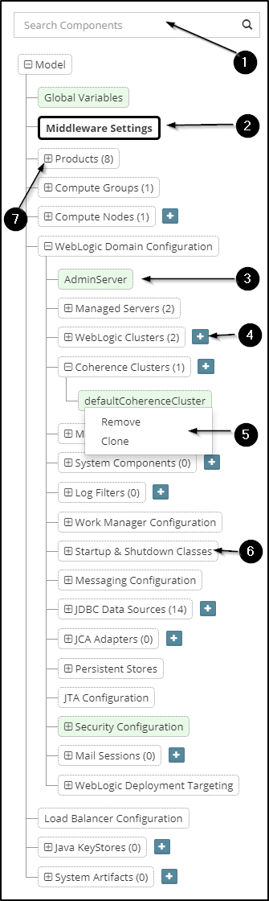
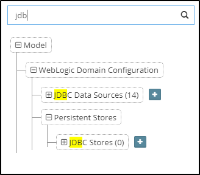

## {{ page.title }}

The Tree View provides a hierarchical view of the platform configuration. It groups components logically and allows us to easily search and traverse through the top level confiuration elements as well as add and remove elements from it.

The different parts of the tree user interface are numbered in the image above. We will now explain what they mean and how each one can be used.

1. **Search Bar** - This can be used to type and search for components within the tree. Once we start typing text, the matching components will get filtered out and the search text will be highlighted in yellow for each one of them.

  

  See how when typing `jdb`, only JDBC Data Sources and JDBC Stores get shown and the search text `jdb` is highlighted for each one of them. Also note, how the parent nodes of the matched ones get auto-expanded. In this example see how Persistent Stores got auto-expanded to reveal JDBC Stores.

 
 The node expansion when we type in text is just temporary. If we clear the search text, we will notice how the tree gets restored back to the state where it was originally at. As in, it would show the nodes in collapsed or expanded state based on how we had originally clicked them. 
 

2. **Selected Node** - Nodes in the tree could either be actual configuration elements or just logical categories for ease of visualization. Only actual configuration elements are selectable. When we click on any such node, it gets highlighted in bold with a black outline and the `Properties View` displays properties specific to that node.

  > The browser URL at this stage can also be bookmarked in you case we want to open this view directly with the same component pre-selected. 

3. **Computed Configuration** - Any component shown in a green background represents something which MyST has automatically computed and that which the user has not explicitly defined / overriden. For example, in the image, the `AdminServer` node has been auto-computed by MyST based on the other user-defined inputs.

4. **Add New Component** - For any component types which are collections, e.g. JDBC Data Sources, WebLogic clusters etc. and that which are editable, MyST provides us with this `+` control which when clicked can add a new component of that type. In the image above, when we click on the `+` button, MyST will prompt us with a modal dialog to capture the WebLogic cluster name and based on that will add a new cluster to the model and select it.

5. **Context Menu** - For any components which are collections, e.g. JDBC Data Sources, MyST provides us with a context menu to take certain actions. These actions include `Remove` to remove the component from the model and `Clone` to create a similar component based on the current one.

6. **Categories** - These are just logical grouping of similar configuration and themselves do not represent any configuration elements. For example, in the image above, `Startup & Shutdown Classes` is just a group which consists of the configuration of individual startup and shutdown classes within it.

7. **Expanding / Collapsing** - Clicking on the plus sign (`+`) of a node will expand it to show any child components and make it collapsible by revealing the minus sign (`-`). Needless to say, clicking this will collapse the component and hide the child components. 

At the top level, platform configuration consists of the following components:

* **Global Variables** - List of zero, one or more key-value pairs which could represent simple variables or in some cases flags and even full-blown configuration elements.
* **Middleware Settings** - The high level Fusion middleware configuration such as the the middleware version, the middleware home directory, etc.
* **Products** - The core products that make up the platform, such as Java, WebLogic, Oracle SOA Suite, etc.
* **Compute Groups** - The heteregenous grouping of compute nodes. It is assumed that each node in a group will have similar confiugration.
* **Compute Nodes** - The physical or virtual machines that host the platform. These are mapped to the actual hosts from the infrastructure provider.
* **WebLogic Domain Configuration** - The entire configuration of the WebLogic domain. Typically, the elements here are what we end up configuring inside WebLogic through the admin console.
* **WebTier Configuration** - The Oracle HTTP Server configuration in case it has been selected as a product. This would include module config file locations, virtual host definition, routing rules, etc.
* **Load Balancer Configuration** - In case a load balancer is present, this just represents a list of frontend definitions which can be referenced by other components such as managed servers, etc.
* **Java KeyStores** - Reusable definitions for Java keystores (JKS files) which can be referenced by managed servers, node managers, etc. for specifying their SSL requirements (identity, trust, etc.)
* **System Artifacts** - Artifacts which are deployed as part of the platform provisioning lifecycle. Examples include any custom SQL scripts to run one-off, any libraries to be copied into the WebLogic domain directory, etc. Typically these represent those artifacts which may well be considered a part of the platform itself rather than being separately handled through release management.