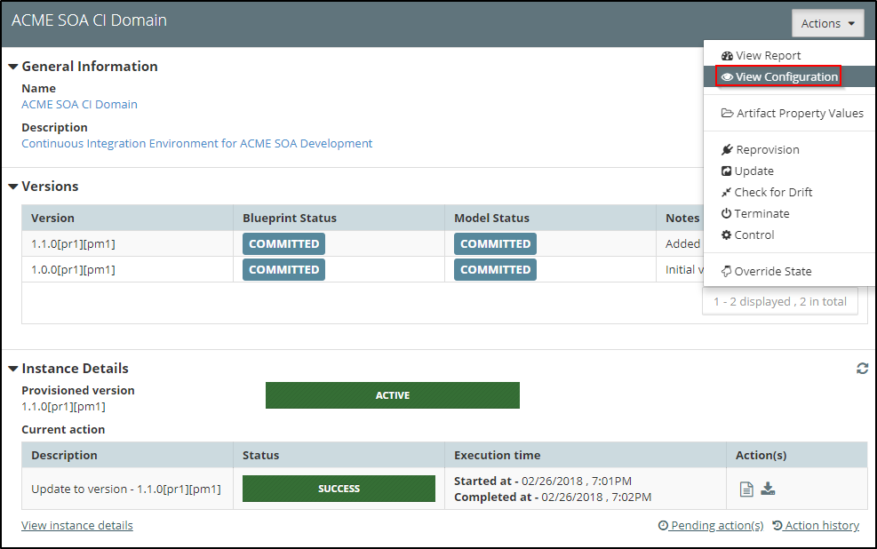
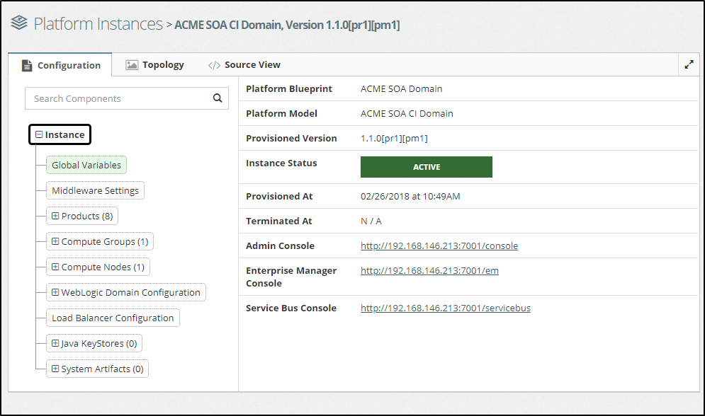
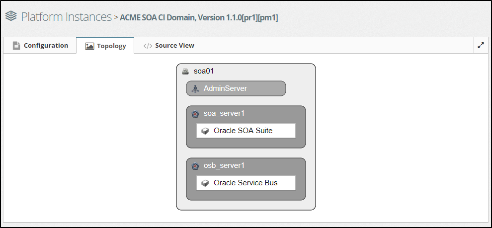
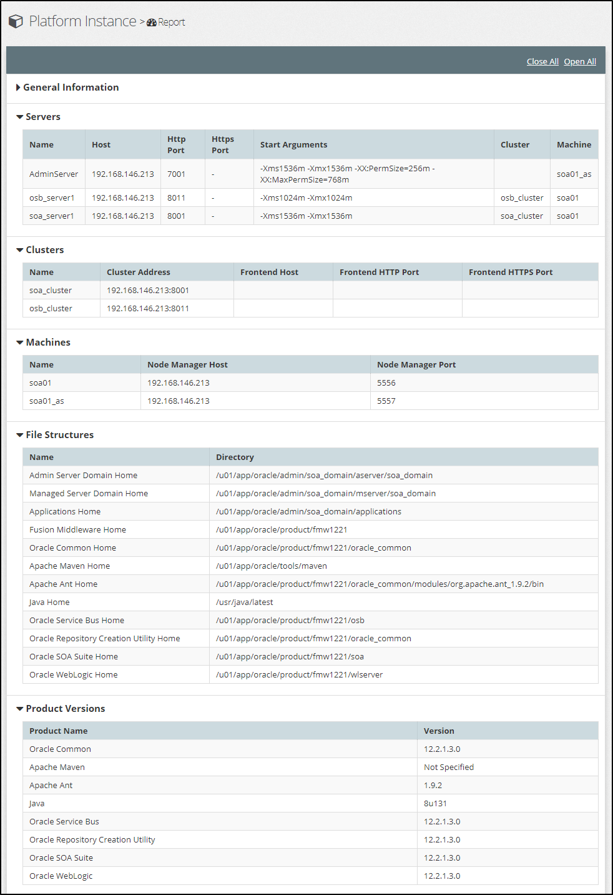
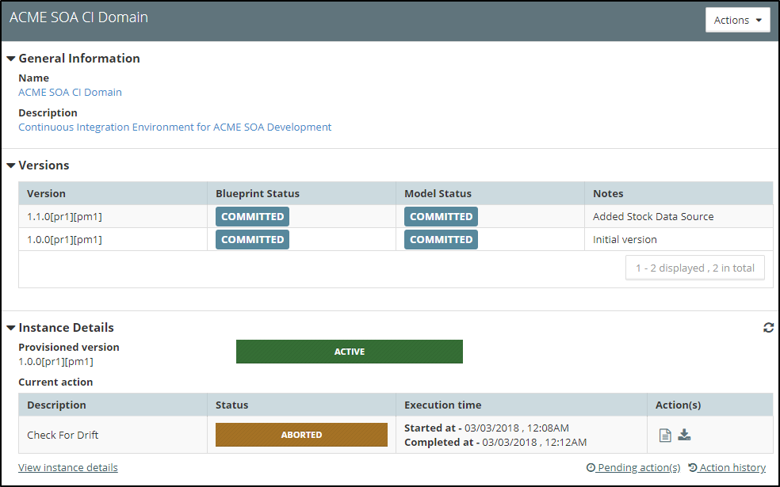

## {{ page.title }}

In this section we detail how to use MyST to perform common platform administration tasks, including how to:
* View a Platform Instance Configuration
* Report on a Platform Instance
* Start, Stop and Restart a Platform Instance
* Check for and Correct Configuration Drift
* Terminate and Re-Provision a Platform Instance
* Patch a Platform Instance
* Override the state of a Platform Instance

In addition, we also cover the mechanism MyST uses to queue actions against a Platform Instance as well as how to view the Action History and current Pending Actions.

All of these activities are performed from the `Platform Instance Summary` window. We can access this from the side menu by navigating to`Provisioning` > `Platform Instances`. This will display a list of existing Platform Instances. 

Select the corresponding Platform Instance (outlined in red above), MyST will display summary information about the state of the Platform Model and Instance Details as shown below.

The **Platform Instance Summary** is broken into three sections; *General Information*, *Versions* and *Instance Details*. Each section provides key information about the Platform Instance as detailed below.

The **General Information** section provides the following information:
* **Name** - This is the name of the Platform Instance as defined by the Platform Blueprint

* **Description** - This is the description of the Platform Instance as defined by the Platform Model

The **Versions** section lists each version of the Platform Blueprint, for each version of the Platform Blueprint it provides the following information:
* **Version** This shows the latest revision of the Platform Blueprint and Platform Model.

* **Blueprint Status** - The status of the latest revision of the Platform Blueprint, this can be Draft, Committed or Final.

* **Model Status** - The status of the latest revision of the Platform Model, this can be Draft, Committed or Final.

* **Notes** - The Platform Model Version Notes.

The **Instance Details** section provides the following information:
* **Provisioned Version** - This is the current version of the Platform Instance.

* **Instance State** - This shows the current state of the Platform Instance. It can be one of:
    * Active
    * Provisioning In Progress
    * Provisioning Failed
    * Termination In Progress
    * Terminated
    * Termination Failed

* **Current Action** - This shows details of the current action being performed (or the last action if completed). This includes:
 * Description - This is the action being performed, for example, Provisioning, Start, Stop, etc.
 * Status - Which could be In Progress, Success or Failed
 * Execution time - The start and stop time of the action
 * Action(s) - Actions that can be taken here. These include ability to `view` and `download` execution logs, `download` support artifacts in event of failure, viewing `drift` and `dry run` reports.

Clicking on `Pending action(s)` will show the list of currently queued actions, whilst clicking on `Action History` will show us the list of actions performed against the Platform Instance till date.

The `Actions` drop-down allows us to select and perform the various management activities against the Platform Instance.

### View Platform Instance Configuration
MyST allows us to view the current configuration of each of our Platform Instances. From within the Platform Instance Summary window, click on the `Actions` drop-down and select `View Configuration`. 

MyST will open the Platform Instance in the `Platform Viewer`. From here we can browse the full configuration of the Platform Instance.

In the initial view, we can see key information about the instance as well as important service URLs such as the Admin Console, Enterprise Manager Console, Service Bus Console.

The rest of the configuration of the instance can be browsed through and navigated as we have previously seen [here](/platform/definitions/editor/README.md). Please go through that section for more details on how to navigate and access the configuration of the platform.

For example, to view the physical topology of the platform, we can click on the `Topology` tab which will show us a topology diagram such as below.

### Platform Instance Report
The Platform instance report provides a summary report of all the key configuration information for our Platform Instance.

To access this select the corresponding Platform Instance, then click on the `Actions` menu and select `View Report`, MyST will open the Platform Instance Report as shown below.

> Note: By clicking on the header for each section, we can close and expand that part of the report as required.

### Start, Stop and Restarting Platform Instance
MyST allows us to easily Start, Stop and Restart Platform Instances. When performing these actions, we can choose to perform these actions against the entire cluster or we can choose to perform the action on specific nodes within the cluster.

#### Stopping a Platform Instance
From within the Platform Instance Summary window, click on the `Actions` drop-down and select `Control`, MyST will open the Platform Instance Control dialog.

Select `Stop` as the action to perform (outlined in red above). By default, MyST will apply this action to all nodes within the cluster. If we only want to stop specific nodes, then first remove the nodes that we don't want to perform this action on.

Enter any notes as to why we are performing the action and click `Execute`.

MyST will queue the action in the list of Pending Actions for the Platform Instance and, when ready, will proceed to stop the Platform Instance.

#### Starting a Platform Instance
To start a Platform Instance we follow the same process for stopping a Platform Instance, but select `Start` as the action to perform.

#### Restarting a Platform Instance

To restart a Platform Instance we follow the same process for stopping a Platform Instance, but select `Restart` as the action to perform.

### Check for and Correct Configuration Drift
Configuration drift is caused by inconsistent configuration across different environments. Configuration drift occurs naturally in data center environments due to manual adhoc changes.

MyST's approach to managing incremental change allows us to define, test, promote and track configuration changes across all environments and thus prevent configuration drift from occurring.

However, this does not stop someone from directly using the WebLogic console to perform manual changes. When this occurs, we want the ability to detect such a change, and then either use MyST to restore the Platform Instance to its correct state or alternatively if the change is required, to incorporate the change into the Platform Blueprint so it can be applied consistently across all environments.

Note: Many MyST users restrict their users from making configuration changes via the WebLogic console to prevent these scenarios' from occurring.

#### Check for Drift
MyST's Check for Drift capability allows us to check the configuration of the Platform Instance as defined by its Platform Blueprint / Model against the actual WebLogic domain and report on differences.

From within the Platform Instance Summary window, click on the `Actions` drop-down and select `Check for Drift`, MyST will initiate the check for drift process.

Once completed, click on the `View Report` icon (outlined in red above). MyST will display a complete drift report as below.

In the above report, we can see that the value of the property `MaxCapacity` has drifted to 100. 

#### Reset Drift
From within the Platform Instance Summary window, click on the `Actions` drop-down and select `Control`, MyST will open the Platform Instance Control dialog.

Select `Reset Drift` as the action to perform (outlined in red above) add any `Action Notes` and click `Execute`. MyST will queue the Reset Drift action for execution and return us to the summary view of the Platform Model and Instance.

Once the `Reset Drift` action has completed, click on the `View Log` icon under the `Current Action -> Action(s)`. This will open a dialog showing the result of the Drift, as shown below.

This will show details of all the changes made to correct any configuration drift. We can see from the log (outlined above) that MyST has reset the MaxCapacity property on the *StockDS* Data Source.

### Terminate and Re-Provision a Platform Instance
MyST allows us to terminate and re-provision our Platform Instances. This can be useful for a number of reasons:
* Reset a Platform Instance to a previous known state, for example, re-provision the Platform Instance based on an earlier version of the Platform Blueprint.
* Temporarily re-purpose the infrastructure, knowing we can re-provision the platform instance when required at a future date.
* Re-provision corrupted environment, for example, if we suspect the underlying file system has been corrupted, we can re-provision the platform instance.

#### Terminate a Platform Instance
From within the Platform Instance Summary window, click on the `Actions` drop-down and select `Terminate`, MyST will open the `Terminate Platform Instance` dialog and prompt for confirmation to proceed.

Click `OK`. MyST will queue the Terminate action for execution and return us to the summary view of the Platform Model and Instance.

Once terminated the status of the Platform Instance will be updated to `TERMINATED` and the Instance Details will indicate `Instance Not Provisioned`.

Even though the Platform Instance has been terminated, we still have access to the `Action History` of the terminated instance.

#### Terminate AWS On-Demand
When terminating a Platform Instance running on infrastructure of type AWS On-Demand, MyST will also provide you with the option of terminating the AWS Instances

If we select this option, MyST will terminate the AWS EC2 instances that were provisioned on-demand when the original Platform Instance was provisioned.

#### Re-Provisioning a Terminated Platform Instance
MyST allows us to re-provision any previously terminated Platform Instance. 
From the side menu navigate to `Modeling` > `Platform Models`, this will display a list of existing Platform Models. 

To re-provision a terminated Platform Instance, select the corresponding Platform Model, MyST will display the Platform Model and Instance summary. Click on the `Actions` menu and select `Reprovision`.

MyST will open the `New Platform Instance` dialog. Here we can select which version of the Platform Instance we want to re-provision. Here, you get access to the following controls

 1. **Version** - Here, we can select the exact version of the platform blueprint and the exact revisions of the blueprint and model that we want to reprovision. By default, the latest and version and revisions will be pre-selected.
 2. **Environment already pre-provisioned?** - Selecting this indicated to MyST that the instance is already provisioning and running. So, MyST will just do some connectivity checks and not actually kick off provisioning of the instance in case this option is checked.
 3. **Auto-deploy applications?** - MyST keeps tracks of artifact deployments that were made over time to a platform instance. If we select this option, MyST will try to auto-deploy those artifacts once more to the instance to bring it to the same state as it was before termination.
 4. **Provisioning Notes** - Any comments to indicate why we are reprovisioning the instance.

Once done, click `Finish`. MyST will queue the Reprovision action for execution and return us to the summary view of the Platform Model and Instance.

### Patching a Platform Instance
MyST allows us to easily patch a Platform Instance. When performing these actions, we can choose to perform these actions against the entire cluster or we can choose to perform the action on specific nodes within the cluster.

Before applying a patch to a Platform Instance, we must first add the patches to the Platform Blueprint - see [Oracle Patches](/platform/resources/weblogic/patches/README.md) for further details.

From within the Platform Instance Summary window, click on the `Actions` drop-down and select `Control`, MyST will open the Platform Instance Control dialog.

Select `Patch` as the action to perform (outlined in red above). By default, MyST will apply this action to all nodes within the cluster. If we only want to patch specific nodes, then first remove the nodes that we don't want to perform this action on.

Specify whether a server restart is required to apply the patch, then enter any notes as to why we are performing the action and click `Execute`.

MyST will queue the action in the list of Pending Actions for the Platform Instance and when ready proceed to patch the Platform Instance.

### Aborting the Current Action
There might be cases where an action is running for a long time and we would want to abort it for various reasons. MyST allows us to abort an current running action on a best-effort basis.

Locate the `Abort` button as shown above and click on it. MyST will show a confirmation dialog like below and once we give a go-ahead, the action will be aborted.

Alternatively, if we restart MyST Studio, we will see that the action and the instance state will automatically go into a state of `INDETERMINATE` and the user then has to manually override the state of the instance to reflect the correct state. See below on how to override the state of an instance.

### Overriding the State of a Platform Instance
MyST allows us to override the state of an instance in case we want to intervene and do manual reconciliation.


This has to be done with extreme caution by users who have advanced privileges as this could have significant impact on the internal workflow for the instance and cause subsequent actions to get stalled


From the side menu navigate to `Modeling` > `Platform Models`, this will display a list of existing Platform Models. 

To override the state of the Platform Instance, select the corresponding Platform Model, MyST will display the Platform Model and Instance summary. Click on the `Actions` menu and select `Override State`.

MyST will open the `Platform Instance State Override` dialog. Here we can see the current state of the instance and change it to be in a new state. MyST will just assume that the user knows what he is doing and internall record this as the new state of the instance and do all subsequent action on this instance obeying this.

