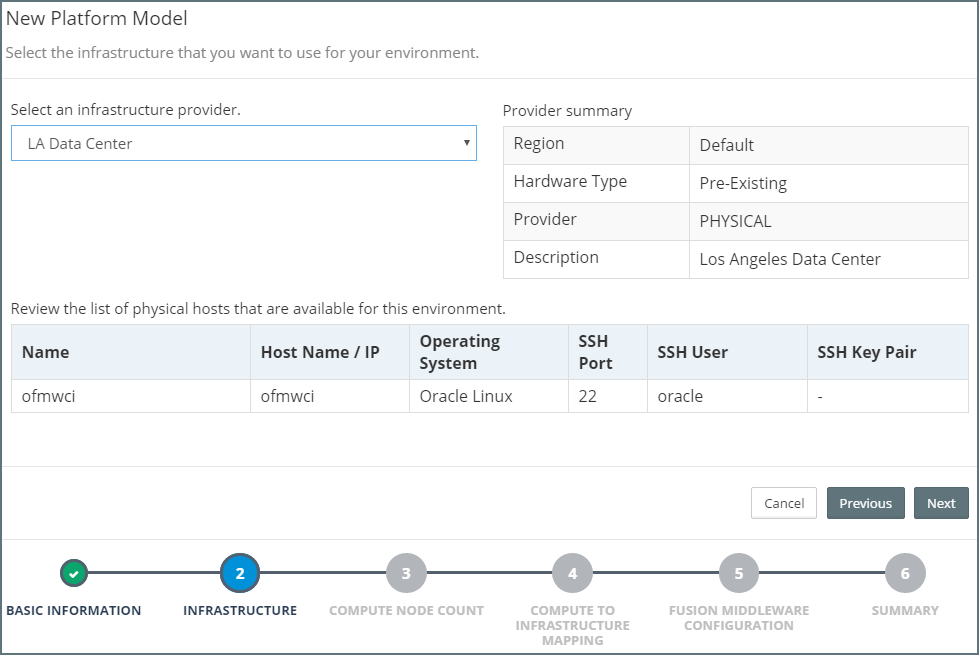
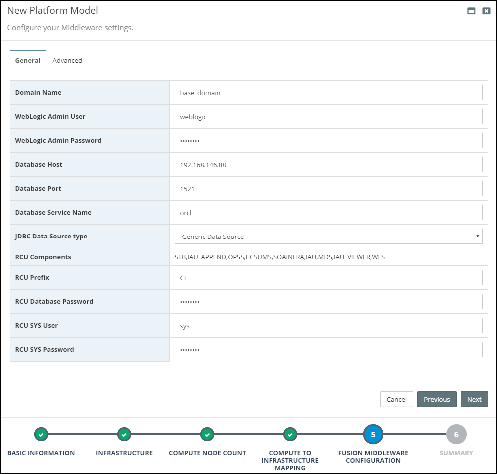
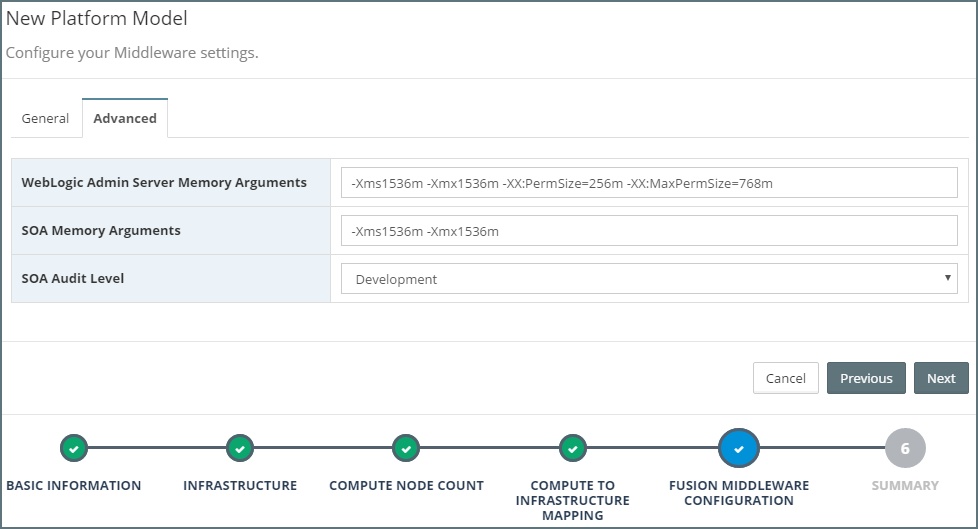
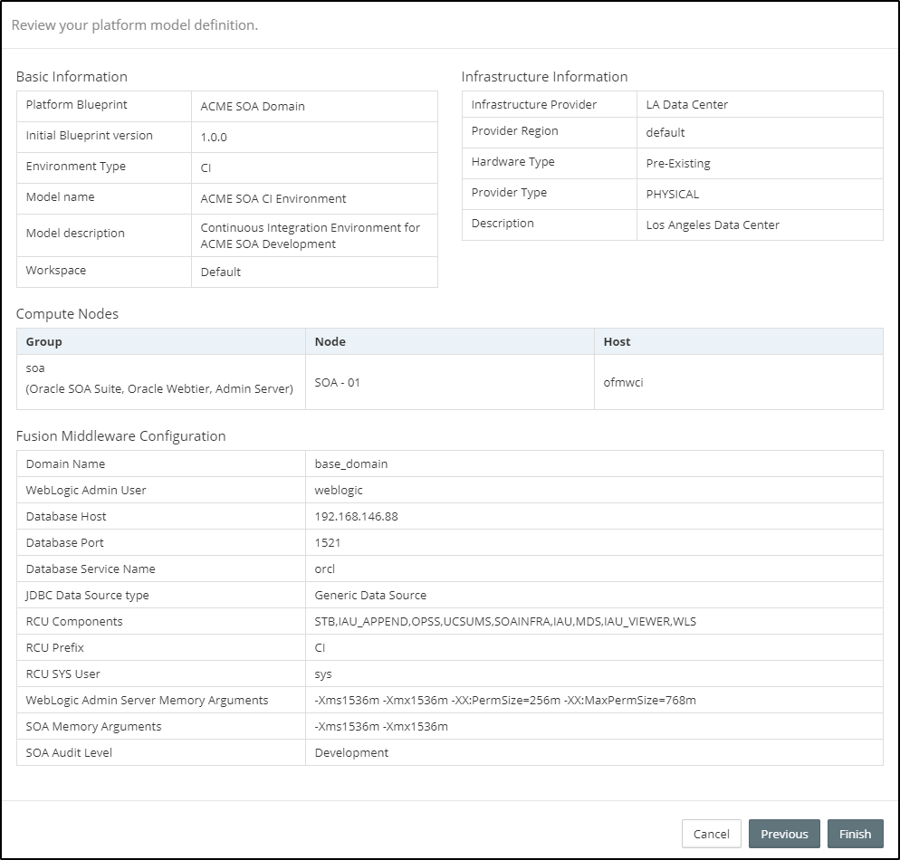

## Creating a Platform Model for Pre-Existing Infrastructure

From the side menu navigate to`Modeling` > `Platform Model`, this will display a list of existing Platform Models. Click on `Create New` in the top right-hand corner of the screen. This will launch the `New Platform Model` wizard.

In the initial dialog, we need to specify the following details about our Platform Model:

* **Platform Blueprint** - The Platform Blueprint that we will use for our Platform Model.
* **Platform Blueprint Version** - The version of the Platform Blueprint that we will use for our Platform Model.
* **Environment Type** - The Environment Type for the Platform Model.
* **Name** - Shorthand name for the Platform Model.
* **Description** - A longer description of the Platform Model
* **Workspaces** - This defines the Workspaces to which the Platform Model belongs. See Role-Based Access Control for further details.

Once we have entered the basic details about our Platform Model click `Next`.

### Select Infrastructure Provider
Next, we need to specify the Infrastructure Provider for our Platform Model. From the corresponding drop-down, select a Pre-Existing Infrastructure Provider. MyST will list all the target hosts within the Pre-Existing Infrastructure provider for the Platform Model Environment Type.

Once done, click `Next`.

### Specify Compute Group Size
For each Compute Group defined within the Platform Blueprint we need to specify the number of nodes to use.

In addition, we can also specify whether we want to have a stand-alone admin server, in which case it will be created within its own compute group. MyST will default to what is specified in the Platform Blueprint.

If we specified a stand-alone Admin Server in the Platform Blueprint, and then choose to override that, then we will also need to specify which compute group we want to target the Admin Server to.

Once done, click `Next`.

### Map to Pre-Existing Servers
Once we have specified the number of nodes for each compute group, the next step is to map each Node to a corresponding Pre-Existing Host in the specified infrastructure provider.

MyST will list out each node required by the Platform Model. Against each node there will be a drop down box, which will list the target hosts available to map the node. For each node, select the target host. Only hosts available from the specified environment will be available for selection.

> Care should be taken not to assign multiple nodes within the same Platform Model to the same host.

Once done, click `Next`.

### Specify Platform Model Configurations
The final stage is to specify configuration properties that are specific to the Platform Model.

For the Platform Model, we need to specify the following details:

* **Domain Name** - This is the WebLogic Domain name, it will default to the value specified in the Platform Blueprint, but can be overridden in the Platform Model.
* **WebLogic Admin User** - Enter the WebLogic Admin user, it defaults to Weblogic.
* **Weblogic Admin Password** - Enter the password to be used for the WebLogic Admin User.
* **Database Host** - The host name for the database that will host the RCU schemas. 
* **Database Port** - The port number for the database.
* **Database Service Name** - The service name / SID of the database. 
* **JDBC Data Source type** - This option is used to specify the Data Source Type for Oracle Middleware specific schemas which are created by the Oracle Middleware Repository Creation Utility (RCU). This will default to the value specified in the Platform Blueprint but can be overridden here.
* **RCU Components** - This details the RCU specific schemas that will be created. This is pre-populated based on the Oracle Middleware Components specified in the Platform Blueprint, this is for information purposes only and can't be modified.
* **RCU Prefix** - Specify the RCU Prefix to be used. The prefix is prepended to and separated from the schema name with an underscore (_) character.
* **RCU Database Password** Enter the password to be used for each of the schema owners created by RCU.
* **RCU SYS User** - Enter the user name for the RCU database. This should be a username with DBA or SYSDBA privileges, for example, SYS.
* **RCU SYS Password** - Enter the password for the RCU Sys User.

> Note: All passwords stored by MyST are encrypted.

#### GridLink and ONS nodes configuration
In case you are using a GridLink (RAC) database, you can specify the additional property, **ONS Nodes** and set specify the list of ONS nodes following standard Oracle documentation.

> MyST will auto-calculate the GridLink Database URLs as appropriate which you can change in the model editor later if you wish to override.

#### Override Default Memory and Logging Settings
It is common to have different JVM Memory Arguments and Logging configurations in upstream dev and test environments. The `Advanced` tab allows you override the settings in the Platform Blueprint.

For the Platform Model we need to specify the following details:

* **WebLogic Admin Server Memory Arguments** - Allows you to specify the JVM Memory arguments for the WebLogic Admin Server.
* **WebLogic Managed Server Memory Arguments** - For each Oracle Middleware Component (for example SOA, OSB and OWSM), allows you to specify the JVM Memory arguments for the WebLogic Managed Server running that component.
* **Logging / Audit Levels for Oracle Middleware Components** - Allows you to specify the Logging / Audit Level for certain Oracle Middleware Components.

> The options available will be dependent on which Oracle Middleware components are included within the Platform Blueprint.

Once we have specified the `General` and `Advanced` Platform Model configurations, click `Next`.

### Review the Summary
MyST will display a Summary screen showing all the key inputs specified in the Platform Model Wizard.

Once done, click `Finish`. MyST will create the corresponding Platform Model and take you to the Platform Model Editor where you can make additional changes if required. See [Editing Platform Models](/platform/definitions/README.md) for further details.