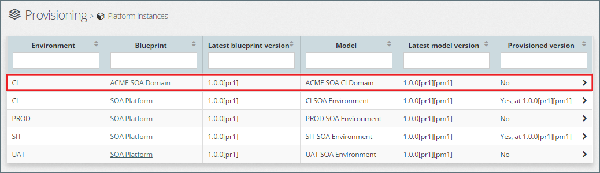
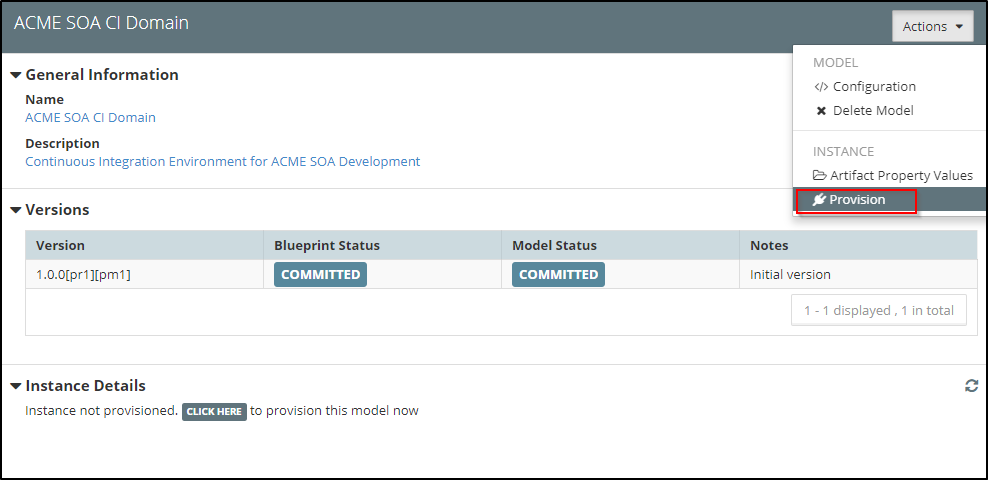
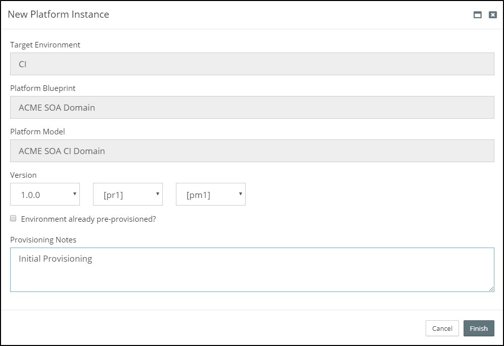
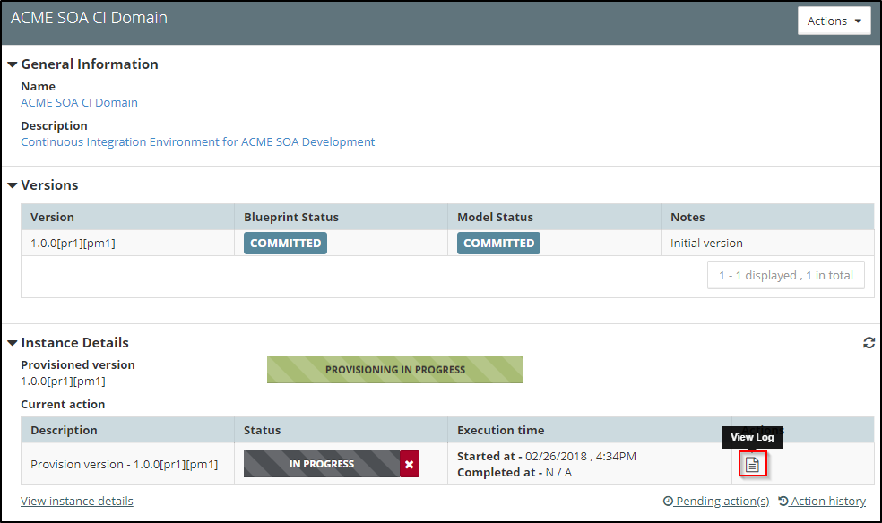
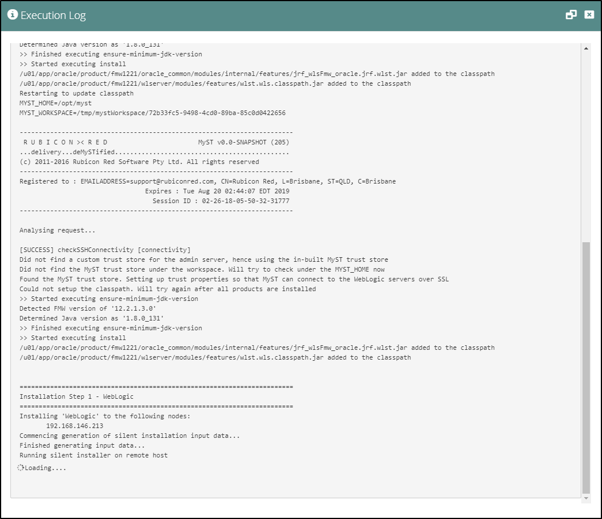
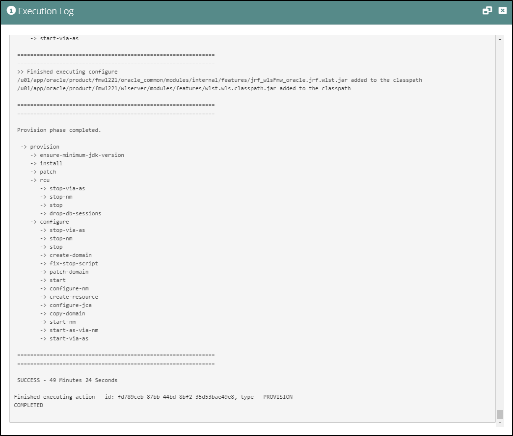
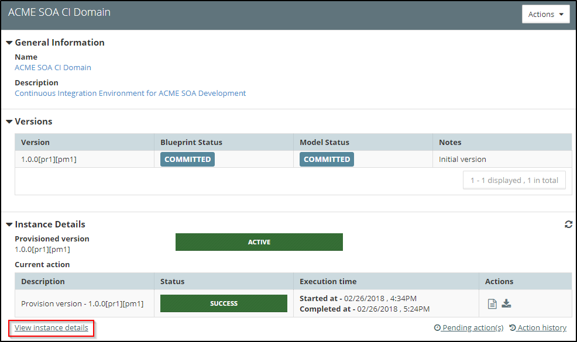
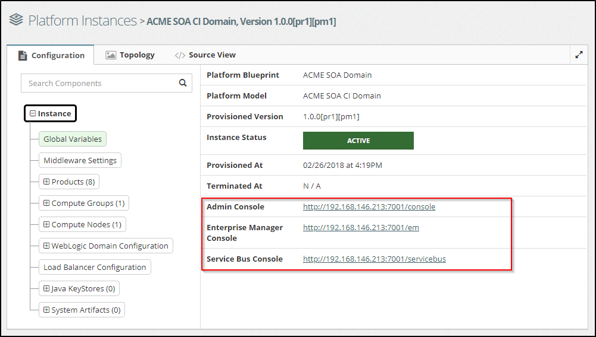
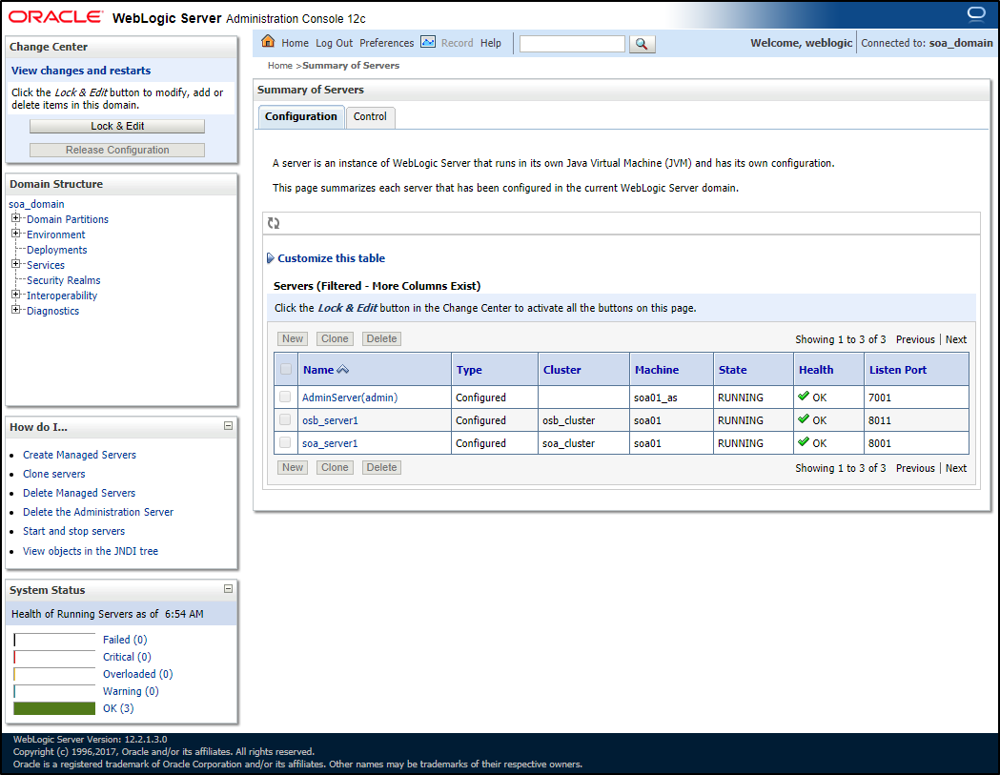

## {{ page.title }}

Once we have created our Platform Model, we are now ready to provision it. 

Before we can provision a Platform Instance, there needs to be a committed version of the corresponding Platform Blueprint and Platform Model. See [Platform Blueprint and Model Versioning](/platform/definitions/version-control/README.md) for more details.

From the side menu we can navigate to`Provisioning` > `Platform Instances`, this will display a list of existing Platform Models. 

For each Platform Model, MyST will indicate if there is currently a provisioned platform instance for that model, and if there is, will indicate the current version and revision of the Platform Blueprint and Platform Model.

To provision a Platform Instance, select the corresponding Platform Model (outlined in red above). MyST will display summary information about the state of the Platform Model and Instance as shown below.

Click on the `Actions` menu and select `Provision`. MyST will open a dialog with the environment and platform details pre-filled and ask us to provide the remaining information.

1. **Version** - The exact version and revisions of the configuration to provision. By default, the latest version and revisions of the blueprint and model will be selected. Note that only `Committed` revisions of the configuration would be available here.
2. **Environment already pre-provisoned?** - In case, this is an existing platform instance which has already been provisioned (example could be when we have reverse-engineered the instance configuration through `introspection`), we should check this box. This will not kick off the full provisioning, rather would allow MyST to just do a basic connectivity check with the instance and mark it as provisioned.
3. **Provisioning Notes** - This is to capture any user comments which can be referred to later when finding historic information about actions taken on an instance.

Click on `Finish` to start the provisioning process.

MyST will now add the provision action to a task queue. The action will initially be in a `PENDING` state, but you should shortly see this change to `IN PROGRESS` as shown below.

MyST will start the process of provisioning the Oracle Middleware. This includes installing the Oracle Middleware binaries, running RCU to create the database schemas if required, creating the Oracle Middleware domain and then starting it up.

The end to end process will typically take 20-60 minutes to complete, depending on the Oracle Middleware components being provisioned and the performance of the underlying infrastructure.

### Viewing Logs
Whilst MyST is provisioning the Platform Instance you can view the action execution log by clicking on the `View Log` icon under `Actions` (outlined in red above). This will open the Execution Log dialog as illustrated below.

If you leave this window open, MyST will continue to update this with the log output.

### Verify Platform Instance
Once our Platform Instance has been successfully provisioned, the log will reflect the same.

 If we look at the summary screen now, the status of the action will change to `SUCCESS` and the status of the Platform instance will change to `ACTIVE`.

We can now directly go to the instance details screen by following the `View instance details` link (outlined in red above). Alternatively, we can go to `Actions` > `Instance` > `View Configuration`.

This will open the Platform Viewer, where we can view all details about the configuration of the Platform Instance. In addition, MyST provides the URLs for the relevant administration consoles (outlined in red).

If we click on the link for the `Admin Console`, this will take us to the login page for the WebLogic Admin Console. Login and view the `Servers` summary page. Here we can see the list of our newly provisioned WebLogic servers.

