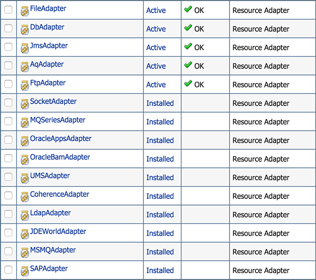
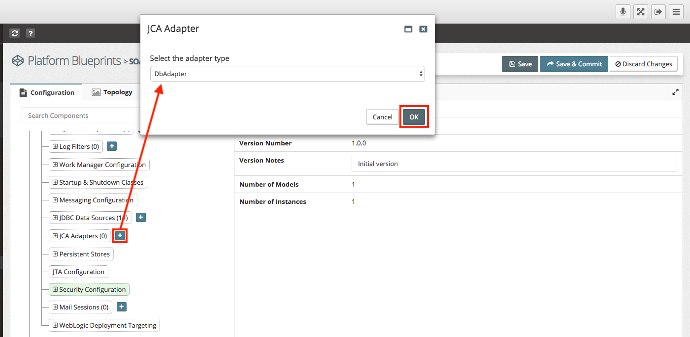
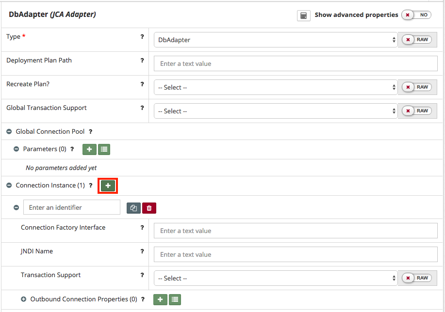
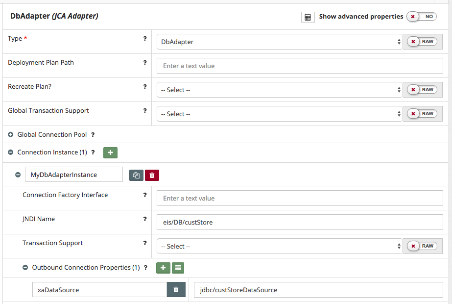

## {{ page.title }}

JCA Adapters are configured through deployment plans. MyST Studio has a mechanism for defining a JCA adapter configuration so that it can be used to generate the deployment plan when the platform is automatically provisioned or updated by MyST.

Below is an example of the JCA Adapters that ship out-of-the-box with the SOA Suite in 12c.

Before these can be used by applications, they need to be configured. This chapter details how JCA Adapter configurations can be added to a Platform Blueprint.

### Add JCA Adapter to Platform Blueprint
To add a new JCA Adapter in the Platform Blueprint, open the Platform Blueprint Editor and navigate to `Blueprint > WebLogic Domain Configuration > JCA Adapters`.

Click on the `+` icon next to `JCA Adapters` (outlined in red). This will then prompt for adapter type.

After selecting the adapter type, MyST will display its current configuration. Initially, none of its properties will be set.

Set the component name to the JCA Adapter type we want to configure, as shown in the WebLogic console. In the example below (outlined in red), we have set the component name to `DbAdapter`.

> An alternative way of creating a new JCA Adapter instance is to select an existing instance, right click on it and select `Clone`.

#### Create Adapter Instances
For each instance of a JCA Adapter, we want to configure, we need to add a corresponding instance to our JCA Adapter. Click on the `+` icon next to the `Connection Instance` (outlined in red above).

MyST will add a new instance to our JCA Adapter. For each instance we need to provide the following property values:
* **Identifier** -  This is used only for identifying the instance in MyST Studio and is not used for WebLogic.
* **JNDI Name** -  The JNDI name of the adapter instance at runtime
* **Outbound Connection Properties** - Contains the name-value properties that are used to configure the JCA Adapter instance.

##### Add Outbound Connection Properties
The Name-Value parameters are used to define properties that are used to configure the adapter instance. To add a property, click on the `+` icon next to `Outbound Connection Properties` and add the properties required to configure the JCA Adapter instance.

> Alternatively, click on `Bulk Edit` to open the property bulk editor

Some JCA adapters support the setting of global connection pool parameters. Setting connection pool parameters is supported for the following JCA Adapters:

* AQ Adapter
* DB Adapter
* File Adapter
* MQ Series Adapter
* Oracle Apps Adapter
* Socket Adapter

The connection pool parameters are set in the WebLogic Admin Console under the Connection Pool tab. The following table describes the MyST parameters that correspond to the fields on the WebLogic Admin Console.

| Admin Console Field | MyST Parameters |	Type|
| --------- | ---------- | ----- |
|Max Capacity 	|max-capacity 	|Number|
|Connection Reserve Timeout Seconds 	|connection-reserve-timeout-seconds 	|Number|
|Highest Num Waiters 	|highest-num-waiters 	|Number|
|Match Connections Supported 	|match-connections-supported 	|Number|
|Initial Capacity 	|initial-capacity 	|Number|
|Capacity Increment 	|capacity-increment 	|Number|
|Shrinking Enabled 	|shrinking-enabled 	|Boolean|
|Shrink Frequency Seconds 	|shrink-frequency-seconds 	|Number|
|Highest Num Unavailable 	|highest-num-unavailable 	|Number|
|Connection Creation Retry Frequency Seconds 	|connection-creation-retry-frequency-seconds 	|Number|
|Test Frequency Seconds 	|test-frequency-seconds 	|Boolean|
|Test Connections On Create 	|test-connections-on-create 	|Boolean|
|Test Connections On Release 	|test-connections-on-release 	|Boolean|
|Test Connections On Reserve 	|test-connections-on-reserve 	|Boolean|

#### Edit JCA Adapter in Platform Blueprint
To edit an existing JCA adapter in the Platform Blueprint, open the Platform Blueprint Editor and navigate to `Blueprint > WebLogic Domain Configuration > JCA Adapters`. Expand this component to see a list of currently defined adapters and select the JCA adapter you wish to edit.

#### Delete Data Source from Platform Blueprint
To delete an existing data source from a Platform Blueprint, open the Platform Blueprint Editor and navigate to `Blueprint > WebLogic Domain Configuration > JCA Adapter`.

Expand this component to see a list of currently defined data sources. Select an existing JCA adapter, right click on it and select `Remove`.
