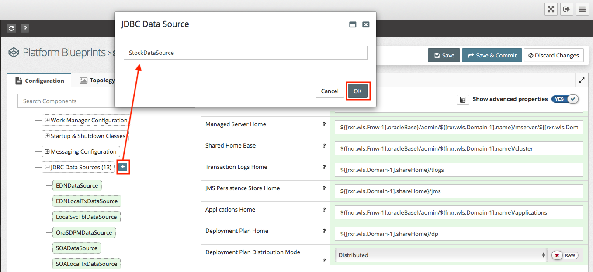
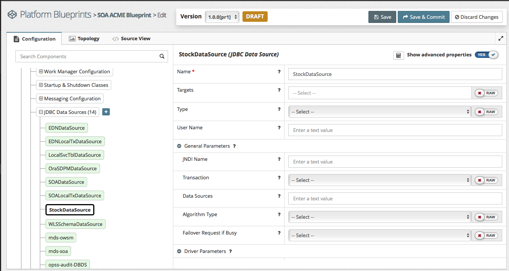
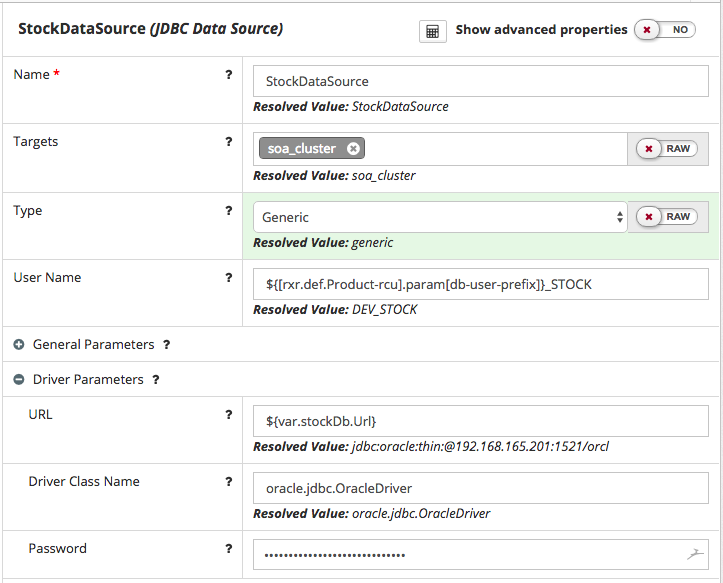
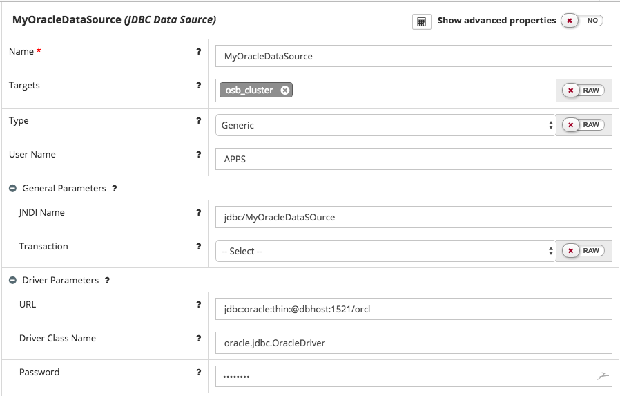
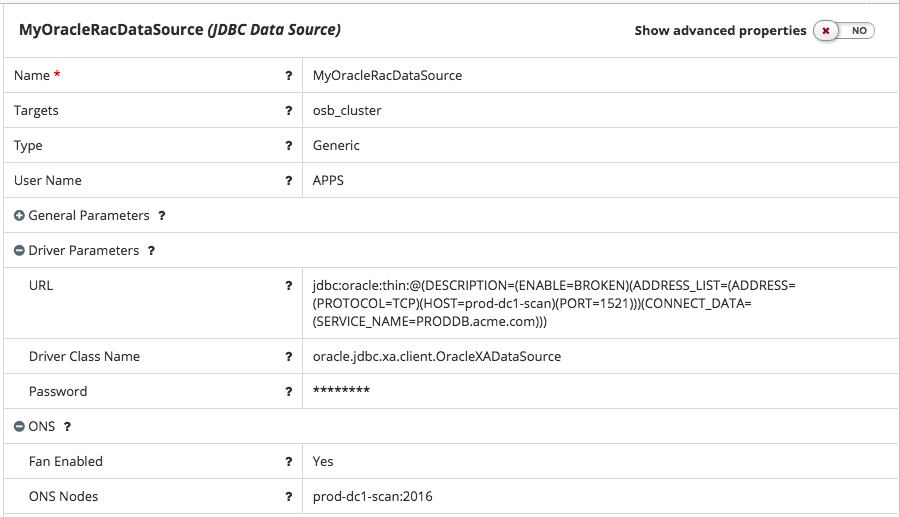
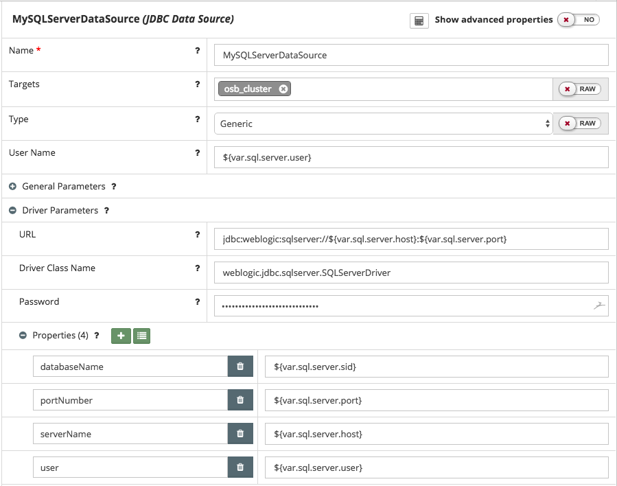
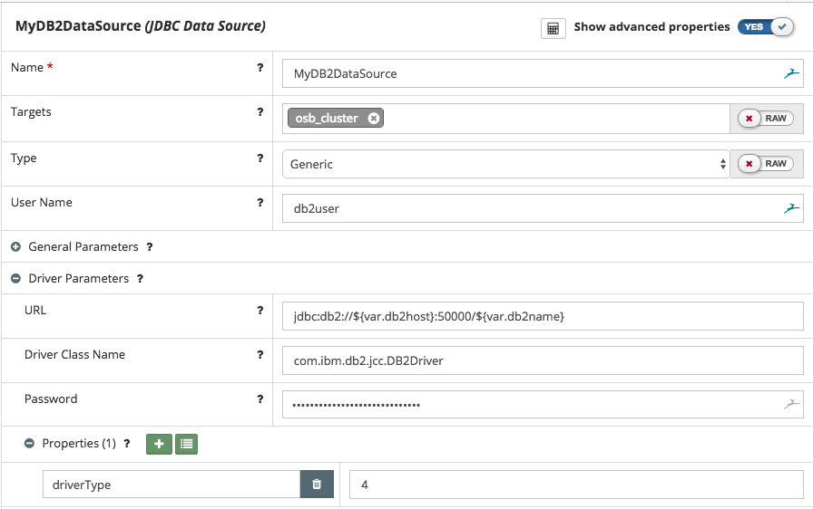

## {{ page.title }}

Configuring JDBC Data Sources in MyST is a two stage process.
* First, define the Data Source in the Platform Blueprint. Here we define the common and default configuration details for the Data Source.
* Second, define the environment specific details in each of the Platform Models, for example the database URL and connection credentials.

### Configuring Data Source in Platform Blueprint

#### Add Data Source to Platform Blueprint
To add a new data source in the Platform Blueprint, open the Platform Blueprint Editor and navigate to `Blueprint > WebLogic Domain Configuration > JDBC Data Sources`. Expand this component to see a list of currently defined data sources.

Click on the `+` icon next to JDBC Data Sources (outlined in red) and enter a name for the JDBC Data Source. Click `OK`.



> Note: An alternative way of creating a new Data Source is to select an existing data source, right click on it and select `Clone`.



 Initially, none of the JDBC properties will be set.

#### Edit Data Source in Platform Blueprint
To edit an existing data source in the Platform Blueprint, open the Platform Blueprint Editor and navigate to `Blueprint > WebLogic Domain Configuration > JDBC Data Sources`. Expand this component to see a list of currently defined data sources and select the data source you wish to edit. Enter the required values as detailed in [JDBC Data Source Properties](#jdbc-data-source-properties)

#### Delete Data Source from Platform Blueprint
To delete an existing data source from a Platform Blueprint, open the Platform Blueprint Editor and navigate to `Blueprint > WebLogic Domain Configuration > JDBC Data Sources`.

Expand this component to see a list of currently defined data sources. Select an existing data source, right click on it and select `Remove`.

### JDBC Data Source Properties
This section details all the properties that we can set for a JDBC data source in the MyST platform blueprint. To see all properties that are available, ensure `Show advanced properties` has been enabled as illustrated below.


The majority of these properties are optional. If a property is `Not Set` then MyST will not set that property when configuring a data source, meaning WebLogic will use the default value. Property values of type password are automatically encrypted by MyST.

#### Component Properties
For each JDBC data source we need to specify the following component properties:
* **Name** - Enter a name for this JDBC data source.

* **Type** - The type of data source. Supported types are `Generic`, `GridLink`. This value defaults to `Generic`.

* **Target** - Reference to the WebLogic Cluster or Admin Server that the JDBC Data Source is targeted to.

* **Username** - Username used to connect to the database. This may or may not be a generic value. If it changes per environment then you do not need to set it in your Platform Blueprint.

#### General Parameters
Under `General Parameters` we can specify the following properties:
* **JNDI Name** - Enter the JNDI path to where this JDBC data source will be bound.

* **Transaction** - The transaction protocol for a JDBC data source determines how connections from the data source are handled during transaction processing. Transactions within a JDBC data source are either global (XA) or non-global (local).

* **Data Sources** - Use this only when using Multi Data Source. Comma-separated list of data sources. If the Algorithm Type is set to `Failover`, the connection request is sent to the first data source in this list. In case the connection fails, the request is sent to the next data source in this list.

* **Algorithm Type** - Use this property only when using Multi Data Source. The algorithm type defines whether you want an active-active (load balancing) or an active-passive (failover) configuration. Supported types are `Load-Balancing` or `Failover`.

* **Failover Request If Busy** - Use this property only when using Multi Data Source and if the Algorithm Type is set to `Failover`. Set this property to `Yes` if you want to failover the connection request to the next data source if all the connections in the active data source are in busy.

#### Driver Parameters
Under `Driver Parameters` we need to specify the following properties:
* **URL** - The JDBC connection URL.

* **Driver Class Name** - The fully qualified class name of the JDBC driver class used to create the physical database connections. Ensure that this driver class supports the transaction behavior you have configured in Global Transactions Protocol.

* **Properties** - Optional list of properties passed to the JDBC driver. For each property we need to define the following attributes:
    * **Key** - The property id
    * **Value** - The property value

#### Connection Pool
Under `Connection Pool` we can specify the following properties (if not specified WebLogic will use default values):

* **Initial Capacity** - The minimum number of physical connections to create when creating the connection pool.

* **Capacity Increment** - The number of additional connections created when new connections are added to the connection pool.

* **Maximum Capacity** - The maximum number of physical connections that this connection pool can contain.

* **Minimum Capacity** - The minimum number of physical connections that this connection pool maintains.

* **Statement Cache Size** - The number of prepared and callable statements stored in the cache. (This may increase server performance.)

* **Test Connections On Reserve** - Enables WebLogic Server to test a connection before giving it to a client. Requires that you specify a Test Table Name.

* **Test Frequency** - The number of seconds between when WebLogic Server tests unused connections. Requires that you specify a Test Table Name. Connections that fail the test are closed and reopened to re-establish a valid physical connection. If the test fails again, the connection is closed. When set to `0`, periodic testing is disabled.

* **Test Table Name** - The name of the database table to use when testing physical database connections. This name is required when you specify a Test Frequency and enable Test Reserved Connections.

* **Seconds To Trust An Idle Pool Connection** - The number of seconds within a connection use that WebLogic server trusts that the connection is still viable and will skip the connection test, either before delivering it to an application or during the periodic connection testing process.

* **Connection Creation Retry Frequency Seconds** - The number of seconds between attempts to establish connections to the database.

* **Remove Infected Connections** - When set to `Yes` (which is the default value), the physical connection is not returned to the connection pool after the application closes the logical connection. Instead, the physical connection is closed and recreated. When set to `No`, when the application closes the logical connection, the physical connection is returned to the connection pool and can be reused by the application or by another application.

#### ONS
Under `ONS` we can specify the following properties:
* **Fan Enabled** - Applicable only to RAC configurations.

* **ONS Nodes** - JDBC Oracle parameters for ONS client configuration.

### Configure environment specific properties in Platform Model
For each Platform Model we need to define the environment specific values for each Data Source, this typically comprises the following properties:
* **URL** - This is the URL for the database that we want our Data Source to connect to.

* **User Name** - The user name used to connect to the database.

* **Password** - The password used to connect to the database.

When it comes to defining the `URL` and `User Name`, one option is to use MyST properties to minimize the number of specific property values we need to define within the Platform Model.

For example, we could define username as
```
Username = ${[rxr.def.Product-rcu].param[db-user-prefix]}_STOCK
```

The RCU prefix defined in the Platform Model will then be prepended to `_STOCK` to create the Username. So for example if the RCU prefix was `DEV` we would get the username `DEV_STOCK`.



In addition, if we are creating multiple data sources against the same database, another option is to define a global variable in the Platform Blueprint, for example `stockDb.Url` which we can then reference in each Data Source that connects to that database as follows:
```
URL = ${var.stockDb.Url}
```

We will, of course, need to set the value of `stockDb.Url` in the Platform Model, but would only need to set this once, irrespective of how many data sources referenced this.

In addition, we may want to override other settings in the Platform Blueprint as they may differ between environments. For example, we may have smaller connection pools or only be using Oracle RAC in Pre-Prod and Prod.

To edit a data source in the Platform Model, open the Platform Model Editor and navigate to `Blueprint > WebLogic Domain Configuration > JDBC Data Sources`. Expand this component to see a list of currently defined data sources and select the data source you wish to edit.

Any values you enter here will override the corresponding value in the Platform Model. Once done, click `Save` to save these values within the Data Source and then click `Save & Commit` to save the Platform Model and commit our changes.

### Example JDBC Data Source Configurations
The following section contains example JDBC Data Source configurations for:
* Oracle Database
* Oracle RAC
* IBM DB2
* Microsoft SQL Server

#### Creating a JDBC Data Source for Oracle Database
Below is an example configuration for an Oracle DB data source. The properties which are specific to Oracle DB are as follows:

| Property | Value |
| -------- | ----- |
| Type | Generic |
| URL | jdbc:oracle:thin:@dbhost:1521/orcl |
| Driver Class Name | oracle.jdbc.OracleDriver |
| Test Table Name | SQL SELECT 1 FROM DUAL |

An example Oracle data source is shown below.



#### Creating a JDBC Data Source for Oracle RAC
Below is an example configuration for an Oracle RAC data source. The properties which are specific to Oracle RAC in addition to the generic Oracle DB JDBC data source configuration are as follows:

| Property | Value |
| -------- | ----- |
| Type | Gridlink |
| Url | jdbc:oracle:thin:@(DESCRIPTION=(ENABLE=BROKEN)(ADDRESS_LIST=(ADDRESS=(PROTOCOL=TCP)(HOST=prod-dc1-scan)(PORT=1521)))(CONNECT_DATA=(SERVICE_NAME=PRODDB.acme.com))) |
| Fan Enabled | true |
| Ons Nodes | prod-dc1-scan:2016 |

An example Oracle RAC data source is shown below.




#### Creating a JDBC Data Source for Microsoft SQL Server
Below is an example configuration for a Microsoft SQL Server data source. The properties which are specific to SQL Server are as follows:

| Property | Value |
| -------- | ----- |
| Type | generic |
| Url | jdbc:weblogic:sqlserver://${var.sql.server.host}:${var.sql.server.port} |
| Driver Name | weblogic.jdbc.sqlserver.SQLServerDriver |

In addition we have specified the following Properties:

| Key | Value |
| -------- | ----- |
| databaseName | ${var.sql.server.sid} |
| portNumber | ${var.sql.server.port} |
| serverName | ${var.sql.server.host} |
| user | ${var.sql.server.user} |

An example SQL Server data source is shown below.



#### Creating a JDBC Data Source for IBM DB2
Below is an example configuration for a DB2 data source. The properties which are specific to DB2 are as follows:

| Property | Value |
| -------- | ----- |
| Type | generic |
| Url | jdbc:db2://${var.db2host}:50000/${var.db2name} |
| Driver Name | com.ibm.db2.jcc.DB2Driver |
| Test Table Name | SQL SELECT COUNT(*) FROM SYSIBM.SYSTABLES |

In addition, we have specified the following Properties:

| Key | Value |
| -------- | ----- |
| driverType | 4 |

An example DB2 data source is shown below.


