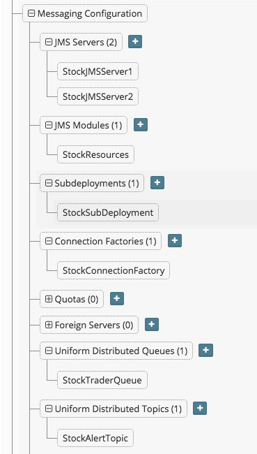
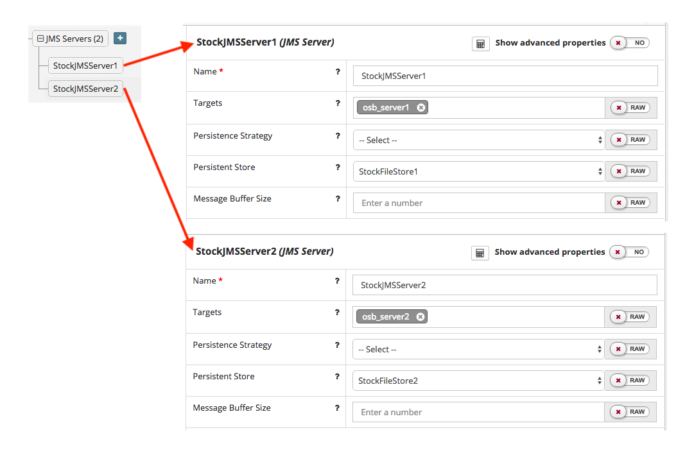
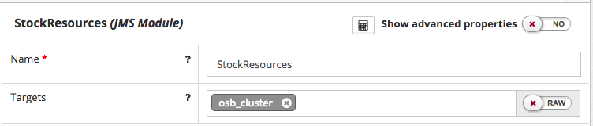
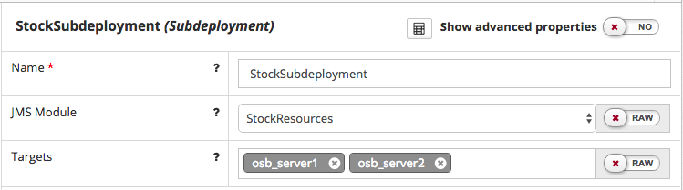
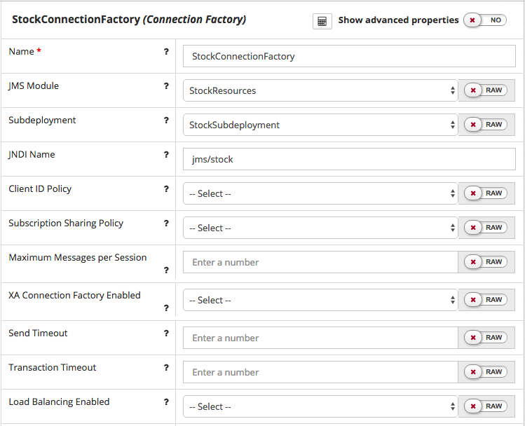
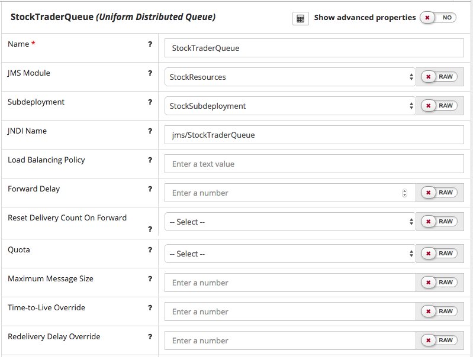
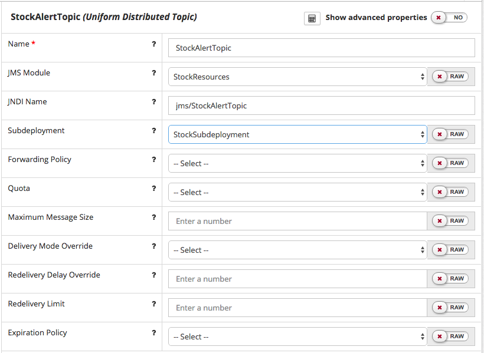

## {{ page.title }}

<!-- toc -->

This section describes how to configure and manage basic JMS system resources, such as JMS servers and JMS system modules within a Platform Blueprint / Model.

When configuring the Java Messaging Service, we will typically need to configure some or all of the following JMS system resources:

* **JMS Servers** - We will typically want to define a JMS Server for each managed server instance in the targeted cluster. Each JMS Server will need to be pinned to a separate managed server in the cluster.

* **Persistent Store** - We will need to define a dedicated persistence store for each JMS Server. See [Configuring Persistent Stores](/platform/resources/weblogic/jms/persistent-stores/README.md) for further details.

* **JMS Module** - We will typically define a JMS Module targeted at a specific cluster. This acts as a configuration container for JMS Resources, such as:
   * **Sub Deployment** - We will typically define one sub deployment per JMS Module and target it to the set of JMS servers running on the WebLogic Server cluster targeted by the JMS Module
   * **Connection Factories** - Used to create a connection with a JMS provider (i.e. queue or topic).
   * **Uniform Distributed Queue** - A JMS Queue for a JMS server.
   * **Uniform Distributed Topic** - A JMS Topic for a JMS server

The following screenshot illustrates a typical JMS configuration within a Platform Blueprint, for a two node cluster, we would define two JMS Servers as illustrated below. Plus a corresponding JMS Module consisting of one Sub Deployment and the required connection factories, queues and topics.


### Configuring a JMS Server

To configure a JMS Server in the Platform Blueprint, open the Platform Blueprint Editor and navigate to `Blueprint > WebLogic Domain Configuration > Messaging Configuration > JMS Servers`. Expand this component to see a list of currently defined JMS Servers.

Either select an existing JMS Server to edit or click on the `+` icon to add a new JMS Server.

For each JMS Server we need to specify the following properties:
* **Name** - Name for the JMS Module.

* **Persistence Strategy**  - This only needs to be set if we need to override the global persistence strategy.

* **Persistent Store**  -  The persistent store for the JMS Server.

* **Message Buffer Size**  - Optional. This only needs to be set to override the default value used by WebLogic.

* **Target** - The server instance on which to deploy the JMS Server.

We will typically want to define a JMS Server for each managed server instance in the targeted cluster. Each JMS Server will need to be pinned to a separate managed server in the cluster and will require a dedicated persistence store. So for a two node cluster, we would define two JMS Servers as illustrated below.

> **Note** From 12.2.1+ it is possible to target a JMS Server to a cluster.

### Configuring a JMS Module
A JMS Module is a configuration container for other JMS Resources, such as Connection Factories, Distributed Queues, and Distributed Topics.

To configure a JMS Module in the Platform Blueprint, open the Platform Blueprint Editor and navigate to `Blueprint > WebLogic Domain Configuration > Messaging > JMS Modules`. Expand this component to see a list of currently defined JMS Modules.

Either select an existing JMS Module to edit or click on the `+` icon next to JMS Modules to create a new JMS Module.

For each JMS Module we need to specify the following properties:
* **Name** - Name for the JMS Module.

* **Target** - The cluster or set of servers instance to which the JMS Module is targeted.

We will typically define a JMS Module targeted at a specific cluster, as illustrated below.

#### Configuring Sub Deployments
Sub Deployments allow a subset of a module's resources to be selectively targeted to a set of JMS Servers.

Navigate to `Subdeployments` under `Messaging Configuration`. Either select an existing Subdeployment to edit or click on the `+` icon to add a Subdeployment.

For each Sub Deployment we need to specify the following properties:
* **JMS Module** - The JMS Module to which the Subdeployment is associated.

* **Name** - Name for the Subdeployment.

* **Target** - The set of JMS Servers targeted by the Subdeployment.

We will typically define one sub deployment per JMS Module and target it to the set of JMS servers running on the WebLogic Server cluster/instances targeted by the JMS Module, as illustrated below.

#### Configuring Connection Factory
Navigate to `Connection Factories` under the `Messaging Configuration`. Either select an existing Connection Factory to edit or click on the `+` icon to add a Connection Factory.

For each Connection Factory we need to specify the following properties:
* **Name** - Name for the Connection Factory.

* **JMS Module** - The JMS Module to which the Connection Factory is targeted.

* **Subdeployment** - The Subdeployment to which the Connection Factory is targeted.

* **JNDI Name** - The JNDI name used to look up the connection factory within the JNDI namespace.

#### Configuring Uniform Distributed Queue
Navigate to `Uniform Distributed Queues` under the `Messaging Configuration`. Either select an existing queue to edit or click on the `+` icon to add a queue.

For each Uniform Distributed Queue we need to specify the following associations:
* **JMS Module** - The JMS Module to which the Queue is targeted.
* **Subdeployment** - The Subdeployment to which the Queue is targeted.

For each Uniform Distributed Queue we need to specify the following properties (if not specified WebLogic will use default values):
* **Name** - Name of the distributed queue.

* **JNDI Name** - The JNDI name used to look up the Uniform Distributed Queue within the JNDI namespace.

* **Load Balancing Policy** - Defines policy `Round Robin` or `Random` for how messages are distributed to the members of this distributed queue.

* **Forward Delay** - 	
The number of seconds after which a uniform distributed queue member with no consumers will wait before forwarding its messages to other uniform distributed queue members that do have consumers.
 The *default* value of `-1` disables this feature so that no messages are forwarded to other uniform distributed queue members.

* **Reset Delivery Count On Forward** - Determines whether or not the delivery count is reset during message forwarding between distributed queue members.
 The default value of `Yes` resets the delivery counts on messages when they are forwarded to another distributed queue member.

* **Quota** - A Quota controls the allotment of system resources available to destinations. For example, the number of bytes a destination is allowed to store can be configured with a Quota.

* **Maximum Message Size** - The maximum size of a message that is accepted from producers on this destination.

* **Time-to-Live Override** - The time-to-live assigned to all messages that arrive at this destination, regardless of the time-to-live value specified by the message producer. The default value of `-1` specifies that this setting will not override the time-to-live setting specified by the message producer.

* **Redelivery Delay Override** - The delay, in milliseconds, before rolled back or recovered messages are redelivered, regardless of the Redelivery Delay specified by the consumer and/or connection factory. The default value of `-1` specifies that the destination will not override the Redelivery Delay setting.

* **Redelivery Limit** -  Specifies the number of redelivery tries a message can have before it is moved to an error destination. The default value of `-1` specifies that the destination will not override the message sender's redelivery limit setting.

* **Expiration Policy** - select the expiration policy (Discard, Log, or Redirect) used when an expired or undeliverable message is encountered on a destination.

* **Expiration Logging Format** - if Log is the selected Expiration Policy, specify what information about the message that you want to be logged.

* **Error Destination** -  The name of the target destination (queue or topic) for messages that have reached their redelivery limit. If no error destination is configured on the local JMS server, then undelivered messages are simply deleted.

The following screen shot illustrates the configuration of Uniform Distributed Queue

#### Configuring Uniform Distributed Topic
Navigate to `Uniform Distributed Topics` under the `Messaging Configuration`. Either select an existing topic to edit or click on the `+` icon to add a topic.

For each Uniform Distributed Topic we need to specify the following associations:
* **JMS Module** - The JMS Module to which the Topic is targeted.
* **Subdeployment** - The Sub Deployment to which the Topic is targeted.

For each Uniform Distributed Topic we need to specify the following properties (if not specified WebLogic will use default values):
* **Name** - Name of the distributed topic.

* **JNDI Name** - The JNDI name used to look up the Uniform Distributed Topic within the JNDI namespace.

* **Forwarding Policy** - Specifies the forwarding policy for sent messages to all members.This can either be `Replicated` (default) or `Partitioned`.

* **Quota** - A Quota controls the allotment of system resources available to destinations. For example, the number of bytes a destination is allowed to store can be configured with a Quota.

* **Maximum Message Size** - The maximum size of a message that is accepted from producers on this destination.

* **Create Destination Identifier** (advanced property) - Optional, unique topic identifier name when using the topicSession.createtopic API defined in the JMS Specification.

* **Delivery Mode Override** - The delivery mode assigned to all messages that arrive at the destination regardless of the DeliveryMode specified by the message producer.
 Supported values are `Persistent`
, `Non-Persistent`
, and `No-Delivery`. The default value of `No-Delivery` means the DeliveryMode will not be overridden.

* **Redelivery Delay Override** - The delay, in milliseconds, before rolled back or recovered messages are redelivered, regardless of the Redelivery Delay specified by the consumer and/or connection factory. The default value of `-1` specifies that the destination will not override the Redelivery Delay setting.

* **Redelivery Limit** -  Specifies the number of redelivery tries a message can have before it is moved to an error destination. The default value of `-1` specifies that the destination will not override the message sender's redelivery limit setting.

* **Expiration Policy** - Specifies the expiration policy (`Discard`, `Log`, or `Redirect`. Used when an expired or undeliverable message is encountered on a destination.

* **Expiration Logging Format** - if `Log` is the selected Expiration Policy, specify what information about the message we want to be logged.

* **Error Destination** -  The name of the target destination (queue or topic) for messages that have reached their redelivery limit. If no error destination is configured on the local JMS server, then undelivered messages are simply deleted.

The following screen shot illustrates the configuration of Uniform Distributed Topic.

