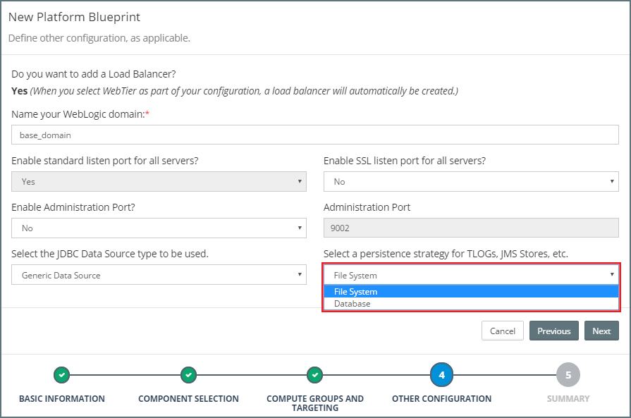
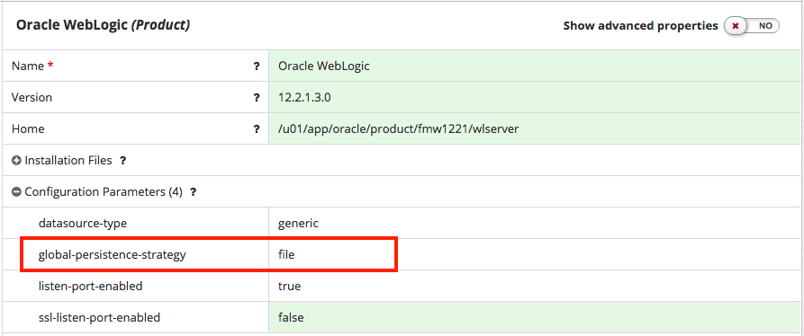

<!-- Note on Persistent Stores
* See https://rubiconred.jira.com/wiki/display/M25D/Configuring+the+Persistence+Store
* See https://rubiconred.jiveon.com/message/4424
* See https://rubiconred.jira.com/wiki/display/RABOCD/MyST+Studio+Configuration+Management+Guide#MySTStudioConfigurationManagementGuide-JavaMessagingServer
-->

## {{ page.title }}

Persistence stores provides a built-in, high-performance storage solution for WebLogic Server subsystems and services that require persistence, such as:
* Java Messaging Service (JMS)
* Store-and-Forward (SAF) Service
* Transaction Logs (TLogs)

WebLogic supports persistence to a file-based store or to a JDBC-enabled database.

### Defining the Global Persistence Strategy
One of the key design decisions when creating our Platform Blueprint is whether to use a file-based or a JDBC-enabled database persistent store. This is specified in step 4 of the Platform Blueprint wizard as shown below.

To view the global persistence strategy for a Platform Blueprint, open the Platform Blueprint Editor and navigate to `Blueprint > Products`. Select the `Oracle WebLogic` component to display its properties.

Under `Configuration Parameters` we will see the property `global-persistence-strategy` as illustrated below.

### File System Persistence Strategy
When we select `File System` as our persistence strategy, MyST will automatically create the required file stores to support the selected product components. For example, if we created a Platform Blueprint with the components SOA Suite and OSB, the following  File Persistence Stores would be created:

| Name | Target | Notes |
| ---- | ------ | ----- |
| `mds-owsm` | `AdminServer` ||
| `mds-soa` | `AdminServer` ||
| `UMSJMSFileStore_auto_[n]` | `osb_server[n]` | One per OSB Managed Server |
| `WseeFileStore_auto_[n]` | `osb_server[n]` | One per OSB Managed Server |
| `FileStore_auto_[n]` | `osb_server[n]` | One per OSB Managed Server |
| `UMSJMSFileStore_auto_[n]` | `soa_server[n]` | One per SOA Managed Server |
| `BPMJMSFileStore_auto_[n]` | `soa_server[n]` | One per SOA Managed Server |
| `SOAJMSFileStore_auto_[n]` | `soa_server[n]` | One per SOA Managed Server |

#### Configure a File Persistent Store
We can configure additional File Persistence Stores in the Platform Blueprint. To do this, open the Platform Blueprint Editor and navigate to `Blueprint > WebLogic Domain Configuration > Persistent Stores > File Stores`. Expand this component to see a list of currently defined file stores.

Either select an existing File Store to edit or click on the `+` icon to add a File Store.

For each File Store we need to specify the following properties:
* **Name** - Name for the File Store.

* **Directory** - Pathname to the directory on the file system where the file store is kept.

* **Target** - Server instance on which to deploy the file store.

We will need to define a separate file store for each JMS server. When configuring a JMS Module, we will need to create a separate JMS Server plus a corresponding File Store for each node in the cluster. So for a two node cluster, we would define two file stores. The except to this rule is for 12.2.1 onwards, where it is possible to target a File Store to a cluster.

### Database Persistence Strategy
When we select a Database as our Global Persistence Strategy, MyST will automatically create the required file stores to support the selected product components.

For example, if we created a Platform Blueprint with the components SOA Suite and OSB, the following  JDBC Persistence Stores would be created:

| Name | Target | Notes |
| ---- | ------ | ----- |
| `UMSJMSJDBCStore_auto_[n]` | `osb_server[n]` | One per OSB Managed Server |
| `WseeJDBCStore_auto_[n]` | `osb_server[n]` | One per OSB Managed Server |
| `JDBCStore_auto_[n]` | `osb_server[n]` | One per OSB Managed Server |
| `UMSJMSJDBCStore_auto_[n]` | `soa_server[n]` | One per SOA Managed Server |
| `BPMJMSJDBCStore_auto_[n]` | `soa_server[n]` | One per SOA Managed Server |
| `SOAJMSJDBCStore_auto_[n]` | `soa_server[n]` | One per SOA Managed Server |

> Note: The default file persistent stores are also created, but these are not targeted by the JMS Servers.

As part of this process, MyST also performs the following steps:
* Creates the JDBC data source WLSDStore
* Creates a JDBC TLOG store and associates it with the JDBC data source persisting the Transaction Logs in the database
* Creates a JDBC data source, GridLink data source, or multi data source to interface with the JDBC store. See Choosing a Data Source.

#### Required Patches
WebLogic 10.3.6 and later support persistence to a JDBC-enabled database. However, before we begin, we need to apply the following patches.

##### WebLogic 10.3.6 Patches

| Patch ID | File | Notes |
| -------- | ---- | ----- |
| WPI2 | p19565095_1036_Generic.zip | Create domain using WLST produces incorrect JMSSERVER name in 50% of the invocations.
 |
| IHFB | p16063328_1036_Generic.zip | BEA-149500 ERROR WITH JDBC TLOG STORE |
| BADF | p16104758_1036_Generic.zip | LIFECYCLESHUTDOWNSEQUENCETEST fails with the ILLEGALSTATEEXCEPTION error.
 |

##### WebLogic 12.1.3 Patches

| Patch ID | File | Notes |
| -------- | ---- | ----- |
| 19565095 | p19565095_121300_Generic.zip | Creating a domain using WLST produces incorrect JMSSERVER name in 50% of the invocations. |

#### Configure a JDBC Persistent Store
To configure a JDBC Persistent Store in the Platform Blueprint, open the Platform Blueprint Editor and navigate to `Blueprint > WebLogic Domain Configuration > Persistent Stores > JDBC Stores`. Expand this component to see a list of currently defined JDBC Stores.

Either select an existing JDBC Store to edit or click on the `+` icon to add a JDBC Store.

For each Database Store we need to specify the following properties:
* **Name** - Name for the File Store.
* **Prefix Name** - The prefix for the JDBC store's database table (WLStore).
* **Data Source** - The JDBC data source used by this JDBC store to access its backing table. You cannot configure a JDBC store to use a JDBC data source that is configured to use an XA JDBC driver or configured to support global transactions.
* **Target** - Server instance on which to target the database store.

For each JDBC Persistence store we **must** define a distinct prefix-name. The prefix-name will be used to prefix the table name WLStore. If you define the same value for two different persistence stores, one of the managed servers might fail to start up.
