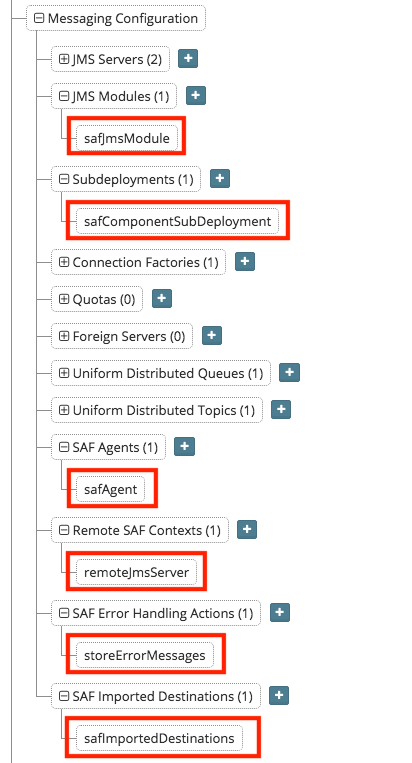

## {{ page.title }}

MyST supports the automatic configuration of Store and Forward (SAF) providers to make integration with external JMS providers or enabling Web Services Reliable Messaging that much easier.

The following object types are supported by MyST Studio:

* **SAF Agents** - which perform the actual work of store and forward of JMS messages at runtime
* **Remote SAF Contexts** - which encapsulate the configuration required to connect to a remote JMS provider
* **SAF Error Handling** - which encapsulates specific behavior used to process messages in the event of an error
* **SAF Imported Destinations** - which encapsulate the configuration for specific remote JMS queues that an SAF Agent will interact with

To create SAF objects, open a blueprint or model for any configuration with components using a WebLogic Server domain (eg. Oracle Service Bus, Oracle Traffic Director) and expand the object tree for the domain under `WebLogic Domain Configuration` > `Messaging Configuration`

When configuring SAF, a sub deployment is required as part of the JMS module configuration in order to target SAF components correctly.

