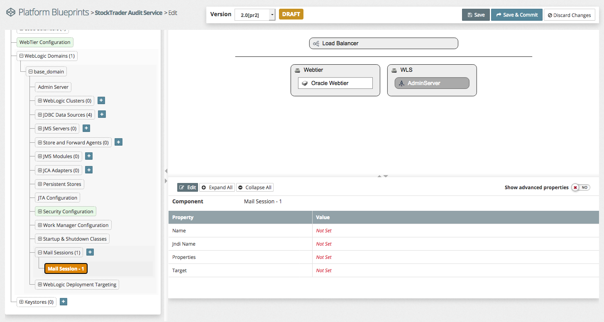
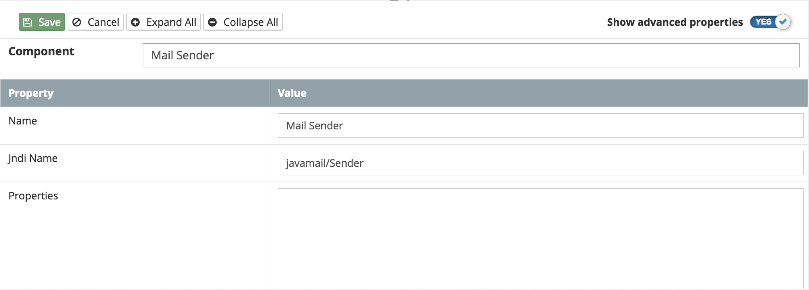
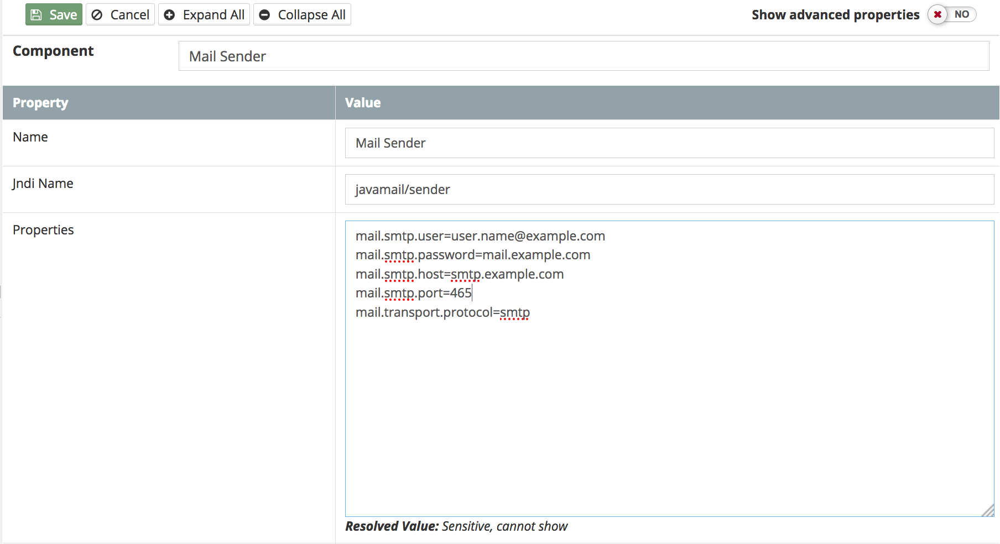

##{{page.title}}  
MyST supports the configuration of **Mail Sessions** which facilitate establishing a connection to an existing mail server using the supplied credentials and properties in order to send and/or receive email messages.

A Mail Session can be used by running applications to interact with mail servers for the sending and receiving of email messages as well as server infrastructure itself for the sending of notifications of alerts and other events that are generated at runtime. A Mail Session can be configured to use IMAP or SMTP or both, depending on the required email interaction type.

### Add Mail Session to Platform Blueprint
To add a new Mail Session in the Platform Blueprint, open the Platform Blueprint Editor and navigate to `Blueprint` > `WebLogic Domains` > `[domain_name]` > `Mail Sessions`.

Click on the `+` icon next to Mail Sessions. This will create a new Mail Session to be configured with the intial name of  **``Mail Session - 1``** as shown in the example below. Click on the ``Edit`` button to make changes to the configuration.

### Mail Session Configuration
A Mail Session configuration defines two categories of information.  

* **Name** and **JNDI Name** of the Mail Session, enabling it to be looked up at runtime by the component wanting to work with the email server.  These are able to be set as specific settings on the Mail Session.

* **Properties** which provide the usage and connection details for the actual external mail server to be used, set as name/value pairs.


A more detailed description of the JavaMail API and the corresponding properties that can be set to connect to mail servers is available at
[JavaMail Description] ](http://docs.oracle.com/javaee/7/api/javax/mail/package-summary.html#package.description).


<!--
### Common Mail Session Properties

|Name| Description  | Default Value |
|--|--|--|
|Name | | |
|JNDI name |||
|Username |  ||
|Password | ||
|mail.smtp.user |||
|mail.smtp.password |||
|mail.smtp.host=smtp.example.com |||
|mail.smtp.port=465 |||
|mail.transport.protocol=smtp |||

JavaMail Properties:
-->
