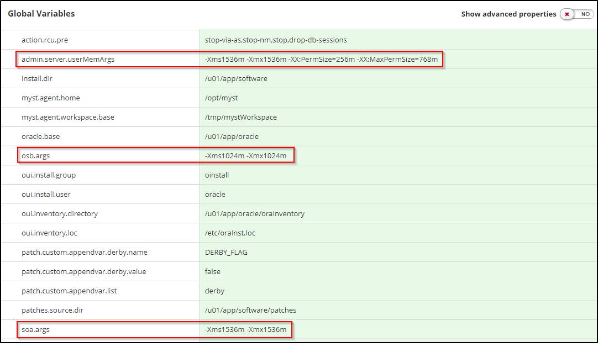
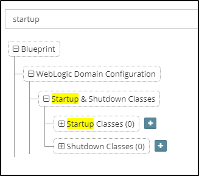
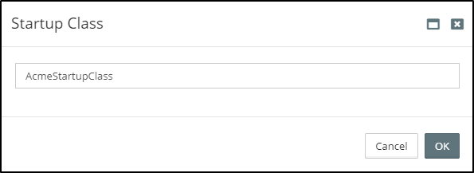
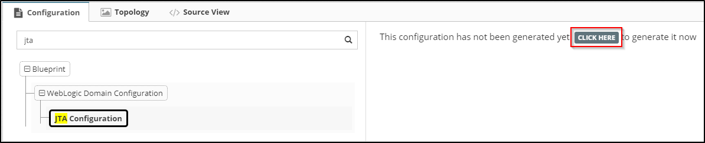

## {{ page.title }}

This chapter details how to define core WebLogic Server configurations, this includes:

* Server Start-Up Arguments
* Server Start-Up Classes
* JTA Timeout

### Server Startup Arguments
Server Startup Arguments are used for providing arguments to the Java Virtual Machine for specific WebLogic Server instances. These are most commonly used for configuring memory settings. 

MyST makes it simple to configure the server startup arguments on a per-product basis. For Server Startup Arguments, MyST automatically generates a property under `Global Variables` for each product, with the naming convention `<product-id>.args`. 

When we create our Platform Model, the WebLogic server instances are generated by MyST, which automatically reference the appropriate property. 

> This makes is easy to define a common property once to be used across a number of WebLogic Server instances in a cluster rather than managing each Server's properties separately like you would have to do when using the WebLogic Administration Console to do manual configuration.

So for example, if we have a SOA domain, containing both SOA and OSB, then MyST would generate the Global Variables `osb.args` and `soa.args`as illustrated below.

Server Startup Arguments defined with the convention `<product-id>.args` are applied during start up by the WebLogic Node Manager. This is **different** to those defined with the convention `<server-id>.userMemArgs` which are instead applied by manipulating the start-up scripts directly. 

Due to a WebLogic product constraint, the Admin Server arguments cannot be managed by the Node Manager. Thus Admin Server start-up arguments should be defined using the property `admin.server.userMemArgs`. MyST automatically does this for you by default (as illustrated above).

> In 11g, Coherence cluster arguments were required to be defined under the server start arguments. As this is a complex and error-prone process, MyST Studio will automatically generate this for you when you have products in your Blueprint that use Coherence out of the box, such as SOA Suite. You don't have to worry about missing this step or making a mistake.

#### Configure Environment Specific Startup Arguments in the Platform Model
It's quite common to provide fewer resources to a Development or Testing environment compared to Production. As a result, these environments often require different memory settings.

MyST makes it simple to override the startup arguments defined in the Platform Blueprint by configuring environment specific Startup arguments in our Platform Model
. 

To do this, navigate to the Global Variables within the Platform Model. By default, MyST will show the start-up arguments inherited from the Platform Blueprint. To override these simply edit the values as required within the Platform Model.

> We also have the option of overriding the startup arguments when we first create the Platform Model by specifying these on the [Advanced tab of the Platform Model Configuration](/platform/models/pre-existing/README.md#override-default-memory-and-logging-settings) override stage of the Platform Model wizard.

### Startup and Shutdown Classes
WebLogic allows us to configure startup and shutdown classes in order to perform tasks when we start up or gracefully shut down the server. 

To add start-up and shutdown classes to the Platform Blueprint, open the Platform Blueprint Editor and type `startup` in the search bar and locate `Startup & Shutdown Classes`.

To add a Startup or Shutdown Class, click on the corresponding `+` symbol. This will show a dialog prompting you to enter a name for the class.

Enter a name and press `OK`. The startup class should now be selected and available for configuring additional properties.

For each Startup/Shutdown Class we need to specify the following properties:

* **Name** - An alpha-numeric value that identifies the startup class configuration. This name attribute is for your identification purposes only.

* **Targets** - The cluster to which the class is to be deployed.

* **Class Name** - Fully qualified name of the Java class.

* **Deployment Order** - Determines order in which classes are loaded and executed. Items with the lowest Deployment Order value are loaded first. Priority is relative to other deployable items of the same type.

* **Arguments** - Arguments that the WebLogic server uses to initialize a class. Multiple arguments must be separated by a comma. For example `attribute1=value1,attribute2=value2`

By default WebLogic Server startup classes are run after the server initializes JMS and JDBC services, and after applications and stand-alone modules have been deployed and activated. We can modify this behavior by configuring the following properties:

* **Load Before App Deployments** - Causes the targeted servers to load and run a startup class before it activates JMS and JDBC services and before it starts deployment for applications and EJBs.

* **Load Before App Activation** - Causes the targeted servers to load and run a startup class before it activates applications and EJBs.

> Note: The startup or shutdown class must be on the classpath of each server to which it is assigned. See [Application Blueprints](deploy/application/blueprints/README.md) for further details.

### Configure JTA Timeout
To set the JTA Timeout in the Platform Blueprint, open the Platform Blueprint Editor and type `jta` in the search bar and locate `JTA Configuration`.

Click the `Generate` button (outlined above).

Set the `Timeout Seconds` attribute to the required value. Once done your settings for the component should look something like:

