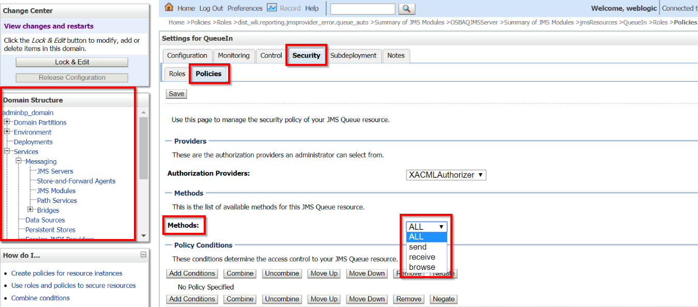

## {{ page.title }}

Myst supports automating the security configuration of the following:

* Creating LDAP users and groups.
* Assigning role conditions.
* Assigning users to groups and roles.
* Creating, updating, and deleting credentials maps.
* Creating security policies on JMS modules.

The users, roles, groups, credentials maps, and the security policies must be defined as **Global Variables** within the Platform Blueprint (or if desired, the Platform Model) using the properties below. 

<!--
> They will be applied by the `Control > Custom > "security"` action. Alternatively you can include it at provisioning time by adding `action.configure.post=security`. \(_**To be clarified\)**_
-->

### User definitions

| Property name | Description |
| :--- | :--- |
| add.users | A comma-separated list of user names to be created. |
| USERNAME.password | Password for the user name. |
| USERNAME.description | Description for the user name. |
| USERNAME.group| Comma-separated list of groups to which you want to add the user name. |
| remove.users | Comma-separated list of users you want to remove |

#### Example User definitions

```
add.users=asmith,jstein
asmith.password=welcome1
asmith.group=Administrators
jstein.password=welcome1
```

### Group definitions

| Property name | Description |
| :--- | :--- |
| add.groups | Comma-separated list of groups you want to create. |
| remove.groups | Comma-separated list of groups you want to remove. |

#### Example Group definitions

```
add.groups=Group1,Group2
```

### Application Role definitions

| Property name | Description |
| :--- | :--- |
| add.app\_roles | Comma-separated list of application role IDs that you want to create. |
| APP_ROLE_ID.app\_stripe | The name of the application stripe for a given application role id. |
| APP_ROLE_ID.app\_role\_name | The name of the application role for a given application role id. |
| grant.app\_roles | Comma-separated list of application role grant IDs to be created |
| GRANT_APP_ROLE_ID.app\_stripe | The name of the application stripe where the role exists. |
| GRANT_APP_ROLE_ID.app\_role\_name | The name of the application role to be granted for the principal. |
| GRANT_APP_ROLE_ID.principal\_type | The type of the principal, either "user" or "group" or "role". |
| GRANT_APP_ROLE_ID.principal\_name | The name of the principal to be granted the role |
| role.expressions | A comma-separated list of WebLogic roles to be have their role conditions updated. |
| role.expression.ROLE | The role expression for the given role. |

#### Example Role definitions

```
add.app_roles=customArchitectRole,
customDeveloperRole

customArchitectRole.app_stripe=soa-infra
customArchitectRole.app_role_name=customArchitectRole

customDeveloperRole.app_stripe=soa-infra
customDeveloperRole.app_role_name=customArchitectRole

grant.app_roles=report-architect-jstein,report-architect-Group1

report-architect-jstein.app_stripe=oracle-bam#11.1.1
report-architect-jstein.app_role_name=Report Architect
report-architect-jstein.principal_type=user
report-architect-jstein.principal_name=jstein

report-architect-Group1.app_stripe=oracle-bam#11.1.1
report-architect-Group1.app_role_name=Report Architect
report-architect-Group1.principal_type=group
report-architect-Group1.principal_name=Group1

role.expressions=Admin,IntegrationAdmin
role.expression.Admin=Grp(Administrators)|Usr(jstein)
role.expression.IntegrationAdmin=
Grp(IntegrationAdministrators)|Grp(Group1)
```

### Credentials Map definitions

| Property name | Description |
| :--- | :--- |
| credential.maps | Comma-separated list of credential map IDs. |
| credential.map.CREDENTIAL_MAP_ID.keys | Comma-separated list of credential map keys. |
| credential.map.CREDENTIAL_MAP_ID.KEY.username | The user name for the credential map key. |
| credential.map.CREDENTIAL_MAP_ID.KEY.password | The password for the credential map key. |
| credential.map.CREDENTIAL_MAP_ID.KEY.description | The description for the credential map key. |
| credential.map.CREDENTIAL_MAP_ID.KEY.present | Specify whether the credential map key should be present or not. If set to false the credential map key is deleted. The default value is set to true. |
| credential.map.CREDENTIAL_MAP_ID.KEY.update-if-exists | Specify whether the credential map key should be updated if it already exists. The default value is false, which means that if the credential map key already exists it will not be updated. |

#### Example Credential Map

```
credential.maps=oracle.wsm.security
credential.map.oracle.wsm.security.keys=owsm-key
credential.map.oracle.wsm.security.owsm-key.username=DeploymentAdmin_ES
credential.map.oracle.wsm.security.owsm-key.password=welcome1
credential.map.oracle.wsm.security.owsm-key.description=Deployment Administrator
```

### JMS Security Policy definitions

#### Example JMS Security policy

Security policies with a **user**.

```properties
add.policies=module1
module1.type=jms
module1.application=MyJMSModule
module1.credential.type=user
module1.credential.value=jsmith
```

#### Example JMS Resource Security policy with a method

Security policies for **resources** with a **group** and a **method**.

```properties
add.policies=module1
module1.type=jms
module1.application=MyJMSModule
module1.credential.type=user
module1.credential.value=jsmith
```

#### Example JMS Security policy with conditions with custom expression

Need to add both **users** and **groups**? Use a **custom expression** for users+groups and a method.

```properties
add.policies=module1
module1.application=MyJMSModule
module1.type=jms
module1.destinationtype=topic
module1.action=send
module1.resource=mytopic
module1.credential.type=expression
module1.credential.value=Usr(weblogic)|Usr(jawed)|Grp(${var.devops})|Grp(${var.awesome})
```




