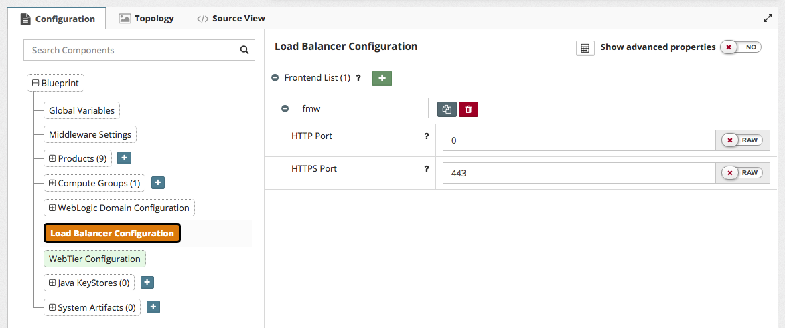
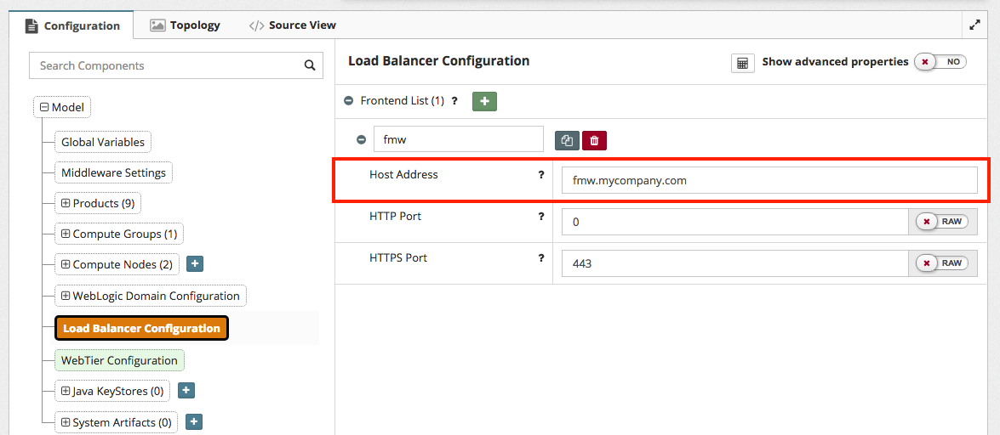

## {{ page.title }}

The load balancer helps you bring in redundancy and distribute workload across your servers. Add this configuration if you want to include a load balancer in your configuration.

MyST supports the definition of a load balancer to ensure that server URLs are correctly re-written to route through the load balancer. If you have blocked direct access \(i.e. not via a load balancer\) from the corporate network to your server instances \(which is a generally a recommended good practice\) then the setting of the load balancer will be mandatory otherwise you will find that URLs you expect to be able to access will get blocked.

A load balancer definition in MyST can have many frontend definitions. A frontend represents a host and port combination. If you are providing access from the load balancer front-end over HTTP or HTTPS you should set its port \(typically this is `80` for HTTP and HTTPS `443`\). If you are not providing access to a given port from the load balancer frontend you should set the port to `0` to prevent the server URLs being re-written to route to this protocol erroneously.

Some of the parameters for the frontend, such as the host, are environment-specific and need not be specified in a blueprint. In this case, you can enter the value "?" for these parameters, and define them in your platform model. MyST will validate that you have defined this value in your platform model at the time of a platform update or provision. When you define the same parameters in your platform model, the values provided in the platform model will take precedence over the values provided in the platform blueprint.

### Creating a frontend entry

Setting up a load balancer frontend requires settings across the Platform Blueprint and Model as shown below.

| Property | Description | Scope |
| :--- | :--- | :--- |
| Identifier | The load-balancer ID used to reference the frontend when defining clusters and managed servers. | Blueprint |
| Host | The frontend host's address. | Model |
| Http Port | The frontend host's HTTP address. | Blueprint |
| Https Port | The frontend host's HTTPS address. | Blueprint |

From the Edit mode in a Platform Blueprint navigate to the **Frontend List** within **Load Balancer Configuration** and click **Add Item**.

Enter an identifier for the Frontend. This is an important part of the definition as the identifier will be used to reference our frontend from given clusters or servers. Through the targeting of a frontend to a cluster or server we tell WebLogic to ensure all URLs are re-written back through this host and port(s).

In our example above we have set the identifier to `fmw`. This is a special identifier. When we set it to this, MyST will automatically set the frontend for every cluster and the admin server to be the `fmw` frontend. This saves you time in manually targeting but should be avoided if you require different frontends per cluster (e.g. `soa.mycompany.com` for SOA Suite Cluster and `osb.mycompany.com` for Oracle Service Bus Cluster).

Once one or more Frontends are set in the Platform Blueprint, you will need to define the `Host` in the Platform Model as shown below. This field will show once you have selected to `Edit Configuration` in the Model editor.

