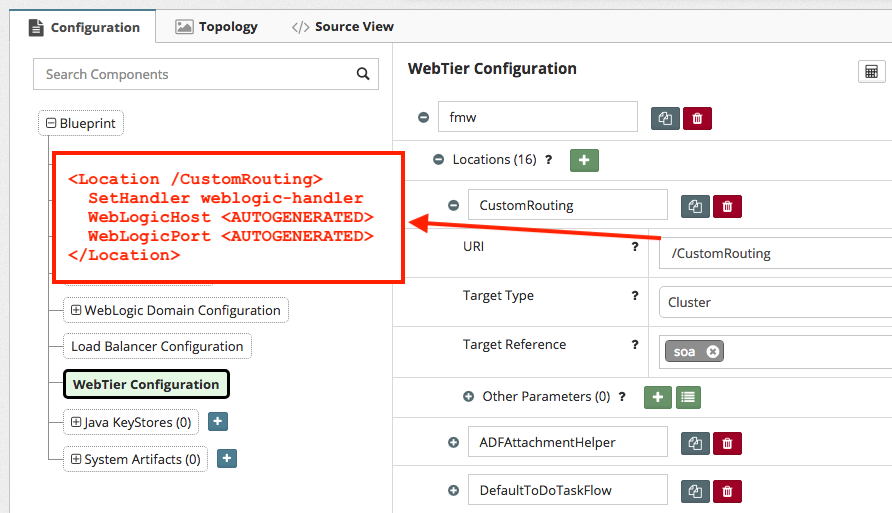

## {{ page.title }}

The **Oracle Webtier** (also known as **Oracle HTTP Server**) provides the interface between your external load balancer and the applications. This topic helps you understand the basic configuration parameters for Oracle Webtier that you can define in the platform blueprint. The Webtier configuration is optional, and you can add it only when you need Webtier in your configuration.

### Prerequisites

Before you begin defining the configuration, the Webtier must be listed as a product in your Platform Blueprint.

If you did not select **Oracle Webtier** during the [Platform Blueprint Wizard](/platform/blueprints/README.md) then you can add it your Blueprint at a later stage as follows:

From the Edit mode in a Platform Blueprint navigate to the **Products** component and click on **+** icon to add a new product.


You will then be prompted to select the product to compute group targeting. Select **Oracle Webtier** and target it to the compute group of your choice.


### Webtier Product Parameters

The following table describes the configuration properties that can be set for Webtier in the platform blueprint.

| Property | Description |
| :--- | :--- |
| Products \[Oracle Webtier\] &gt; Configuration Parameters\[webcache-enabled\]  | Whether to enable Webcache or not |
| Products \[Oracle Webtier\] &gt; Configuration Parameters\[opmn-remote-port\] | The Oracle Process Manager and Notification \(OPMN\) remote port. If not set, the default value is taken as 6701. |
| Products \[Oracle Webtier\] &gt; Configuration Parameters\[opmn-local-port\] | The Oracle Process Manager and Notification \(OPMN\) local port. If not set, it defaults to 6700 |
| Products \[Oracle Webtier\] &gt; Configuration Parameters\[base-port\] | Listen port for the Oracle HTTP Server component. If not set, the default value is taken as 7777. |
| Products \[Oracle Webtier\] &gt; Configuration Parameters\[ssl-port\] | SSL listen port for the Oracle HTTP Server component.  |
| Products \[Oracle Webtier\] &gt; Configuration Parameters\[root-permissions-enabled\] | This is required when setting base-port or ssl-port to be in the range from 1-1024 |

## Auto-generating the default Webtier Location Routing Rules

If you selected "Yes" to the prompt about creating a Load Balancer, then you will see an `fmw` [Load Balancer](/platform/resources/weblogic/servers/load-balancer-configuration.md) record under **Load Balancer Configuration** in the [Platform Definition](/platform/definitions/README.md). When this is set in combination with the Webtier product, it will default the load balancer to the Webtier host and port and auto-generate the product-specific Webtier Location Routing Rules under the **WebTier Configuration** within the Platform Definition. If the Webtier is fronted by another External Load Balancer, such as an F5, be sure to replace the Host and HTTP/S ports accordingly so that the URLs are re-written correctly to match the External Load Balancer.


## Adding custom Webtier Location Routing Rules

Custom routing rules can be added within the **Frontend List** under **WebTier Configuration** alongside the auto-generated product-specific routing rules.



Based on this, the `Location` definitions within the Webtier Configuration are automatically generated.

<!--
TODO...
The below is copied from MyST CLI docs but still needs to be updated to reflect MyST Studio

## Understanding how Webtier Location Routing Rules are defined

The Webtier is configured through moduleconf files that you define outside your platform blueprint. The MyST agent references the configuration information from your moduleconf file. A moduleconf file is a standard Oracle HTTP Server configuration. MyST automatically copies moduleconf configuration to the target Oracle HTTP Server hosts and replaces any property references defined in the files with the associated values in configuration. The moduleconf file is stored in the MYST\_WORKSPACE/resources/ohs/moduleconf. This is the default path where MyST tries to locate the moduleconf files to copy to the node. If there is a need to have different moduleconf for environments, then they should be stored in separate folders. For example, if there was a separate OHS configuration for single node and cluster, there should be two folders created as follows:

* MYST\_WORKSPACE/resources/ohs/moduleconf/single
* MYST\_WORKSPACE/resources/ohs/moduleconf/cluster

If you are using a custom moduleconf source, the folder directory must be defined in the `core.webtier.moduleconf-source.directory` property.The following is a sample moduleconf file located at MYST\_WORKSPACE/resources/ohs/soa\_vh.conf.

```
<VirtualHost *:${core.product[webtier].param[base-port]}>
ServerName ${core.load-balancer.frontend[fmw].host}:${core.load-balancer.frontend[fmw].http-port}
RewriteEngine On
RewriteOptions inherit

# Admin Server and EM
<Location /console>
SetHandler weblogic-handler
WebLogicHost ${core.domain.server[admin.server].listen-address}
WeblogicPort ${core.domain.server[admin.server].listen-port}
</Location>

<Location /em>
SetHandler weblogic-handler
WebLogicHost ${core.domain.server[admin.server].listen-address}
WeblogicPort ${core.domain.server[admin.server].listen-port}
</Location>

# WSM-PM
<Location /wsm-pm>
SetHandler weblogic-handler
WebLogicCluster ${core.webtier.cluster[wsm].server-addresses}
</Location>

# SOA infra
<Location /soa-infra>
SetHandler weblogic-handler
WebLogicCluster ${core.webtier.cluster[soa].server-addresses}
</Location>

</VirtualHost>
```

#### Special property for server addresses

When routing to the multiple nodes in a cluster the WebLogicCluster property in the OHS moduleconf would typically be set as follows:

```
${core.server[soa.server1].listen-address}:${core.server[soa.server1].listen-port},${core.server[soa.server2].listen-address}:${core.server[soa.server2].listen-port}
```

...which would resolve to WebLogicCluster soa-machine01:8001,soa-machine02:8001. To simplify this, there is a property that is dynamically created at runtime, which can be used to automatically retrieve this list of server addresses. This property is core.webtier.cluster\[CLUSTER-ID\].server-addresses. At run time, it will automatically create the server list as above without the need to explicitly define all the listen-address and listen-port elements of the servers in the cluster.

> Note: When you enable root permissions through the flag core.product\[webtier\].param\[root-permissions-enabled\], it is assumed that the operating system group which owns the home defined by core.product\[webtier\].home is "oracle". If this is not the case, then this property must be overridden with the custom property webtier.oracle.group. For example:

`webtier.oracle.group=dba`


TODO: Determine if the below content migrated from CLI should be included or not.

| Cluser List \[ID\] &gt; Server Addresses | Computed from Servers in a given cluster and used within the generate moduleconf routing rules |


> Note: The above configuration contains only the details required for the Oracle HTTP Server configuration. However, typically there are a number of additional configuration properties which are also required for WebLogic server configuration as well. By defining the Oracle HTTP Server and WLS configuration in the same definition, it is possible to perform the Oracle HTTP Server configuration at the same time as WebLogic server configuration. To do this, add the configure-webtier action to the start of the definition of the provision flow as follows:

| Property | Description |
| :--- | :--- |
| action.configure.pre | configure-webtier,stop-via-as,stop-nm,stop,create-domain,patch-domain,apply-jrf,start-nm,start,configure-nm,create-resource,reassociate-security-store,stop,copy-domain,start-as-via-nm,start-via-as,configure-soa,configure-ums |
| action.provision.pre | install,configure |

-->
